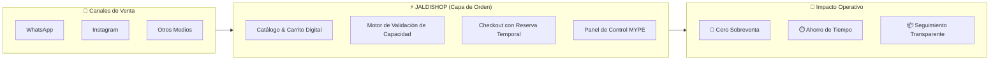
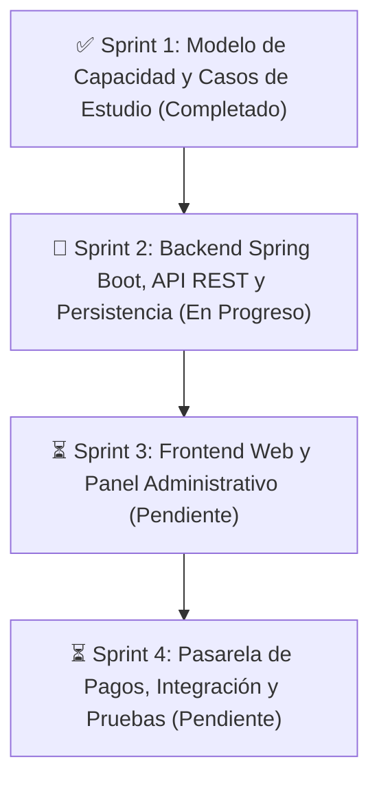

# 🛍️ JaldiShop

### Plataforma de Gestión de Pedidos y Control Inteligente de Capacidad para MYPE

[](https://github.com/iJosueeh/jaldishop)
[](https://github.com/iJosueeh/jaldishop)
[](https://github.com/iJosueeh/jaldishop/issues)
[](./docs/06-scrum/sprint-01.md)
[](./docs)

> **Capa de orden operativa** para micro y pequeñas empresas que comercializan por WhatsApp e Instagram, eliminando la sobreventa y sincronizando pedidos con su capacidad real.

---

## 📌 Visión General

Las MYPE que trabajan bajo pedido (panaderías, dark kitchens, reposterías, catering) enfrentan a diario **sobreventa, pedidos traspapelados y saturación operativa**. 

A diferencia del e-commerce tradicional —que únicamente evalúa si hay *stock* de producto—, **JaldiShop** incorpora la **capacidad operativa** (tiempo de preparación, disponibilidad de personal y slots de entrega) como restricción inteligente para asegurar que el negocio solo acepte lo que verdaderamente puede cumplir.



---

## 👥 Equipo de Desarrollo

| Miembro | Rol | Responsabilidad Sprint 1 | Perfil |
|---|:---:|---|:---:|
| **Josue Royer Tanta Cieza** | Full Stack Dev | Caso A (Pastelería), Caso C (Logística) & Modelo de Capacidad | [](https://github.com/iJosueeh) |
| **Katherine Patricia Salas Quiroz** | Full Stack Dev | Caso B (Dark Kitchen) & Consolidación | [](https://github.com/kath144) |
| **Mia Vitalia Gual Vega** | Full Stack Dev | Flujo AS-IS / TO-BE & Modelado de Procesos | [](https://github.com/miagv) |

---

## 🛠️ Stack Tecnológico

| Capa | Tecnologías | Propósito |
|:---|:---|:---|
| **Backend** |   | API RESTful, Reglas de Dominio y Transaccionalidad |
| **Frontend** |    | Portal Cliente y Panel Administrativo MYPE |
| **Persistencia** |   | Base de datos relacional y control concurrente |
| **Tiempo Real** |  | Actualización de estados y disponibilidad en vivo |
| **Documentación** |   | Diagramas interactivos y especificaciones vivas |

---

## 🗺️ Mapa de Documentación del Proyecto

Toda la documentación técnica y de producto se encuentra estructurada y versionada en [`/docs`](./docs):

```
jaldishop/
├── 📁 docs/
│   ├── 📁 01-producto/                 # Visión de negocio y modelo operativo
│   │   ├── 📄 propuesta.md             # Propuesta y justificación del producto
│   │   ├── 📄 modelo-capacidad-v1.md   # Core: Algoritmo y reglas de capacidad
│   │   └── 📄 decisiones-producto.md   # Decisiones técnicas y de negocio (DP-G01 a G06)
│   ├── 📁 02-investigacion/            # Levantamiento de requisitos de campo
│   │   ├── 📄 caso-a-pasteleria.md     # Caso A: Capacidad en repostería bajo pedido
│   │   ├── 📄 caso-b-dark-kitchen.md   # Caso B: Cocina oculta y franjas horarias
│   │   ├── 📄 caso-c-logistica.md      # Caso C: Capacidad de delivery y recojo
│   │   └── 📄 matriz-consolidacion.md  # Matriz comparativa de hallazgos
│   ├── 📁 03-requisitos/               # Alcance del MVP y especificaciones
│   │   └── 📄 alcance-mvp.md           # Must / Should / Could / Won't have
│   ├── 📁 04-design/                   # Modelado de procesos y UX
│   │   └── 📁 proceso/
│   │       └── 📄 as-is-to-be.md       # Diagramas comparativos AS-IS vs TO-BE
│   ├── 📁 06-scrum/                    # Gestión ágil de sprints
│   │   └── 📄 sprint-01.md             # Sprint 1: Modelo de capacidad (Completado)
│   └── 📄 TEMPLATE.md                  # Plantilla estándar para nuevos documentos
├── 📁 backend/                         # Servidor Spring Boot (Próximo Sprint)
├── 📁 frontend/                        # Aplicación Web (Próximo Sprint)
└── 📄 README.md                        # Portal principal del repositorio
```

---

## 🚀 Estado de los Sprints



| Sprint | Enfoque | Estado | Entregable Clave |
|:---:|---|:---:|---|
| **01** | Modelo de Capacidad y Casos de Estudio | `COMPLETADO` | [Modelo de Capacidad v1](./docs/01-producto/modelo-capacidad-v1.md) |
| **02** | Arquitectura Backend y Persistencia | `EN PROGRESO` | Diagrama ER, API REST Spring Boot |
| **03** | Frontend Web & Panel de Control | `PENDIENTE` | Interfaz Next.js / Angular |
| **04** | Integración, Pasarela de Pagos & QA | `PENDIENTE` | MVP Funcional Desplegado |

---

## 💡 Conceptos Clave del Dominio

* **Capacidad Base:** Límite estándar de pedidos que una tienda procesa por día o bloque horario.
* **Excepción Temporal:** Ajuste en caliente para fechas festivas o imprevistos operativos sin alterar la base semanal.
* **Reserva Temporal (Hold):** Bloqueo transaccional de cupo durante 10 minutos mientras el cliente realiza el pago.
* **Capacidad Comprometida:** Total de cupos bloqueados por pedidos pagados y reservas en curso.

---

**JaldiShop** — Construido con rigor de ingeniería de software para impulsar a las MYPE.
