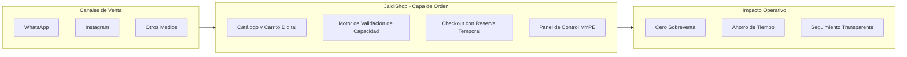
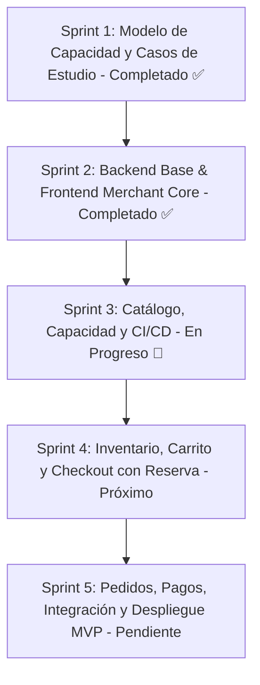

# 🛍️ JaldiShop

### Plataforma de Gestión de Pedidos y Control Inteligente de Capacidad para MYPE

[](https://github.com/iJosueeh/jaldishop)
[](https://github.com/iJosueeh/jaldishop)
[](https://github.com/iJosueeh/jaldishop/actions/workflows/ci.yml)
[](./docs/06-scrum/sprint-03.md)
[-success?style=flat-square&logo=vitest)](./frontend-merchant)
[](https://negocios-jaldishop.pages.dev/)
[](https://jaldishop-api.onrender.com/api/v1)
[](./docs)

> **Capa de orden operativa** para micro y pequeñas empresas que comercializan por WhatsApp e Instagram, eliminando la sobreventa y sincronizando pedidos con su capacidad real.

---

## 📌 Visión General

Las MYPE que trabajan bajo pedido (panaderías, dark kitchens, reposterías, catering) enfrentan a diario **sobreventa, pedidos traspapelados y saturación operativa**. 

A diferencia del e-commerce tradicional —que únicamente evalúa si hay *stock* de producto—, **JaldiShop** incorpora la **capacidad operativa** (tiempo de preparación, disponibilidad de personal y slots de entrega) como restricción inteligente para asegurar que el negocio solo acepte lo que verdaderamente puede cumplir.



---

## 👥 Equipo de Desarrollo

| Miembro | Rol | Responsabilidad Sprint 3 | Perfil |
|---|:---:|---|:---:|
| **Josue Royer Tanta Cieza** | Full Stack Dev | **CI-01** · Pipeline CI/CD (✅ Hecho), **BE-17** · Carrito (🔒 Bloqueada), **Despliegue** (Render & Cloudflare Pages) y **FE Branding** | [](https://github.com/iJosueeh) |
| **Katherine Patricia Salas Quiroz** | Full Stack Dev | **BE-12** · Módulo de Catálogo (🟢 En Progreso) & **BE-13** · Módulo de Inventario (🔒 Bloqueada por BE-12) | [](https://github.com/kath144) |
| **Mia Vitalia Gual Vega** | Full Stack Dev | **BE-14** · Capacidad Base (✅ Hecho), **BE-15** · Excepciones (✅ Hecho) & **BE-16** · Capacidad Efectiva (🟢 En Progreso) | [](https://github.com/miagv) |

---

## 🛠️ Stack Tecnológico

| Capa | Tecnologías | Propósito |
|:---|:---|:---|
| **Backend** |   | API RESTful, Arquitectura Hexagonal/DDD, Bean Validation y Transaccionalidad |
| **Seguridad** |   | Autenticación sin estado, RBAC (CUSTOMER, MERCHANT, ADMIN) y control de acceso |
| **Persistencia** |   | Base de datos NeonDB en la nube, versionamiento DDL forward-only y JPA |
| **Frontend** |    | Panel de Comerciante (Angular Standalone/Signals) y Portal Cliente (Next.js) |
| **Despliegue & DevOps** |    | Despliegue en la nube (Frontend en Cloudflare Pages, Backend en Render) |
| **Calidad / QA & CI** |    | 274 pruebas automatizadas pasando al 100% (153 BE + 121 FE) y pipeline continuo |
| **Documentación** |   | Diagramas interactivos y especificaciones de arquitectura viva |

---

## 🗺️ Mapa de Documentación del Proyecto

Toda la documentación técnica y de producto se encuentra estructurada y versionada en [`/docs`](./docs):

```
jaldishop/
├── 📁 docs/
│   ├── 📁 01-producto/                 # Visión de negocio y modelo operativo
│   │   ├── 📄 propuesta.md             # Propuesta y justificación del producto
│   │   ├── 📄 modelo-capacidad-v1.md   # Core: Algoritmo y reglas de capacidad
│   │   └── 📄 decisiones-producto.md   # Decisiones técnicas y de negocio (DP-G01 a G06)
│   ├── 📁 02-investigacion/            # Levantamiento de requisitos de campo
│   │   ├── 📄 caso-a-pasteleria.md     # Caso A: Capacidad en repostería bajo pedido
│   │   ├── 📄 caso-b-dark-kitchen.md   # Caso B: Cocina oculta y franjas horarias
│   │   ├── 📄 caso-c-logistica.md      # Caso C: Capacidad de delivery y recojo
│   │   └── 📄 matriz-consolidacion.md  # Matriz comparativa de hallazgos
│   ├── 📁 03-requisitos/               # Alcance del MVP y especificaciones
│   │   ├── 📄 alcance-mvp.md           # Must / Should / Could / Won't have (v1.1)
│   │   ├── 📄 reglas-negocio.md        # Reglas e invariantes del dominio (RN-01 a 15) (v1.1)
│   │   ├── 📄 historia.md              # Historias de usuario del MVP (v1.1)
│   │   └── 📄 modelo-dominio.md        # Modelo de dominio y conceptos (v1.0)
│   ├── 📁 04-diseno/                   # Modelado de persistencia y API
│   │   ├── 📄 modelo-er.md             # Modelo Entidad-Relación v1.6 (Listo para DDL)
│   │   ├── 📄 diagrama-er.md           # Diagrama ER visual
│   │   ├── 📄 contrato-api-errores.md  # Contrato estandarizado de respuestas y errores HTTP
│   │   └── 📄 as-is-to-be.md           # Diagramas comparativos AS-IS vs TO-BE
│   ├── 📁 05-arquitectura/             # Decisiones arquitectónicas
│   │   └── 📄 arquitectura-sistema.md  # Arquitectura del sistema (v0.2)
│   ├── 📁 06-scrum/                    # Gestión ágil de sprints
│   │   ├── 📄 sprint-01.md             # Sprint 1: Modelo de Capacidad (Completado)
│   │   ├── 📄 sprint-02.md             # Sprint 2: Backend Base y Frontend Merchant Core (Completado)
│   │   └── 📄 sprint-03.md             # Sprint 3: Catálogo, Capacidad y CI/CD (En Progreso)
│   └── 📄 TEMPLATE.md                  # Plantilla estándar para nuevos documentos
├── 📁 backend/                         # Servidor Spring Boot (Identity + Store + Notification + Catalog + Capacity)
├── 📁 frontend-merchant/               # Panel de Comerciante (Angular 20 Standalone con Signals)
├── 📁 frontend/                        # Portal Cliente (Próximo Sprint)
└── 📄 README.md                        # Portal principal del repositorio
```

---

## 🚀 Estado de los Sprints



| Sprint | Enfoque | Estado | Entregable Clave |
|:---:|---|:---:|---|
| **01** | Modelo de Capacidad y Casos de Estudio | `COMPLETADO` | [Modelo de Capacidad v1](./docs/01-producto/modelo-capacidad-v1.md) |
| **02** | Backend Base & Frontend Merchant Core | `COMPLETADO` | [Sprint 02 Backlog](./docs/06-scrum/sprint-02.md) (Identity + Store + Notificaciones + Onboarding + Dashboards + Tienda + Errores + Perfil, 156 tests) |
| **03** | Catálogo, Capacidad y CI/CD | `EN PROGRESO` | [Sprint 03 Backlog](./docs/06-scrum/sprint-03.md) (Catálogo BE-12, Capacidad Base BE-14, Pipeline CI-01) |
| **04** | Inventario, Carrito y Checkout con Reserva | `PRÓXIMO` | Motor de reserva temporal (Hold 10 min) y catálogo público |
| **05** | Pedidos, Pagos, Integración y QA | `PENDIENTE` | Pasarelas de pago, ciclo de pedidos y MVP Desplegado |

---

## 💡 Conceptos Clave del Dominio

* **Capacidad Base:** Límite estándar de pedidos que una tienda procesa por día o bloque horario.
* **Excepción Temporal:** Ajuste en caliente para fechas festivas o imprevistos operativos sin alterar la base semanal.
* **Reserva Temporal (Hold):** Bloqueo transaccional de cupo durante **10 minutos para iniciar el pago**. El pago puede completarse después de este periodo si inició válidamente antes de la expiración.
* **Capacidad Comprometida:** Total de cupos bloqueados por pedidos pagados y reservas en curso.

---

**JaldiShop** — Construido con rigor de ingeniería de software para impulsar a las MYPE.
