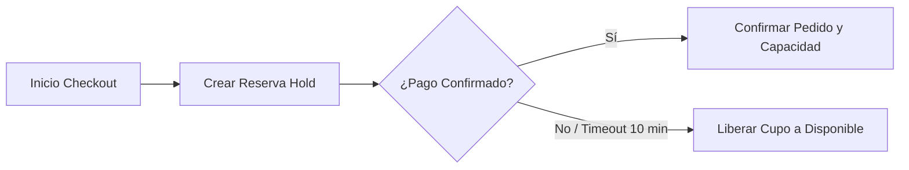

# Decisiones de Producto

### JaldiShop — Definición de Decisiones Generales del MVP

---

`📍 Docs` > `01-Producto` > **Decisiones de Producto**  
[⬅ Modelo de Capacidad v1](./modelo-capacidad-v1.md) | [🏠 Índice General](../../README.md) | [Investigación Caso A ➡](../02-investigacion/caso-a-pasteleria.md)

---

## 1. Propósito

> 📌 **Nota:** Registrar las decisiones de diseño funcional y técnico aprobadas tras la consolidación de los Casos A, B y C, delimitando el alcance del primer MVP.

---

## 2. DP-G01 — Modelo Simple de Capacidad

> 💡 **Decisión:** Utilizar capacidad simple (**1 pedido = 1 cupo**) en el MVP.

El consumo ponderado por producto o nivel de complejidad queda reservado como evolución para versiones posteriores.

* **Motivación:** Permite validar y demostrar el valor diferencial de JaldiShop sin convertir el MVP en un motor de planificación excesivamente complejo.

---

## 3. DP-G02 — Capacidad Operativa Principal

> 💡 **Decisión:** Gestionar una única capacidad operativa principal por cada configuración de tienda.

La gestión de múltiples recursos simultáneos (hornos, cocina fría, empaque y repartidores de forma desacoplada) queda como evolución posterior.

---

## 4. DP-G03 — Día y Franja Horaria

> 💡 **Decisión:** Permitir configurar capacidad tanto por día completo como por franjas horarias específicas.

Esto cubre tanto a negocios con producción anticipada (pastelerías) como a negocios con demanda concentrada en horas pico (dark kitchens).

---

## 5. DP-G04 — Reserva Temporal Durante Checkout

> 💡 **Decisión:** Bloquear temporalmente el cupo de capacidad cuando el cliente inicia el proceso de checkout (*Hold* transaccional de 10 minutos).

| Evento | Acción en el Sistema |
|---|---|
| **Pago confirmado** | La reserva temporal se convierte en pedido confirmado |
| **Pago fallido** | La reserva se cancela y se libera el cupo |
| **Tiempo expirado (>10 min)** | El cupo vuelve a estar disponible para otros clientes |

---

## 6. DP-G05 — Protección Ante Concurrencia

> ⚠️ **Advertencia:** El backend garantizará que dos pedidos simultáneos no puedan comprometer el mismo último cupo disponible.

* La solución técnica aplicará transaccionalidad atómica a nivel de base de datos relacional (PostgreSQL).

---

## 7. DP-G06 — Alcance Logístico

> 💡 **Decisión:** Incluir únicamente logística y delivery básico en el MVP.

| Funcionalidad Logística | Alcance en MVP | Estado |
|---|:---:|:---:|
| Ubicación del negocio y del cliente | Esencial | ✅ Incluido |
| Cobertura y validación por radio | Esencial | ✅ Incluido |
| Selección Delivery vs Recojo | Esencial | ✅ Incluido |
| Costo fijo o por rango de distancia | Esencial | ✅ Incluido |
| Optimización automática de rutas GPS | Evolución | ❌ Excluido v1 |
| Tracking en vivo del motorizado | Evolución | ❌ Excluido v1 |

---

## 8. Pendientes Después de Aprobar Estas Decisiones

| Pendiente | Descripción | Estado |
|---|---|:---:|
| **Estados del pedido** | Definir máquina de estados finita (`PENDIENTE_PAGO` $\rightarrow$ `COMPLETADO`) | ✅ Definido |
| **Política de cancelación** | Reglas de liberación de capacidad según estado operativo | ✅ Definido |
| **Duración de reservas** | Ventana estándar fijada en 10 minutos | ✅ Definido |
| **Modelo ER** | Traducir entidades a diagrama relacional Spring Boot / JPA | 🔄 En Sprint 2 |

---

[⬅ Modelo de Capacidad v1](./modelo-capacidad-v1.md) | [🏠 Volver al Índice General](../../README.md) | [Investigación Caso A ➡](../02-investigacion/caso-a-pasteleria.md)
