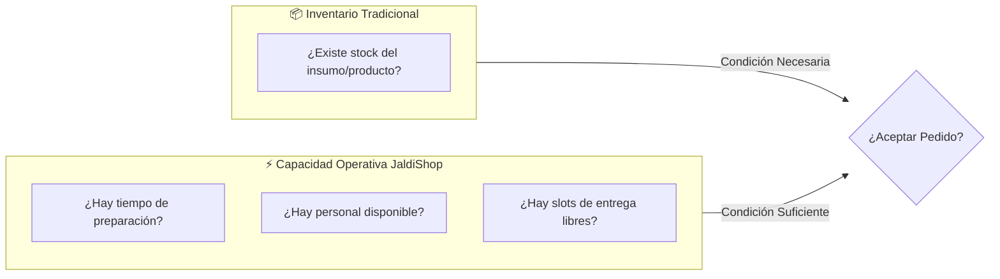
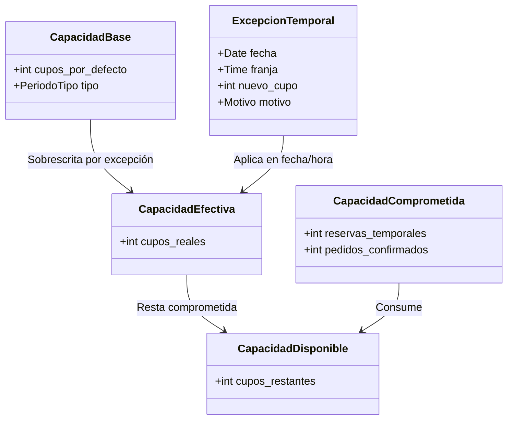
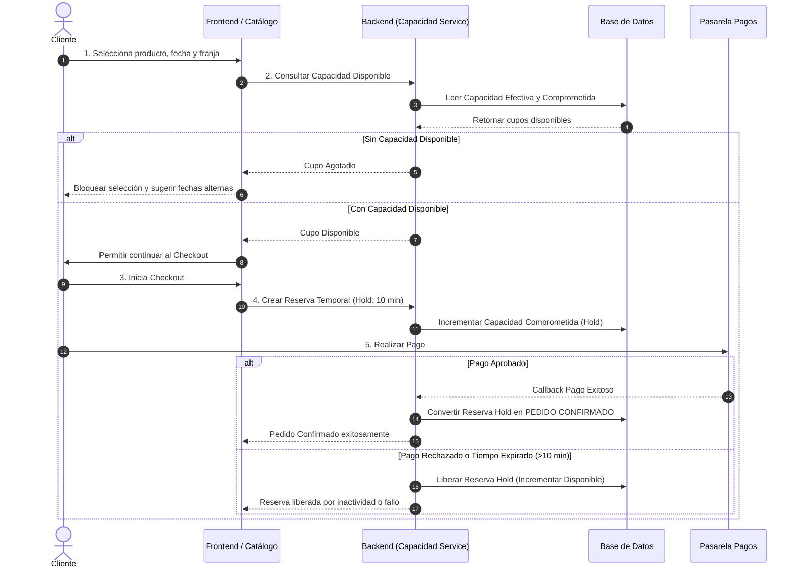
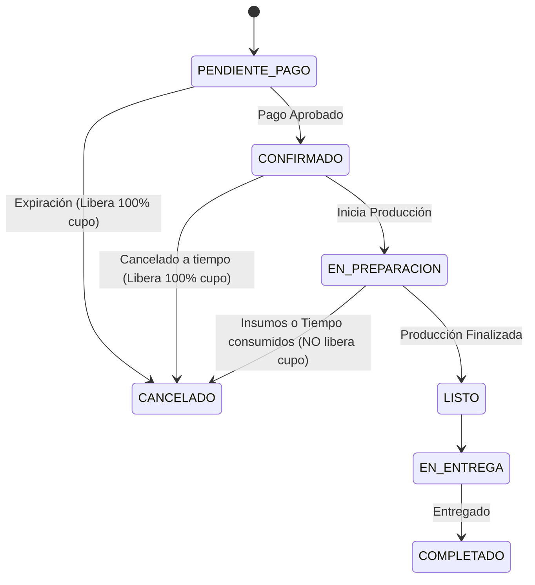
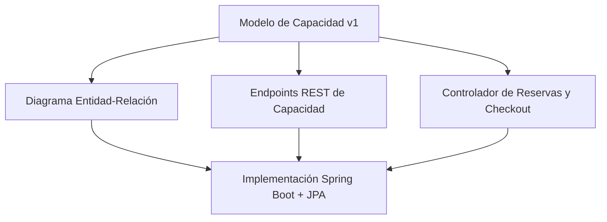

# Modelo de Capacidad v1

### JaldiShop — Núcleo Operativo para MYPE

[](./decisiones-producto.md)
[](./modelo-capacidad-v1.md)
[](../06-scrum/sprint-01.md)

---

`📍 Docs` > `01-Producto` > **Modelo de Capacidad v1**  
[⬅ Propuesta de Producto](./propuesta.md) | [🏠 Índice General](../../README.md) | [Decisiones de Producto ➡](./decisiones-producto.md)

---

## 1. Propósito

> 📌 **Nota:** Define la primera versión general del modelo de capacidad de **JaldiShop** a partir de la consolidación de los Casos A (Pastelería), B (Dark Kitchen) y C (Logística).

El objetivo primordial es **evitar que una MYPE confirme más pedidos** de los que su infraestructura, personal o tiempo le permiten procesar dentro de una fecha o franja determinada.

---

## 2. Principio Central

> 💡 **Principio Fundamental:** **JaldiShop no tratará la capacidad como sinónimo de inventario.**
> 
> Un negocio puede disponer de stock de ingredientes o productos y, aun así, **no tener tiempo, personal ni disponibilidad operativa** para aceptar otro pedido.



> **Regla de oro:** La capacidad representa **cuánto trabajo adicional** puede comprometer el negocio dentro de un periodo.

---

## 3. Componentes del Modelo



### 3.1 Capacidad Base
Valor habitual configurado que el negocio puede atender o producir en condiciones normales.

### 3.2 Periodo
La capacidad se asigna a unidades temporales específicas:

| Tipo de Periodo | Granularidad | Aplicación Típica |
|:---|:---:|:---|
| **Día** | Diario completo | Negocios bajo pedido anticipado (ej. tortas temáticas, catering) |
| **Franja Horaria** | Bloques de 30 min / 1-2 horas | Dark kitchens, comida rápida, entregas programadas |

### 3.3 Capacidad Efectiva
Capacidad real aplicable tras evaluar si existe una excepción configurada para el periodo:

```text
Capacidad Efectiva = Capacidad Excepcional (si existe excepción) | Capacidad Base (por defecto)
```

### 3.4 Capacidad Comprometida
Suma de los cupos bloqueados por pedidos confirmados más las reservas activas en proceso de checkout:

```text
Capacidad Comprometida = Pedidos Confirmados + Reservas Temporales (Hold)
```

### 3.5 Capacidad Disponible
Cupos netos disponibles para nuevos clientes:

```text
Capacidad Disponible = Capacidad Efectiva - Capacidad Comprometida
```

> ⚠️ **Advertencia:** Un pedido **no podrá continuar al checkout** cuando la capacidad requerida sea mayor a la disponible (`Capacidad Disponible <= 0`).

---

## 4. Excepciones Temporales

Permiten al comerciante alterar temporalmente su capacidad para una fecha o franja horaria sin reconfigurar su horario base:

| Tipo de Excepción | Causa Operativa | Efecto en Capacidad |
|---|---|:---:|
| 🟢 **Incremento** | Personal extra / Turno doble | Sube cupos |
| 🔴 **Reducción** | Ausencia de personal / Mantenimiento de horno | Baja cupos |
| ⛔ **Cierre Parcial** | Evento privado / Feriado no laborable | Cupos = 0 |
| ⭐ **Fecha Especial** | Campaña alta demanda (Día de la Madre, Navidad) | Ajuste a medida |

---

## 5. Ciclo de Capacidad de un Pedido



---

## 6. Concurrencia y Bloqueos

> 💡 **Regla Crítica:** El sistema debe garantizar a nivel de base de datos / backend que **dos clientes no puedan comprometer simultáneamente el último cupo disponible** (condición de carrera).

* **Mecanismo:** Bloqueo transaccional o atómico al momento de solicitar la reserva temporal de checkout.
* **Duración:** La reserva expira automáticamente a los **10 minutos** si no se confirma el pago.

---

## 7. Políticas de Cancelación

> ⛔ **Precaución:** Cancelar un pedido **no implica necesariamente recuperar la capacidad productiva o logística**.



---

## 8. Delivery en el MVP

| Funcionalidad | Alcance MVP | Estado |
|---|:---:|:---:|
| Dirección del cliente y tienda | `Must Have` | ✅ Incluido |
| Validación de cobertura y distancia | `Must Have` | ✅ Incluido |
| Costo básico de envío | `Must Have` | ✅ Incluido |
| Selección Delivery vs Recojo en tienda | `Must Have` | ✅ Incluido |
| Optimización automática de rutas GPS | `Out of Scope` | ❌ Excluido v1 |
| Tracking de repartidor en tiempo real | `Out of Scope` | ❌ Excluido v1 |

---

## 9. Elementos Fuera del Modelo v1

Para evitar sobreingeniería en el primer entregable, se excluyen deliberadamente el cálculo de pesos ponderados por complejidad de producto, la gestión desacoplada de múltiples estaciones simultáneas (como cocineros, hornos y repartidores independientes) y los algoritmos predictivos basados en inteligencia artificial. Estas capacidades quedan reservadas como evolución arquitectónica para fases posteriores una vez validado el núcleo operativo simple del sistema.

---

## 10. Relación con los Entregables

> 📌 **Nota:** Este modelo de capacidad constituye el **diferenciador central** de JaldiShop sobre un e-commerce estándar y servirá como base para el modelado de base de datos relacional (Entidad-Relación) y las APIs REST.



---

[⬅ Propuesta de Producto](./propuesta.md) | [🏠 Volver al Índice General](../../README.md) | [Decisiones de Producto ➡](./decisiones-producto.md)
