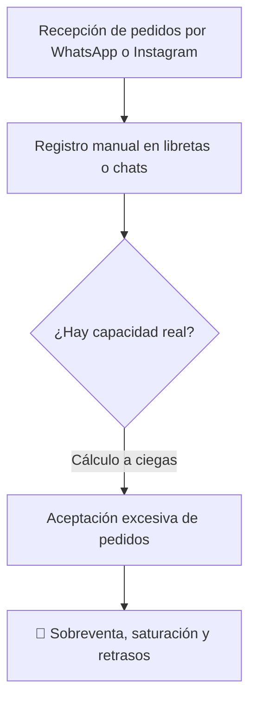
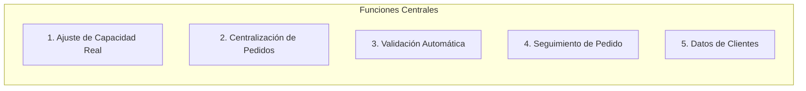

# Propuesta del Producto

### JaldiShop — Solución de Capacidad y Pedidos para MYPE

---

`📍 Docs` > `01-Producto` > **Propuesta del Producto**  
[🏠 Índice General](../../README.md) | [Modelo de Capacidad v1 ➡](./modelo-capacidad-v1.md)

---

## 1. Problema Identificado

> 💡 **Problema Central:** Las MYPE que venden mediante **WhatsApp, Instagram y redes sociales** gestionan sus pedidos de forma manual y fragmentada. El principal dolor operativo es la **sobreventa** y el incumplimiento ocasionado por la ausencia de un control de capacidad en tiempo real.

---

## 2. Diferencia frente al Stock Tradicional

| Enfoque | Pregunta Clave | Factor Evaluado |
|---|---|---|
| **E-commerce Tradicional** | *¿Cuántas unidades físicas quedan en stock?* | Inventario de materia prima / productos terminados |
| **JaldiShop** | *¿Cuántos pedidos puede comprometerse a cumplir realmente el negocio?* | **Tiempo, mano de obra, slots de cocina y despacho** |

> 📌 **Ejemplos de la realidad operativa:**
> * Una **pastelería** puede tener harina y azúcar, pero no tener horas de horno ni personal para decorar otra torta.
> * Una **dark kitchen** puede tener insumos, pero tener su línea de preparación colapsada en hora pico.
> * Una **tienda de regalos** puede armar el detalle, pero no disponer de repartidor para entregarlo a la hora exacta.

---

## 3. Propuesta de Valor

JaldiShop funciona como una capa de orden y orquestación para pequeños negocios que venden por canales digitales. La plataforma no busca reemplazar WhatsApp o Instagram, sino complementarlos centralizando la recepción de pedidos y validando automáticamente la disponibilidad de capacidad operativa antes de comprometer cualquier venta. De esta manera, el cliente obtiene confirmación inmediata con una franja de entrega garantizada y seguimiento en tiempo real, mientras la microempresa previene la sobreventa y organiza su producción diaria sin fricciones.

---

## 4. Funciones Centrales

| # | Función Central | Impacto para la MYPE |
|:---:|---|---|
| **1** | Configuración de capacidad real | Define límites realistas por día y franja horaria |
| **2** | Gestión centralizada de pedidos | Consolida ventas evitando pedidos perdidos |
| **3** | Control automático de disponibilidad | Bloquea fechas y franjas saturadas |
| **4** | Seguimiento del pedido | Reduce consultas repetitivas de clientes |
| **5** | Clientes y recurrencia | Base de datos unificada de clientes frecuentes |

---

## 5. Público Objetivo

MYPE con capacidad de producción o atención limitada que trabajan principalmente **bajo pedido o con despacho programado**:

* 🎂 **Pastelerías y reposterías artesanales**
* 🍳 **Dark kitchens y comida por delivery**
* 🍱 **Menús y comida preparada programada**
* 🎁 **Regalos y detalles personalizados**

---

[🏠 Volver al Índice General](../../README.md) | [Siguiente: Modelo de Capacidad v1 ➡](./modelo-capacidad-v1.md)