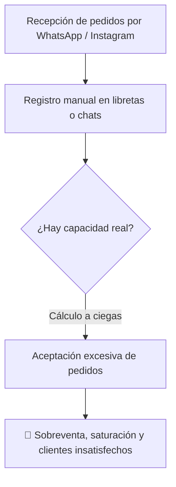
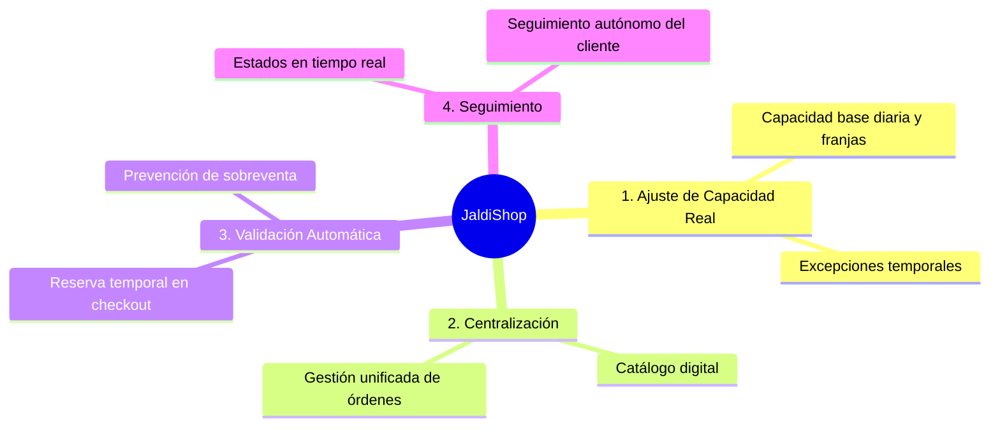

# Propuesta del Producto
### JaldiShop — Solución de Capacidad y Pedidos para MYPE

`📍 Docs` > `01-Producto` > **Propuesta del Producto**  
[🏠 Índice General](../../README.md) | [Modelo de Capacidad v1 ➡](./modelo-capacidad-v1.md)

---

<b>📑 Tabla de Contenidos</b>

- [1. Problema Identificado](#1-problema-identificado)
- [2. Diferencia frente al Stock Tradicional](#2-diferencia-frente-al-stock-tradicional)
- [3. Propuesta de Valor](#3-propuesta-de-valor)
- [4. Funciones Centrales](#4-funciones-centrales)
- [5. Público Objetivo](#5-público-objetivo)

---

## 1. Problema Identificado

> [!IMPORTANT]
> Las MYPE que venden mediante **WhatsApp, Instagram y redes sociales** gestionan sus pedidos de forma manual y fragmentada. El principal dolor operativo es la **sobreventa** y el incumplimiento ocasionado por la ausencia de un control de capacidad en tiempo real.

---

## 2. Diferencia frente al Stock Tradicional

| Enfoque | Pregunta Clave | Factor Evaluado |
|---|---|---|
| **E-commerce Tradicional** | *¿Cuántas unidades físicas quedan en stock?* | Inventario de materia prima / productos terminados |
| **JaldiShop** | *¿Cuántos pedidos puede comprometerse a cumplir realmente el negocio?* | **Tiempo, mano de obra, slots de cocina y despacho** |

> [!NOTE]
> * Una **pastelería** puede tener harina y azúcar, pero **no tener horas de horno ni personal** para decorar otra torta.
> * Una **dark kitchen** puede tener insumos, pero tener su **línea de preparación colapsada** en hora pico.
> * Una **tienda de regalos** puede armar el detalle, pero **no disponer de repartidor** para entregarlo a la hora exacta.

---

## 3. Propuesta de Valor

Desarrollar una **capa de orden y orquestación** para pequeños negocios digitales que:
1. No busca desplazar los canales de captación (WhatsApp/Instagram), sino **complementarlos**.
2. Centraliza pedidos y valida automáticamente disponibilidad antes de comprometer al negocio.
3. Brinda al cliente visibilidad y certeza sobre la fecha y franja horaria de entrega.

---

## 4. Funciones Centrales

| # | Función Central | Impacto para la MYPE |
|:---:|---|---|
| **1** | Configuración de capacidad real | Define límites realistas por día y franja horaria |
| **2** | Gestión centralizada de pedidos | Consolida ventas evitando pedidos perdidos |
| **3** | Control automático de disponibilidad | Bloquea fechas y franjas saturadas |
| **4** | Seguimiento del pedido | Reduce consultas repetitivas de clientes |
| **5** | Clientes y recurrencia | Base de datos unificada de clientes frecuentes |

---

## 5. Público Objetivo

MYPE con capacidad de producción o atención limitada que trabajan principalmente **bajo pedido o con despacho programado**:

* 🎂 **Pastelerías y reposterías artesanales**
* 🍳 **Dark kitchens y comida por delivery**
* 🍱 **Menús y comida preparada programada**
* 🎁 **Regalos y detalles personalizados**

---

[🏠 Volver al Índice General](../../README.md) | [Siguiente: Modelo de Capacidad v1 ➡](./modelo-capacidad-v1.md)

