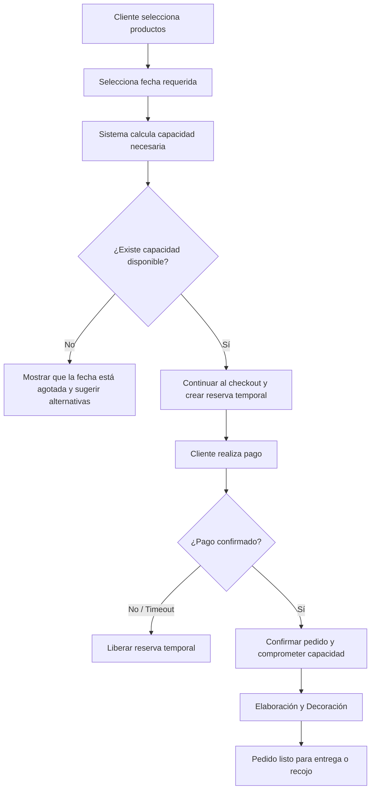

# Caso A: Capacidad en Pastelería

### JaldiShop — Investigación de Dominio y Capacidad Bajo Pedido

[](./matriz-consolidacion.md)
[](./caso-a-pasteleria.md)

---

`📍 Docs` > `02-Investigación` > **Caso A: Pastelería**  
[⬅ Decisiones de Producto](../01-producto/decisiones-producto.md) | [🏠 Índice General](../../README.md) | [Caso B: Dark Kitchen ➡](./caso-b-dark-kitchen.md)

---

<details open>
<summary><b>📑 Tabla de Contenidos</b></summary>

- [1. Objetivo](#1-objetivo)
- [2. Contexto del Caso](#2-contexto-del-caso)
- [3. Problema Identificado](#3-problema-identificado)
- [4. Concepto de Capacidad](#4-concepto-de-capacidad)
- [5. Capacidad Base Diaria](#5-capacidad-base)
- [6. Excepciones Temporales](#6-excepciones-temporales)
- [7. Modelo Básico vs Ponderado](#7-capacidad-segun-tipo-de-producto)
- [8. Flujo Operativo del Caso A](#8-flujo-general-del-caso-a)
- [9. Reglas de Negocio Preliminares](#9-reglas-preliminares-del-caso-a)

</details>

---

## 1. Objetivo

> [!NOTE]
> Analizar cómo debe funcionar el **modelo de capacidad** en una pastelería que trabaja bajo pedido y cuya capacidad de producción es limitada en tiempo, equipamiento y mano de obra.

El caso busca determinar cómo el sistema evita que el negocio acepte **más pedidos de los que realmente puede elaborar**, incluso disponiendo de stock de ingredientes.

---

## 2. Contexto del Caso

Una pastelería artesanal recibe pedidos de diversos tamaños y diseños de tortas mediante WhatsApp e Instagram.

| Aspecto | Situación Real |
|---|---|
| **Ingredientes** | Dispone de harina, azúcar y materias primas suficientes. |
| **Canales de venta** | Recibe mensajes y consultas constantemente. |
| **Restricción real** | Su tiempo de decoración, capacidad de hornos y personal solo permite producir un cupo límite diario. |

> [!IMPORTANT]
> **Conclusión clave:** Disponer de insumos físicos **no significa tener capacidad operativa** para aceptar otro pedido.

---

## 3. Problema Identificado

### Sobreventa por compromiso excesivo

```text
Capacidad base del sábado:     8 tortas
-----------------------------------------
Pedido 1 (Cliente A):         -4 tortas  -> Restan 4 cupos
Pedido 2 (Cliente B):         -4 tortas  -> Restan 0 cupos
-----------------------------------------
Pedido 3 (Cliente C):         ❌ NO ACEPTABLE (Saturado)
```

---

## 4. Concepto de Capacidad

$$\text{Capacidad Disponible} = \text{Capacidad Base / Excepción} - \text{Capacidad Comprometida}$$

* **Capacidad Base:** Límite estándar de producción habitual.
* **Capacidad Comprometida:** Total de órdenes confirmadas y reservas temporales en checkout.
* **Capacidad Disponible:** Saldo neto para nuevos pedidos.

---

## 5. Capacidad Base

Configuración semanal estándar del negocio:

| Día | Capacidad (Tortas) | Nivel Operativo |
|---|:---:|:---:|
| Lunes a Miércoles | 6 | Normal |
| Jueves | 8 | Medio |
| Viernes | 10 | Alto |
| Sábado | 12 | Máximo |
| Domingo | 8 | Medio |

---

## 6. Excepciones Temporales

Ajustes para fechas puntuales sin alterar la configuración habitual de la semana:

* **Incremento:** Contratación de decorador de apoyo (+4 cupos).
* **Reducción:** Mantenimiento de horno principal (-4 cupos).
* **Cierre Parcial:** Descanso o evento privado (0 cupos).

---

## 7. Capacidad según Tipo de Producto

* **Modelo Básico (MVP):** 1 torta = 1 cupo de capacidad.
* **Modelo Ponderado (Evolución):**
  * Torta grande / temática $\rightarrow$ 1.00 cupo
  * Torta mediana $\rightarrow$ 0.50 cupos
  * Torta pequeña $\rightarrow$ 0.25 cupos

---

## 8. Flujo General del Caso A



---

## 9. Reglas Preliminares del Caso A

| Código | Regla de Negocio |
|:---:|---|
| **RN-A01** | El negocio dispondrá de una capacidad base habitual por día. |
| **RN-A02** | La disponibilidad se calcula restando la capacidad comprometida de la capacidad efectiva. |
| **RN-A03** | Todo pedido que supere la capacidad disponible será bloqueado automáticamente. |
| **RN-A04** | Los pedidos multi-unidad descuentan la suma total de unidades solicitadas. |
| **RN-A05** | Las excepciones temporales tienen prioridad sobre la capacidad base durante su vigencia. |
| **RN-A06** | La cancelación solo libera capacidad si la preparación no ha iniciado. |

---

[⬅ Decisiones de Producto](../01-producto/decisiones-producto.md) | [🏠 Volver al Índice General](../../README.md) | [Caso B: Dark Kitchen ➡](./caso-b-dark-kitchen.md)