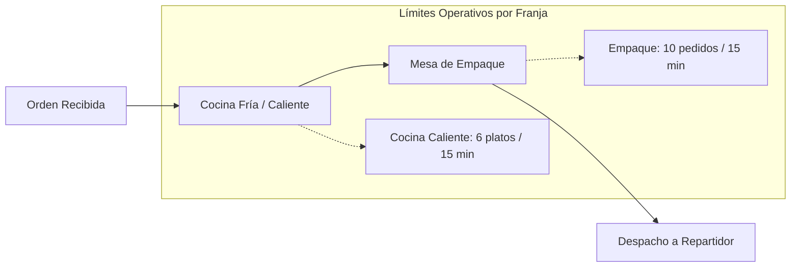
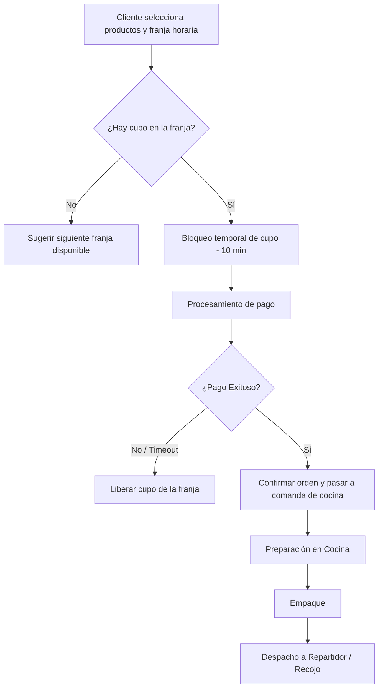

# Caso B: Capacidad en Dark Kitchen

### JaldiShop — Investigación de Dominio para Cocinas Ocultas y Franjas Horarias

[](./matriz-consolidacion.md)
[](./caso-b-dark-kitchen.md)

---

`📍 Docs` > `02-Investigación` > **Caso B: Dark Kitchen**  
[⬅ Caso A: Pastelería](./caso-a-pasteleria.md) | [🏠 Índice General](../../README.md) | [Caso C: Logística ➡](./caso-c-logistica.md)

---

<details open>
<summary><b>📑 Tabla de Contenidos</b></summary>

- [1. Objetivo](#1-objetivo)
- [2. Contexto Operativo](#2-contexto-del-caso)
- [3. Problema: Concentración de Demanda](#3-problema-identificado)
- [4. Capacidad por Franja Horaria](#4-capacidad-por-franja-horaria)
- [5. Cuellos de Botella en Cocina](#5-cuellos-de-botella)
- [6. Ciclo de Vida y Saturación](#6-ciclo-de-vida-y-saturación)
- [7. Reglas Preliminares RN-B](#7-reglas-preliminares-rn-b)

</details>

---

## 1. Objetivo

> [!NOTE]
> Analizar cómo debe funcionar el control de capacidad en una Dark Kitchen (cocina oculta) donde la demanda se concentra fuertemente en franjas horarias específicas (almuerzo/cena) y el cuello de botella es la velocidad de preparación y empaque.

---

## 2. Contexto del Caso

Una Dark Kitchen opera exclusivamente para canales digitales y delivery/recojo. Aunque disponga de ingredientes almacenados, su capacidad está delimitada por la velocidad simultánea de sus estaciones:

* **Cocina Caliente:** Hornillas, freidoras y planchas.
* **Cocina Fría:** Ensaladas, postres, ceviches.
* **Mesa de Empaque y Despacho:** Consolidación de órdenes para repartidores.

> [!IMPORTANT]
> Recibir 40 pedidos en una sola ventana de 15 minutos satura la cocina y degrada la calidad, aun cuando la capacidad teórica diaria sea de 200 pedidos.

---

## 3. Problema Identificado

### Sobreventa Operativa en Horas Pico

```text
Capacidad diaria total: 100 pedidos
-------------------------------------------------
Demanda de 20:00 a 20:15: 40 pedidos entrantes
Capacidad real de cocina en 15 min: 10 pedidos
-------------------------------------------------
Resultado sin control: 30 pedidos con retraso y colapso de cocina
```

---

## 4. Capacidad por Franja Horaria

Para negocios de alta rotación, la unidad de control debe ser la **franja horaria (bloques de 15 a 30 minutos)**:

| Franja Horaria | Capacidad Base (Pedidos) | Estado Típico |
|---|:---:|:---|
| 19:00 - 19:30 | 10 | Preparación de turno |
| 19:30 - 20:00 | 15 | Inicio hora pico |
| 20:00 - 20:30 | 15 | Pico de demanda |
| 20:30 - 21:00 | 12 | Demanda media |

---

## 5. Cuellos de Botella



* **Modelo Simple para el MVP:** Límite global de **$N$ pedidos por franja** (fácil de operar para microempresas).
* **Modelo Avanzado (Evolución):** Control independiente por estación y cálculo de tiempo de preparación (*Food Processing Time*).

---

## 6. Ciclo de Vida y Saturación



---

## 7. Reglas Preliminares RN-B

| Código | Regla de Negocio |
|:---:|---|
| **RN-B01** | La capacidad se configura por bloques o franjas horarias parametrizables. |
| **RN-B02** | Al agotarse los cupos de una franja, el sistema bloquea dicha opción y ofrece la siguiente disponible. |
| **RN-B03** | Durante el checkout se genera una reserva temporal por 10 minutos para evitar condiciones de carrera. |
| **RN-B04** | El comerciante puede registrar excepciones en caliente (ej. fallo de freidora $\rightarrow$ reducir cupos de la franja). |
| **RN-B05** | Una cancelación antes de iniciar cocina libera el cupo al 100%. |

---

[⬅ Caso A: Pastelería](./caso-a-pasteleria.md) | [🏠 Volver al Índice General](../../README.md) | [Caso C: Logística ➡](./caso-c-logistica.md)
