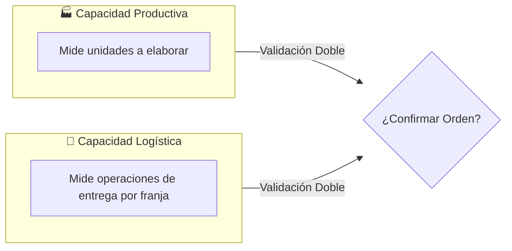
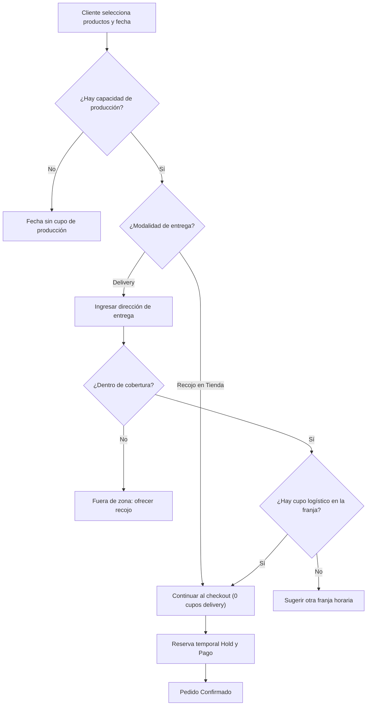

# Caso C: Capacidad Logística y Delivery

### JaldiShop — Investigación de Capacidad en Despacho y Reparto

---

`📍 Docs` > `02-Investigación` > **Caso C: Logística y Delivery**  
[⬅ Caso B: Dark Kitchen](./caso-b-dark-kitchen.md) | [🏠 Índice General](../../README.md) | [Matriz de Consolidación ➡](./matriz-consolidacion.md)

---

## 1. Objetivo

> 📌 **Nota:** Analizar el comportamiento de la capacidad en negocios donde aceptar un pedido no solo depende de elaborar el producto, sino de disponer de repartidores o slots de entrega en el horario solicitado por el cliente.

---

## 2. Contexto del Caso

Un negocio de regalos, desayunos sorpresa o catering puede tener capacidad en cocina para elaborar 10 pedidos, pero disponer únicamente de 2 motorizados para la franja de 7:00 a 8:00 a.m.

> 💡 **Conclusión Clave:** La capacidad de producción y la capacidad logística son **dos dimensiones independientes** que deben sincronizarse.

---

## 3. Separación de Capacidades

---

## 4. Capacidad por Destino

* **Mismo Destino:** Un pedido con 3 cajas de regalo a una misma dirección consume **3 unidades productivas** y **1 único cupo de delivery**.
* **Destinos Distintos:** Tres pedidos a direcciones diferentes consumen **3 cupos de delivery**.
* **Recojo en Tienda:** Consume **0 cupos de delivery**, dependiendo únicamente de la capacidad de producción.

---

## 5. Cobertura y Ubicación

| Factor | Regla en el MVP |
|---|---|
| **Radio de Cobertura** | Validación de distancia máxima en km desde el local. |
| **Cálculo de Tarifa** | Costo fijo o escalonado por rango de distancia (ej. 0-3km: S/5, 3-6km: S/8). |
| **Fuera de Cobertura** | Se inhabilita la opción de delivery y se ofrece recojo en tienda. |

---

## 6. Flujo Completo del Caso C

---

## 7. Reglas Preliminares RN-C

| Código | Regla de Negocio |
|:---:|---|
| **RN-C01** | El sistema valida capacidad productiva y logística antes de confirmar un pedido con delivery. |
| **RN-C02** | Los pedidos con modalidad 'Recojo en tienda' no consumen cupos de delivery. |
| **RN-C03** | Una dirección fuera de la cobertura configurada no puede procesarse como delivery. |
| **RN-C04** | Cancelar un pedido antes de que el motorizado salga libera el cupo logístico para otro cliente. |
| **RN-C05** | Una cancelación con el repartidor en ruta no libera la capacidad logística consumida. |

---

[⬅ Caso B: Dark Kitchen](./caso-b-dark-kitchen.md) | [🏠 Volver al Índice General](../../README.md) | [Matriz de Consolidación ➡](./matriz-consolidacion.md)