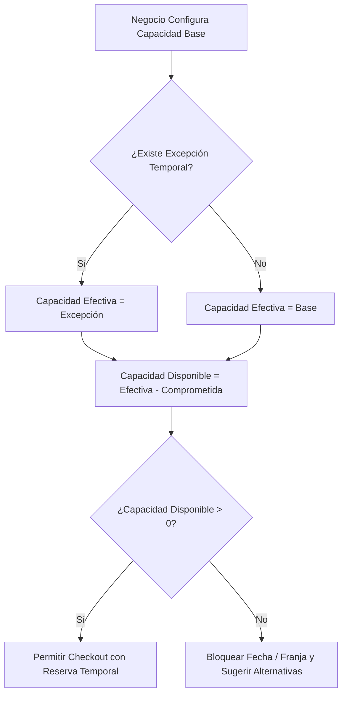
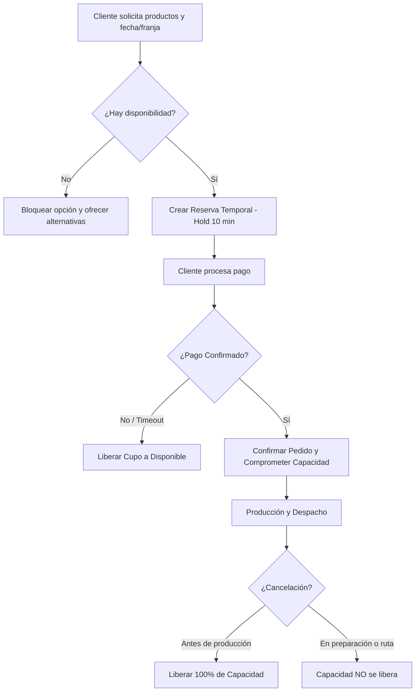

# Matriz de Consolidación

### JaldiShop — Consolidación de Casos de Investigación (A + B + C)

---

`📍 Docs` > `02-Investigación` > **Matriz de Consolidación**  
[⬅ Caso C: Logística](./caso-c-logistica.md) | [🏠 Índice General](../../README.md) | [Alcance del MVP ➡](../03-requisitos/alcance-mvp.md)

---

<b>📑 Tabla de Contenidos</b>

- [1. Objetivo](#1-objetivo)
- [2. Matriz Comparativa](#2-matriz-comparativa)
- [3. Conceptos Comunes Consolidados](#3-conceptos-comunes)
- [4. Flujo Conceptual Resultante](#4-flujo-conceptual-resultante)
- [5. Alcance en el Modelo v1](#5-alcance-en-el-modelo-v1)

---

## 1. Objetivo

> [!NOTE]
> Consolidar los hallazgos de los tres casos de estudio (Caso A: Pastelería, Caso B: Dark Kitchen, Caso C: Logística) para extraer el modelo unificado de control de capacidad de **JaldiShop**.

---

## 2. Matriz Comparativa

| Concepto Clave | Caso A (Pastelería) | Caso B (Dark Kitchen) | Caso C (Logística) | Modelo Consolidado JaldiShop |
|---|---|---|---|:---:|
| **Límite Operativo** | Producción en horno/decorado | Estaciones de cocina en hora pico | Unidades y slots de entrega | **Capacidad Operativa** |
| **Capacidad Base** | Por día | Por franjas horarias | Por franja de despacho | **Configurable (Día/Franja)** |
| **Unidad de Consumo** | 1 torta = 1 cupo | Pedidos por ventana | 1 destino = 1 cupo | **1 pedido = 1 cupo (MVP)** |
| **Excepciones** | Sí (fechas festivas) | Sí (fallas de equipo) | Sí (refuerzo motorizados) | **Excepción con Prioridad** |
| **Saturación** | Cierre de fecha | Desplazamiento a otra franja | Inhabilitar delivery en franja | **Bloqueo Automático** |
| **Checkout** | Reserva necesaria | Reserva necesaria | Reserva necesaria | **Hold Temporal (10 min)** |
| **Cancelaciones** | Condicional al avance | Condicional a cocina | Condicional a ruta | **Regla por Estado Operativo** |

---

## 3. Conceptos Comunes

* **Capacidad Efectiva:** Saldo aplicable evaluando excepciones temporales.
* **Capacidad Comprometida:** Suma de pedidos pagados más carritos en checkout activo.
* **Capacidad Disponible:** Saldo neto para nuevos pedidos.

---

## 4. Flujo Conceptual Resultante

---

## 5. Alcance en el Modelo v1

| Funcionalidad | Estado en MVP v1 | Estado en Evolución Futura |
|---|:---:|:---:|
| Capacidad simple por día y franja | ✅ Incluido | — |
| Excepciones temporales | ✅ Incluido | — |
| Reserva temporal durante checkout | ✅ Incluido | — |
| Validación de cobertura y distancia | ✅ Incluido | — |
| Consumo ponderado por producto | ❌ Excluido | 🔄 Fase 2 |
| Estaciones independientes de cocina | ❌ Excluido | 🔄 Fase 2 |
| Optimización automática de rutas GPS | ❌ Excluido | 🔄 Fase 2 |

---

[⬅ Caso C: Logística](./caso-c-logistica.md) | [🏠 Volver al Índice General](../../README.md) | [Alcance del MVP ➡](../03-requisitos/alcance-mvp.md)