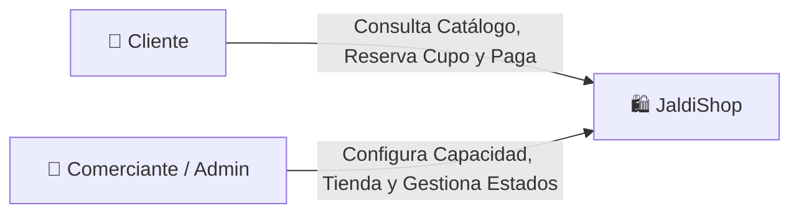
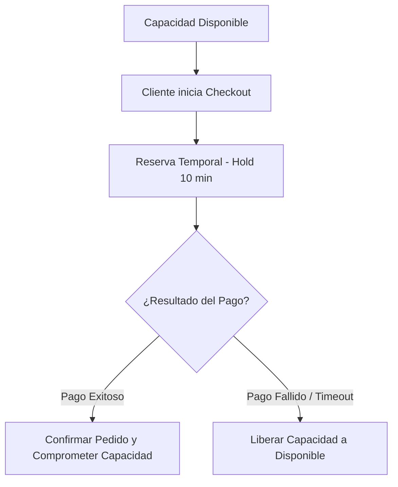
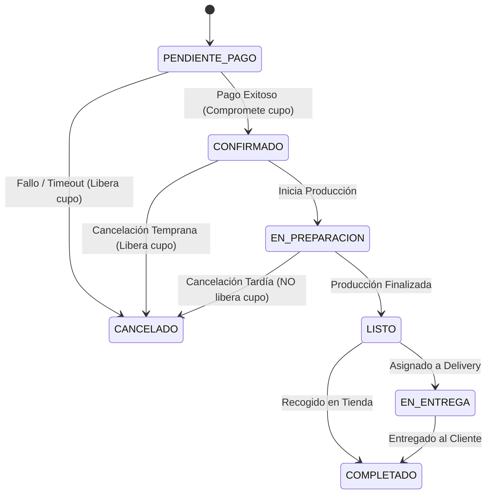

# Alcance del MVP

### JaldiShop — Definición de Requisitos y Alcance Funcional v1.0

---

`📍 Docs` > `03-Requisitos` > **Alcance del MVP**  
[⬅ Matriz de Consolidación](../02-investigacion/matriz-consolidacion.md) | [🏠 Índice General](../../README.md) | [AS-IS vs TO-BE ➡](../04-design/proceso/as-is-to-be.md)

---

## 1. Propósito

> [!NOTE]
> Define el alcance funcional de la primera versión operativa de **JaldiShop**, estableciendo los módulos indispensables (*Must Have*), las funcionalidades complementarias y los límites claros para evitar sobreingeniería.

---

## 2. Descripción del Producto

**JaldiShop** es una plataforma web para MYPE gastronómicas y de manufactura bajo pedido que venden por WhatsApp e Instagram. Funciona como una **capa de orden** que centraliza la recepción de pedidos y valida la **capacidad operativa en tiempo real**, evitando la sobreventa y los pedidos incumplidos.

---

## 3. Objetivo del MVP

Demostrar un flujo completo de extremo a extremo donde:
1. El comerciante configura su tienda, productos y capacidad base (por día y franja horaria).
2. El cliente consulta el catálogo, añade al carrito y elige fecha/franja horaria.
3. El sistema valida simultáneamente stock de producto y capacidad disponible.
4. Se genera una reserva temporal (*Hold* de 10 minutos) durante el checkout.
5. El pago confirmado compromete el cupo y envía el pedido al panel del comerciante.
6. El cliente realiza seguimiento de estados en tiempo real.

---

## 4. Actores del MVP

* **Cliente:** Navega el catálogo, verifica disponibilidad, compra y rastrea su pedido.
* **Comerciante (MYPE):** Administra productos, inventario, cupos de capacidad, excepciones y órdenes activas.

---

## 5. Modelo de Tiendas

JaldiShop maneja tiendas independientes (*Stores*):
* Cada comerciante administra su propia tienda de forma aislada.
* Cada tienda mantiene sus productos, categorías, inventario, capacidad y pedidos separados de otros comercios.

---

## 6. Diferencia entre Inventario y Capacidad

> [!IMPORTANT]
> **Inventario:** *¿Hay stock físico del producto o insumo?*  
> **Capacidad:** *¿Tiene el negocio tiempo, personal y slots de entrega para atender otro pedido en esa franja?*

---

## 7. Modelo de Capacidad del MVP

* **Regla del MVP:** 1 pedido = 1 cupo de capacidad.
* **Granularidad:** Configuración por día completo o por franjas horarias (15 a 60 min).
* **Excepciones:** Capacidad temporal para fechas de alta demanda o imprevistos técnicos.
* **Saturación:** Bloqueo automático de franjas cuando $\text{Capacidad Disponible} = 0$.

---

## 8. Reserva Temporal de Capacidad

---

## 9. Módulos Incluidos en el MVP

| Módulo | Prioridad | Funcionalidades Clave |
|---|:---:|---|
| **Autenticación** | `Must Have` | Registro, login, JWT y roles (Cliente / Comerciante). |
| **Gestión de Tienda** | `Must Have` | Perfil del negocio, horarios y aislamiento de datos. |
| **Catálogo e Inventario** | `Must Have` | CRUD de productos, categorías, imágenes y stock. |
| **Motor de Capacidad** | `Must Have` | Capacidad base, franjas, excepciones y reservas temporales. |
| **Carrito y Checkout** | `Must Have` | Carrito persistente y bloqueo temporal de cupo. |
| **Gestión de Pedidos** | `Must Have` | Dashboard de órdenes, actualización de estados y detalle. |
| **Pagos Sandbox** | `Must Have` | Integración con pasarela de pagos en modo pruebas. |
| **Delivery Básico** | `Must Have` | Selección Delivery vs Recojo, validación de cobertura y costo. |

---

## 10. Máquina de Estados del Pedido

---

## 11. Priorización General

| Funcionalidad | Prioridad MoSCoW | Justificación |
|---|:---:|---|
| Autenticación, Catálogo, Carrito y Pagos | **Must Have** | Flujo comercial esencial |
| Motor de Capacidad y Reservas Temporales | **Must Have** | **Diferenciador central de JaldiShop** |
| Panel Dashboard del Comerciante | **Must Have** | Gestión de órdenes para la MYPE |
| Notificaciones por Correo | **Should Have** | Confirmación transaccional al cliente |
| Integración con Maps (Radio de Cobertura) | **Could Have** | Valor agregado para delivery |
| Optimización de Rutas y GPS en Vivo | **Won't Have (v1)** | Excluido para evitar sobreingeniería |
| IA predictiva de saturación | **Won't Have (v1)** | Reservado para Fase 2 |

---

## 12. Criterio de Éxito del MVP

El MVP se considerará 100% exitoso cuando permita ejecutar de punta a punta:
1. Configuración de tienda y capacidad base por el comerciante.
2. Navegación del cliente y selección de franja horaria.
3. Bloqueo automático de opciones saturadas.
4. Reserva transaccional (*Hold*) durante el pago.
5. Confirmación del pedido y actualización en tiempo real en el dashboard del negocio.

---

[⬅ Matriz de Consolidación](../02-investigacion/matriz-consolidacion.md) | [🏠 Volver al Índice General](../../README.md) | [AS-IS vs TO-BE ➡](../04-design/proceso/as-is-to-be.md)
