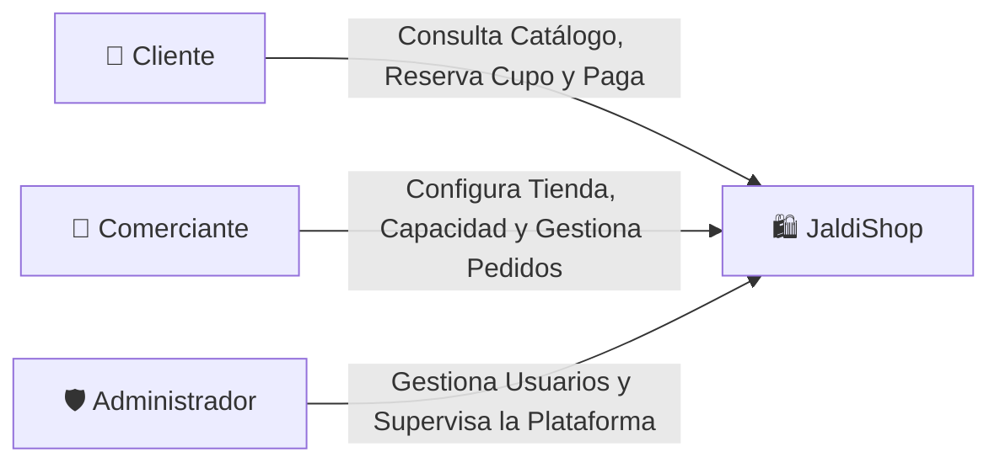
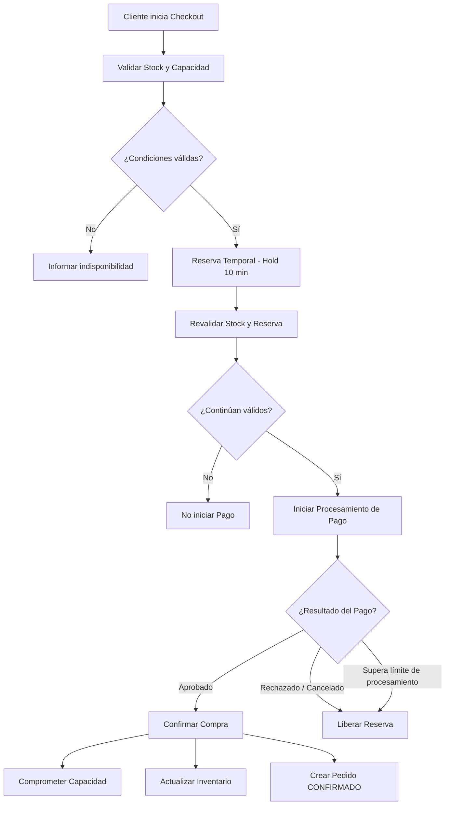
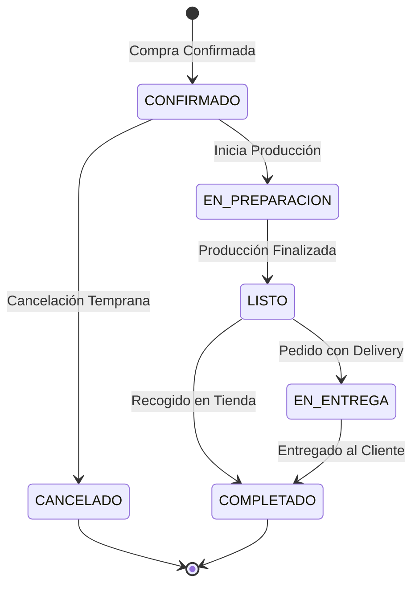

# Alcance del MVP

### JaldiShop — Definición de Requisitos y Alcance Funcional v1.1

[](./alcance-mvp.md)
[](./alcance-mvp.md)

---

`📍 Docs` > `03-Requisitos` > **Alcance del MVP**  
[⬅ Matriz de Consolidación](../02-investigacion/matriz-consolidacion.md) | [🏠 Índice General](../../README.md) | [AS-IS vs TO-BE ➡](../04-design/proceso/as-is-to-be.md)

---

## 1. Propósito

> 📌 **Nota:** Define el alcance funcional de la primera versión operativa de **JaldiShop**, estableciendo los módulos indispensables (*Must Have*), las funcionalidades complementarias y los límites claros para evitar sobreingeniería.

---

## 2. Descripción del Producto

> 💡 **Concepto Central:**  
> **JaldiShop** es una plataforma web para MYPE gastronómicas y de manufactura bajo pedido que venden por WhatsApp e Instagram. Funciona como una **capa de orden** que centraliza la recepción de pedidos y valida la **capacidad operativa en tiempo real**, evitando la sobreventa y los pedidos incumplidos.

---

## 3. Objetivo del MVP

> 📌 **Alcance Estratégico:**  
> El objetivo principal de JaldiShop v1 es validar un flujo comercial y operativo integral de extremo a extremo. El proceso inicia cuando el comerciante registra su tienda, cataloga sus productos y establece su capacidad operativa habitual por día o franjas horarias. A partir de allí, el cliente accede al catálogo digital, selecciona productos y elige la fecha u horario deseado, momento en el cual el sistema valida simultáneamente el stock y la disponibilidad de capacidad.

Durante el checkout se genera una reserva temporal de capacidad de **diez minutos para iniciar el proceso de pago**, protegiendo el cupo ante accesos concurrentes. Antes de iniciar el procesamiento del pago, el sistema revalida el stock y la vigencia de la reserva.

Si el pago se inicia mientras la reserva continúa vigente, el cupo permanece temporalmente protegido durante su procesamiento, sujeto a un límite de procesamiento. Una vez aprobado el pago y confirmada correctamente la operación, el inventario se actualiza, el cupo pasa de reservado a comprometido, se crea el pedido en estado **CONFIRMADO**, el comerciante recibe la orden en su panel de control y el cliente puede consultar posteriormente su estado.

---

## 4. Actores del MVP



| Actor | Rol Principal | Alcance en MVP |
|---|---|---|
| **👤 Cliente** | Navega el catálogo, verifica disponibilidad, compra y consulta el estado de sus pedidos | Acceso completo al flujo de compra y seguimiento |
| **🏪 Comerciante (MYPE)** | Administra productos, inventario, cupos de capacidad, excepciones y pedidos de su tienda | Gestión operativa completa de su tienda |
| **🛡️ Administrador** | Realiza funciones básicas de administración general de JaldiShop | Usuarios, roles y supervisión básica |

> 📌 **Alcance del administrador:** El rol Administrador forma parte del MVP, pero no implica desarrollar un backoffice avanzado. Las funciones de analítica global, auditoría avanzada y supervisión detallada quedan fuera del núcleo de la primera versión.

---

## 5. Modelo de Tiendas

> 🏪 **Tiendas Independientes:**  
> JaldiShop maneja tiendas independientes (*Stores*) donde cada comerciante opera de forma aislada.

| Regla | Descripción |
|---|---|
| **Única tienda por comerciante** | Para el MVP, **un comerciante administra una única tienda** |
| **Aislamiento de datos** | Cada tienda mantiene sus productos, categorías, inventario, capacidad, reservas y pedidos separados de otros comercios |
| **Administración exclusiva** | Un comerciante únicamente puede administrar la tienda que tiene asociada |
| **Sin sucursales** | El soporte para múltiples tiendas o sucursales por comerciante queda fuera de JaldiShop v1 |

---

## 6. Diferencia entre Inventario y Capacidad

> 💡 **Principio Clave:**  
> **Inventario:** *¿Hay stock físico suficiente del producto?*  
> **Capacidad:** *¿Puede el negocio atender otro pedido en la fecha o franja seleccionada?*

Ambos recursos se administran de forma independiente:

* Incorporar un producto al carrito **no reserva inventario ni capacidad**.
* El inventario no se reserva temporalmente durante el checkout en el MVP.
* El stock se valida durante el proceso de compra y se **revalida inmediatamente antes de iniciar el pago**.
* La capacidad sí utiliza una reserva temporal durante el checkout.

---

## 7. Modelo de Capacidad del MVP

> ⚡ **Regla Fundamental:**  
> **1 pedido = 1 cupo de capacidad.** Esta es la regla base del MVP para simplificar la gestión operativa.

| Característica | Descripción |
|---|---|
| **Granularidad** | Configuración por día completo o por franjas horarias |
| **Capacidad base** | Cada tienda establece su capacidad habitual para sus periodos de operación |
| **Excepciones** | El comerciante puede modificar temporalmente la capacidad para una fecha o periodo específico sin alterar su configuración base |
| **Saturación** | Bloqueo automático de periodos cuando `Capacidad Disponible = 0` |

La capacidad disponible se determina mediante:

```text
Capacidad Disponible =
Capacidad Efectiva
- Capacidad Reservada
- Capacidad Comprometida
```

Donde:

| Concepto | Significado |
|---|---|
| **Capacidad Efectiva** | Capacidad aplicable al periodo considerando la configuración base y las excepciones temporales. |
| **Capacidad Reservada** | Cupos retenidos temporalmente durante procesos de checkout. |
| **Capacidad Comprometida** | Cupos correspondientes a pedidos ya confirmados. |
| **Capacidad Disponible** | Cupos que todavía pueden utilizarse para nuevos pedidos. |

---

## 8. Reserva Temporal de Capacidad



> ⏱️ **Hold de 10 Minutos:**  
> La reserva temporal tendrá una duración inicial fija de **10 minutos**. Este periodo representa el tiempo disponible para que el cliente inicie correctamente el proceso de pago.

Si el pago se inicia mientras la reserva continúa vigente, el cupo permanecerá temporalmente protegido durante el procesamiento. Esta protección no podrá mantenerse indefinidamente y finalizará cuando:

* El pago sea aprobado.
* El pago sea rechazado o cancelado.
* Se alcance el límite máximo definido para el procesamiento.

> ⚠️ **Validación Crítica:**  
> Un resultado de pago recibido cuando la operación ya haya dejado de ser válida **no deberá confirmar automáticamente un pedido**.

---

## 9. Módulos Incluidos en el MVP

> 📦 **Módulos Priorizados:**  
> El siguiente detalle muestra los módulos del MVP organizados por prioridad MoSCoW.

### Must Have (Imprescindibles)

| Módulo | Funcionalidades Clave |
|---|---|
| **Autenticación** | Registro, login, JWT y roles (Cliente / Comerciante / Administrador). |
| **Gestión de Tienda** | Perfil del negocio, horarios y aislamiento de datos. |
| **Catálogo e Inventario** | CRUD de productos, categorías, imágenes, stock y validación de disponibilidad. |
| **Motor de Capacidad** | Capacidad base, franjas, excepciones y reservas temporales. |
| **Carrito y Checkout** | Carrito persistente, revalidaciones y bloqueo temporal de cupo. |
| **Gestión de Pedidos** | Dashboard de pedidos, actualización de estados y detalle. |
| **Pagos Sandbox** | Integración con pasarela de pagos en modo pruebas. |
| **Delivery Básico** | Selección Delivery vs Recojo e ingreso de dirección cuando corresponda. |
| **Administración Básica** | Gestión básica de usuarios, roles y control general de la plataforma. |

### Should Have (Deseables)

| Módulo | Funcionalidades Clave |
|---|---|
| **Seguimiento de Pedidos** | Consulta de cambios de estado del pedido. |
| **Notificaciones por Correo** | Confirmaciones y notificaciones transaccionales básicas. |

### Could Have (Opcionales)

| Módulo | Funcionalidades Clave |
|---|---|
| **Maps y Cobertura** | Ubicación, visualización geográfica y validación de cobertura para delivery. |

---

## 10. Máquina de Estados del Pedido

> 🔄 **Flujo Operativo:**  
> En JaldiShop v1, el proceso previo a la aprobación del pago corresponde al **checkout, reserva e intento de pago**. Por ello, el pedido operativo se crea una vez confirmada correctamente la compra e inicia en estado **CONFIRMADO**.



### Política básica de cancelación

| Escenario | Comportamiento |
|---|---|
| **Cancelación en CONFIRMADO** | El cliente puede cancelar mediante el flujo ordinario mientras el pedido permanezca en **CONFIRMADO**. Una cancelación en estado **CONFIRMADO** libera el cupo comprometido. |
| **Cancelación en EN_PREPARACION** | Una vez iniciado **EN_PREPARACION**, el cliente no podrá cancelar mediante el flujo ordinario del MVP. |
| **Cancelación excepcional** | El comerciante podrá realizar cancelaciones excepcionales cuando no pueda continuar con la atención. |
| **Impacto en capacidad** | Una cancelación durante o después de la preparación no recuperará el cupo operativo del periodo. |

---

## 11. Priorización General

> 🎯 **Priorización MoSCoW:**  
> El siguiente detalle muestra la priorización de funcionalidades para el MVP de JaldiShop.

### Must Have (Imprescindibles)

| Funcionalidad | Justificación |
|---|---|
| Autenticación, Catálogo, Carrito y Pagos | Flujo comercial esencial |
| Inventario | Evita confirmar compras sin stock suficiente |
| Motor de Capacidad y Reservas Temporales | **Diferenciador central de JaldiShop** |
| Panel Dashboard del Comerciante | Gestión de pedidos y operación de la MYPE |
| Administración Básica | Gestión mínima de usuarios, roles y control de plataforma |
| Delivery / Recojo | Define la modalidad de entrega del pedido |

### Should Have (Deseables)

| Funcionalidad | Justificación |
|---|---|
| Seguimiento de Pedidos | Reduce consultas manuales y mejora la experiencia |
| Notificaciones por Correo | Confirmación transaccional al cliente |

### Could Have (Opcionales)

| Funcionalidad | Justificación |
|---|---|
| Integración con Maps (Cobertura) | Valor agregado para delivery |
| Supervisión Administrativa Avanzada | Facilita monitoreo global sin ser esencial para validar el MVP |

### Won't Have (v1) - Excluidos

| Funcionalidad | Justificación |
|---|---|
| Optimización de Rutas y GPS en Vivo | Excluido para evitar sobreingeniería |
| IA predictiva de saturación | Reservado para Fase 2 |

---

## 12. Criterio de Éxito del MVP

> ✅ **Definición de Éxito:**  
> El MVP se considerará completamente exitoso cuando una tienda opere de forma autónoma desde la configuración inicial hasta la entrega final. Esto implica que el comerciante pueda gestionar su catálogo, inventario y límites operativos, mientras los clientes navegan, seleccionan periodos disponibles y procesan compras con reserva temporal de capacidad.

El sistema deberá:

| Criterio | Descripción |
|---|---|
| **Bloqueo de saturación** | Bloquear nuevos intentos de reserva en periodos saturados. |
| **Revalidación previa** | Revalidar stock y reserva antes de iniciar el procesamiento del pago. |
| **Control de stock** | Evitar confirmar pedidos sin stock suficiente. |
| **Stock no negativo** | Evitar que el stock resulte negativo. |
| **Exclusividad de cupo** | Evitar que un mismo cupo sea asignado simultáneamente a más de una compra. |
| **Confirmación válida** | Confirmar el pedido únicamente después de una operación válida y un pago aprobado. |
| **Prevención de duplicados** | Evitar el procesamiento duplicado de una misma confirmación. |
| **Aislamiento de tiendas** | Mantener separados los datos operativos de cada tienda. |
| **Gestión del comerciante** | Permitir al comerciante gestionar el ciclo de atención del pedido. |
| **Seguimiento del cliente** | Permitir al cliente consultar el estado de sus pedidos. |

> ✅ **Validación principal:** JaldiShop debe demostrar que una MYPE puede controlar simultáneamente **inventario y capacidad operativa**, evitando aceptar pedidos que físicamente podría vender pero que operativamente no puede atender.

---

## 13. Fuera del Alcance de JaldiShop v1

> ⚠️ **Límites del MVP:**  
> Las siguientes funcionalidades quedan expresamente excluidas de la primera versión para evitar sobreingeniería y centrar los esfuerzos en la validación del modelo core.

### Capacidad y Recursos

| Funcionalidad | Motivo de Exclusión |
|---|---|
| Capacidad ponderada según producto | Complejidad adicional sin validación de mercado |
| Capacidad basada en múltiples recursos, estaciones o trabajadores | Modelo avanzado para fases posteriores |
| Reserva temporal de inventario | No esencial para la validación del MVP |

### Gestión de Tiendas

| Funcionalidad | Motivo de Exclusión |
|---|---|
| Más de una tienda o sucursal por comerciante | Modelo de una sola tienda para MVP |
| Personal y permisos avanzados por tienda | Funcionalidad administrativa avanzada |

### Procesos de Negocio

| Funcionalidad | Motivo de Exclusión |
|---|---|
| Políticas avanzadas de cancelación y reembolso | Flujo simplificado para MVP |
| Tarifas avanzadas de delivery | Modelo básico de delivery |

### Tecnología e Integraciones

| Funcionalidad | Motivo de Exclusión |
|---|---|
| Optimización automática de rutas | Requiere integración con proveedores externos |
| GPS en tiempo real | Funcionalidad de alto costo para MVP |
| Integraciones directas con WhatsApp o Instagram | Depende de APIs de terceros con costos asociados |
| Predicción de demanda mediante inteligencia artificial | Modelo avanzado para fases posteriores |
| Analítica y auditoría administrativa avanzada | Funcionalidad de backoffice avanzado |

---

## 14. Decisiones Técnicas Posteriores

> 🔧 **Arquitectura Diferida:**  
> Este documento define el alcance funcional del producto. Las decisiones sobre la forma concreta de implementar estas reglas serán documentadas posteriormente durante el diseño y la arquitectura.

Entre ellas se encuentran:

| Área | Decisiones Pendientes |
|---|---|
| **Seguridad** | Implementación de JWT y seguridad |
| **Concurrencia** | Control de concurrencia y estrategia de idempotencia |
| **Transacciones** | Manejo de transacciones y posible uso de `Idempotency-Key` |
| **Tiempo Real** | Uso de WebSocket para actualizaciones en tiempo real |
| **Integraciones** | Pasarela de pagos definitiva y proveedor de mapas |
| **API** | Diseño de endpoints REST |
| **Base de Datos** | Diseño físico de PostgreSQL |
| **Despliegue** | Estrategia de despliegue |

---

[⬅ Matriz de Consolidación](../02-investigacion/matriz-consolidacion.md) | [🏠 Volver al Índice General](../../README.md) | [AS-IS vs TO-BE ➡](../04-design/proceso/as-is-to-be.md)
