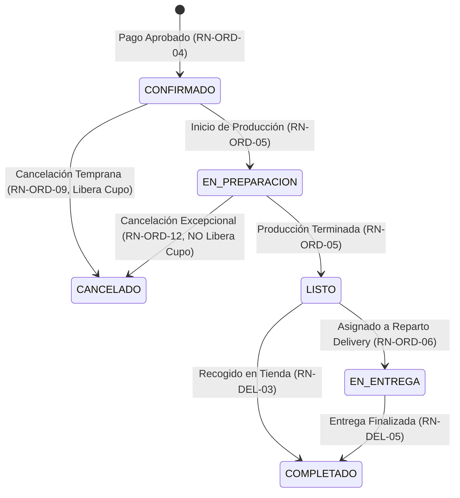

# Reglas de Negocio Oficiales

### JaldiShop — Definición de Restricciones e Invariantes del Dominio v1.0

[](./reglas-negocio.md)
[](./reglas-negocio.md)
[](../06-scrum/sprint-02.md)

---

`📍 Docs` > `03-Requisitos` > **Reglas de Negocio**  
[⬅ Alcance del MVP](./alcance-mvp.md) | [🏠 Índice General](../../README.md) | [AS-IS vs TO-BE ➡](../04-design/proceso/as-is-to-be.md)

---

## 1. Objetivo y Alcance

> 📌 **Nota:** Este documento define formalmente las reglas e invariantes de negocio que gobiernan el comportamiento operativo del MVP de **JaldiShop**.

Las reglas aquí descritas expresan políticas, restricciones y validaciones puras del dominio. No definen detalles técnicos de implementación, tecnologías, endpoints ni mecanismos específicos de infraestructura o persistencia.

```mermaid
flowchart LR
    subgraph CONFIG["🏪 Tienda & Catálogo"]
        STR["RN-STR: Tienda Aislada"]
        PRD["RN-PRD: Precios y Estados"]
        INV["RN-INV: Stock No Negativo"]
        CAP["RN-CAP: Límites y Franjas"]
    end

    subgraph CHECKOUT["⚡ Validación & Pago"]
        CART["RN-CART: Carrito Consistente"]
        RES["RN-RES: Hold Temporal 10 min"]
        PAY["RN-PAY: Aprobación Única"]
    end

    subgraph ORDENES["📦 Cumplimiento"]
        ORD["RN-ORD: Estados del Pedido"]
        DEL["RN-DEL: Delivery vs Recojo"]
    end

    CONFIG --> CHECKOUT --> ORDENES
```



---

## 2. Tiendas (Store)

* **RN-STR-01 (Asociación de datos a tienda):** Todos los productos, categorías, inventarios, configuraciones de capacidad y pedidos deberán pertenecer obligatoriamente a una tienda específica.
* **RN-STR-02 (Separación de información):** La información operativa de una tienda deberá mantenerse estrictamente aislada de los datos pertenecientes a otros comercios registrados en la plataforma.
* **RN-STR-03 (Administración única):** Para el MVP, cada comerciante administrará una única tienda.
* **RN-STR-04 (Alcance de administración):** Un comerciante únicamente podrá consultar y modificar la información correspondiente a la tienda que tiene asignada.

---

## 3. Usuarios y Roles

* **RN-USR-01 (Roles del MVP):** Los usuarios de JaldiShop operarán bajo los roles formales `CLIENTE` y `COMERCIANTE`.
* **RN-USR-02 (Operaciones según rol):** Los permisos de acceso a las funcionalidades del sistema estarán estrictamente delimitados por el rol asignado al usuario.
* **RN-USR-03 (Propiedad de pedidos):** Un cliente únicamente podrá consultar y gestionar los pedidos asociados a su propia cuenta de usuario.

---

## 4. Productos y Categorías

* **RN-PRD-01 (Pertenencia del producto):** Todo producto pertenecerá a una única tienda.
* **RN-PRD-02 (Categoría obligatoria):** Todo producto estará asociado a una categoría registrada dentro de su misma tienda.
* **RN-PRD-03 (Precio válido):** Todo producto habilitado para venta deberá registrar un precio unitario mayor que cero.
* **RN-PRD-04 (Estado del producto):** Un producto podrá encontrarse activo o inactivo; únicamente los productos en estado activo estarán visibles para nuevas compras.
* **RN-PRD-05 (Producto habilitado en compra):** Solo los productos en estado activo podrán ser agregados a órdenes de compra.
* **RN-PRD-06 (Cantidad positiva):** La cantidad solicitada de cualquier producto en una orden deberá ser siempre un entero mayor que cero.
* **RN-PRD-07 (Pertenencia de categoría):** Las categorías creadas por una tienda serán de uso exclusivo de dicha tienda.
* **RN-PRD-08 (Precio de compra al momento del pago):** La confirmación de una compra registrará el precio unitario vigente del producto al momento exacto de procesar la transacción.
* **RN-PRD-09 (Precio histórico inmutable):** Las modificaciones posteriores al catálogo de precios no alterarán los montos registrados en pedidos previamente confirmados.

---

## 5. Inventario

* **RN-INV-01 (Inventario por tienda):** El control de stock de un producto corresponderá exclusivamente a la tienda propietaria.
* **RN-INV-02 (Disponibilidad de stock):** Una compra no podrá confirmarse si la cantidad requerida de alguno de los productos supera el stock disponible en ese instante.
* **RN-INV-03 (Validación previa):** El sistema comprobará la existencia de stock suficiente antes de permitir el paso al proceso de pago.
* **RN-INV-04 (Descuento de inventario):** Las existencias se descontarán de forma definitiva únicamente cuando el pedido quede formalmente confirmado tras un pago exitoso.
* **RN-INV-05 (Descuento exacto):** La cantidad descontada del inventario coincidirá con las unidades confirmadas en el pedido.
* **RN-INV-06 (Stock no negativo):** Ninguna confirmación de pedido podrá provocar que el stock disponible de un producto sea menor a cero.
* **RN-INV-07 (Umbral de stock bajo):** Un producto se marcará en estado de stock bajo cuando sus existencias disponibles sean menores o iguales al umbral configurado por el comerciante.
* **RN-INV-08 (Integridad por tienda):** Los productos validados en una orden deberán pertenecer en su totalidad a la misma tienda de la compra.
* **RN-INV-09 (Revalidación previa al pago):** El stock de todos los productos de la compra se revalidará inmediatamente antes de iniciar el cobro en la pasarela; si el stock es insuficiente, la transacción se cancelará.

---

## 6. Carrito de Compras

* **RN-CART-01 (Asociación a tienda):** Cada carrito de compra estará vinculado a una única tienda.
* **RN-CART-02 (Consistencia de productos):** No se permitirá mezclar en un mismo carrito productos pertenecientes a distintas tiendas.
* **RN-CART-03 (Cantidad mínima):** La cantidad de cada ítem en el carrito deberá ser mayor que cero.
* **RN-CART-04 (Carácter no reservado del carrito):** Agregar productos al carrito no bloquea ni reserva stock físico ni capacidad operativa.

---

## 7. Capacidad Operativa

* **RN-CAP-01 (Configuración independiente):** Cada tienda gestionará de forma autónoma sus parámetros de capacidad operativa.
* **RN-CAP-02 (Periodos de capacidad):** La capacidad operativa podrá definirse por día completo o por franjas horarias específicas.
* **RN-CAP-03 (Capacidad base):** El comerciante establecerá una capacidad base habitual para sus operaciones estándar.
* **RN-CAP-04 (Excepciones temporales):** El comerciante podrá registrar variaciones puntuales (aumentos, reducciones o cierres) para una fecha o franja sin alterar su configuración base.
* **RN-CAP-05 (Prioridad de excepciones):** Durante el periodo de vigencia de una excepción temporal, esta sobrescribirá la capacidad base y determinará la capacidad efectiva.
* **RN-CAP-06 (Unidad de capacidad del MVP):** Cada pedido confirmado consumirá exactamente un (1) cupo de capacidad del periodo seleccionado, independientemente de la cantidad o mezcla de productos.
* **RN-CAP-07 (Cálculo de disponibilidad):** La disponibilidad se calculará mediante la siguiente fórmula:

```text
Capacidad Disponible = Capacidad Efectiva - Capacidad Reservada (Hold) - Capacidad Comprometida
```

* **RN-CAP-08 (Saturación automática):** El sistema bloqueará de inmediato nuevas reservas cuando la capacidad disponible del periodo llegue a cero (`Capacidad Disponible = 0`).
* **RN-CAP-09 (Capacidad mínima para compra):** Una orden solo podrá avanzar al checkout si existe al menos un (1) cupo disponible en la fecha o franja horaria solicitada.

---

## 8. Reservas Temporales de Capacidad (Hold)

* **RN-RES-01 (Reserva previa al pago):** Al ingresar al checkout, el sistema creará una reserva temporal bloqueando un cupo en la franja horaria seleccionada.
* **RN-RES-02 (Condición de reserva):** La reserva temporal solo se generará si `Capacidad Disponible >= 1`.
* **RN-RES-03 (Duración de la reserva):** La reserva temporal tendrá una vigencia fija de diez (10) minutos.
* **RN-RES-04 (Expiración automática):** Si el pago no se completa dentro de los 10 minutos, la reserva expirará de forma automática.
* **RN-RES-05 (Liberación de cupo):** Al expirar una reserva o cancelarse el checkout, el cupo retenido retornará inmediatamente al saldo de capacidad disponible.
* **RN-RES-06 (Exclusividad anti-concurrencia):** Un mismo cupo de capacidad no podrá ser asignado simultáneamente a más de un cliente.
* **RN-RES-07 (Conversión a pedido):** Al confirmarse el pago exitoso, la reserva temporal se transformará en capacidad comprometida definitiva.
* **RN-RES-08 (Revalidación de reserva):** Antes de ejecutar el cobro, el sistema verificará que la reserva temporal permanezca activa y no haya expirado.
* **RN-RES-09 (Protección durante el cobro):** Si la pasarela de pagos está procesando la transacción al momento en que expira el temporizador, el cupo se mantendrá retenido hasta recibir la respuesta definitiva de la pasarela.
* **RN-RES-10 (Límite de procesamiento):** La retención por procesamiento de pago tendrá una tolerancia máxima acotada para evitar bloqueos indefinidos.
* **RN-RES-11 (Liberación por fallo de pago):** Si la pasarela rechaza la transacción o se supera el límite de tiempo, la reserva temporal se anulará y liberará el cupo.

---

## 9. Pagos y Transacciones

* **RN-PAY-01 (Intentos de pago):** El cliente podrá realizar múltiples intentos de pago dentro de la ventana de vigencia de su reserva temporal.
* **RN-PAY-02 (Confirmación exclusiva por pago aprobado):** Únicamente una respuesta de pago aprobado permitirá formalizar la confirmación de la orden.
* **RN-PAY-03 (Pago rechazado):** Un intento fallido o rechazado no generará pedido ni comprometerá de forma definitiva la capacidad.
* **RN-PAY-04 (Reserva obligatoria):** Ningún cobro podrá procesarse sin una reserva temporal de capacidad activa y válida.
* **RN-PAY-05 (Idempotencia y unicidad):** Una misma transacción de pago no podrá generar órdenes duplicadas ni descontar inventario o capacidad más de una vez.
* **RN-PAY-06 (Pago de uso único):** Un comprobante de pago aprobado utilizado para una orden no podrá ser reutilizado para confirmar compras posteriores.
* **RN-PAY-07 (Resultados fuera de tiempo):** Una confirmación de pago recibida cuando la reserva ya haya expirado y el cupo haya sido tomado por otro cliente no creará automáticamente el pedido; requerirá gestión de excepción.

---

## 10. Pedidos y Máquina de Estados



* **RN-ORD-01 (Creación de orden):** Todo pedido nacerá formalmente tras la confirmación satisfactoria de la compra y el pago.
* **RN-ORD-02 (Pertenencia a tienda):** Todo pedido pertenecerá a una única tienda.
* **RN-ORD-03 (Asociación al cliente):** Todo pedido estará enlazado al cliente que efectuó la compra.
* **RN-ORD-04 (Estado inicial):** Todo nuevo pedido comenzará directamente en estado `CONFIRMADO`.
* **RN-ORD-05 (Flujo de preparación estándar):** Los pedidos avanzarán secuencialmente por: `CONFIRMADO` $\rightarrow$ `EN_PREPARACION` $\rightarrow$ `LISTO` $\rightarrow$ `COMPLETADO`.
* **RN-ORD-06 (Secuencia con delivery):** En pedidos con despacho a domicilio, el estado `LISTO` pasará a `EN_ENTREGA` antes de marcarse como `COMPLETADO`.
* **RN-ORD-07 (Transiciones válidas):** Los estados de un pedido solo podrán modificarse siguiendo estrictamente el flujo permitido.
* **RN-ORD-08 (Estados finales inmutables):** Los pedidos en estado `COMPLETADO` o `CANCELADO` son terminales y no podrán reactivarse.
* **RN-ORD-09 (Cancelación por el cliente):** El cliente podrá cancelar su pedido de forma directa únicamente mientras permanezca en estado `CONFIRMADO`.
* **RN-ORD-10 (Recuperación de cupo por cancelación temprana):** Cancelar un pedido en estado `CONFIRMADO` devolverá de forma automática el cupo de capacidad al periodo correspondiente.
* **RN-ORD-11 (Bloqueo de cancelación en preparación):** Una vez que el pedido pase a `EN_PREPARACION`, el cliente no podrá cancelarlo desde la plataforma.
* **RN-ORD-12 (Cancelación por el comerciante):** El comerciante podrá cancelar una orden de su tienda ante imprevistos operacionales insalvables.
* **RN-ORD-13 (Capacidad ante cancelación del comerciante):** Si el comerciante cancela antes de iniciar cocina, el cupo se libera; si cancela durante o después de la preparación, el cupo no se restituye.
* **RN-ORD-14 (Inhabilitación de orden cancelada):** Un pedido `CANCELADO` no podrá ser preparado, despachado ni finalizado.

---

## 11. Modalidades de Entrega

* **RN-DEL-01 (Modalidades admitidas):** Todo pedido deberá registrarse bajo una de las dos modalidades: `RECOJO` en tienda o `DELIVERY`.
* **RN-DEL-02 (Dirección para delivery):** Los pedidos en modalidad `DELIVERY` requerirán obligatoriamente una dirección de entrega válida dentro de la cobertura del comercio.
* **RN-DEL-03 (Recojo en establecimiento):** Los pedidos en modalidad `RECOJO` no requerirán datos de dirección y pasarán de `LISTO` directamente a `COMPLETADO` al retirar el producto.
* **RN-DEL-04 (Estado de despacho):** El estado `EN_ENTREGA` será exclusivo para órdenes en modalidad `DELIVERY`.
* **RN-DEL-05 (Cierre de entrega):** Un pedido en reparto pasará a `COMPLETADO` cuando se confirme la recepción por parte del cliente.

---

## 12. Decisiones Técnicas y Arquitectónicas Diferidas

Las siguientes consideraciones técnicas forman parte del diseño de arquitectura y no del núcleo funcional de reglas de negocio:

* Implementación del encabezado `Idempotency-Key` en APIs REST.
* Estrategias de bloqueo transaccional (`Pessimistic Locking` en PostgreSQL/JPA).
* Generación y validación de tokens JWT para autenticación.
* Mensajería y sincronización bidireccional mediante WebSockets.
* Integración con SDK de pasarelas de pago y proveedores de mapas.

---

## 13. Funcionalidades Reservadas para Siguientes Versiones

Las siguientes capacidades quedan registradas como evolución futura tras la validación del MVP:

* Gestión multi-tienda y múltiples sucursales para un mismo comerciante.
* Duración configurable del temporizador de reserva (*Hold*).
* Modelo ponderado de consumo de capacidad según complejidad del producto.
* Control desacoplado por estaciones internas de cocina y dotación de personal.
* Optimización inteligente de rutas de reparto y tracking GPS en vivo.

---

[⬅ Alcance del MVP](./alcance-mvp.md) | [🏠 Volver al Índice General](../../README.md) | [AS-IS vs TO-BE ➡](../04-design/proceso/as-is-to-be.md)