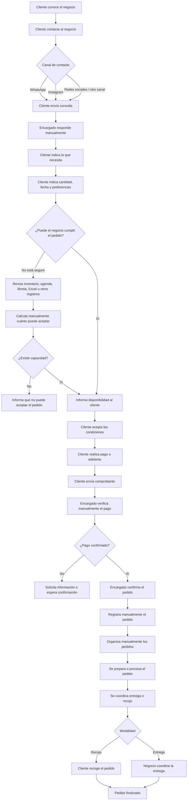
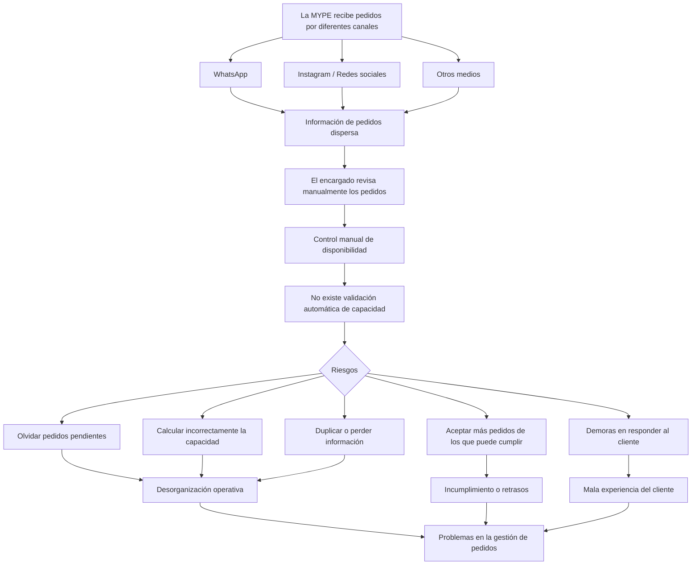
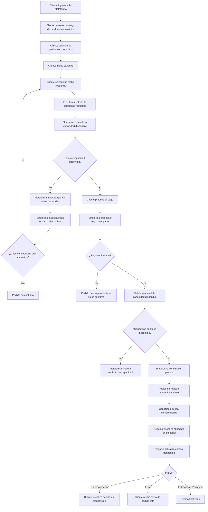

# Análisis AS-IS y TO-BE

## 1. Objetivo

Representar cómo una MYPE gestiona actualmente sus pedidos y su
capacidad de atención o producción, y cómo este proceso cambiaría
mediante la plataforma propuesta.

El problema central identificado es que las MYPE pueden recibir
pedidos mediante diferentes canales y gestionarlos manualmente,
sin disponer de un mecanismo que determine automáticamente si
todavía existe capacidad real para aceptar un nuevo pedido.

La propuesta busca centralizar la gestión de pedidos y controlar
la capacidad disponible.

---

## 2. Proceso AS-IS

El proceso AS-IS representa la situación actual del negocio antes
de utilizar la plataforma.

Actualmente, los pedidos pueden llegar mediante diferentes canales,
como WhatsApp, Instagram u otros medios.

El negocio debe revisar manualmente la solicitud, comprobar su
disponibilidad, coordinar el pago, registrar el pedido y comunicar
posteriormente su estado al cliente.

### Flujo AS-IS

---

## 3. Problemas identificados en el AS-IS

El análisis del proceso actual permite identificar que la
información se encuentra dispersa y que gran parte de las
operaciones dependen de verificaciones manuales.

---

## 4. Proceso TO-BE

El proceso TO-BE representa cómo funcionaría la operación
utilizando la plataforma propuesta.

El objetivo es reducir las verificaciones manuales y permitir que
el sistema controle automáticamente la capacidad disponible antes
de confirmar un pedido.

### Flujo TO-BE

> **Nota:** La forma exacta de reservar y revalidar capacidad
> durante el pago todavía se encuentra pendiente de definición.

---

## 5. Comparación AS-IS → TO-BE

| AS-IS | Transformación | TO-BE |
|---|---|---|
| Cliente contacta por diferentes canales | Centralización | Cliente utiliza una plataforma centralizada |
| Consulta manual | Digitalización | Consulta productos o servicios |
| Negocio revisa disponibilidad manualmente | Automatización | Sistema valida disponibilidad |
| Capacidad calculada manualmente | Control automático | Sistema calcula y controla capacidad |
| Pago verificado manualmente | Integración | Pago registrado o confirmado en el sistema |
| Pedido registrado en diferentes medios | Registro centralizado | Pedido registrado automáticamente |
| Estados comunicados manualmente | Gestión de estados | Estados actualizados en la plataforma |
| Cliente pregunta por seguimiento | Autoseguimiento | Cliente realiza seguimiento del pedido |

---

## 6. Qué gestiona la plataforma

A partir del flujo TO-BE se identifican inicialmente las siguientes
responsabilidades:

- Catálogo de productos o servicios.
- Gestión de pedidos.
- Control de capacidad.
- Validación de disponibilidad.
- Pagos.
- Registro centralizado de pedidos.
- Estados del pedido.
- Seguimiento del pedido por parte del cliente.

Estas responsabilidades todavía deberán contrastarse con el
alcance definitivo del MVP.

---

## 7. Relación con el modelo de capacidad

El análisis AS-IS/TO-BE identifica **dónde interviene la capacidad
dentro del proceso general**.

Los Casos A, B y C tienen otro objetivo: determinar **cómo debe
funcionar internamente esa capacidad**.

Por lo tanto:

AS-IS / TO-BE
→ Define el proceso.

Casos A + B + C
→ Definen el comportamiento de la capacidad.

Ambos análisis serán utilizados posteriormente para construir el
Modelo de Capacidad v1 y los requisitos del sistema.

---

## 8. Punto pendiente de revisión

La propuesta original considera que las MYPE ya captan clientes
principalmente mediante redes sociales.

Debe definirse posteriormente hasta qué punto el MVP:

1. Centralizará la compra directamente dentro de la plataforma.
2. Recibirá pedidos provenientes de canales externos.
3. Permitirá una combinación de ambos enfoques.

Esta decisión afectará el flujo TO-BE definitivo.

---

## 9. Estado

**Estado: análisis inicial completado.**

Los diagramas AS-IS y TO-BE representan el proceso planteado
actualmente y podrán modificarse después de definir el Modelo de
Capacidad v1 y el alcance del MVP.