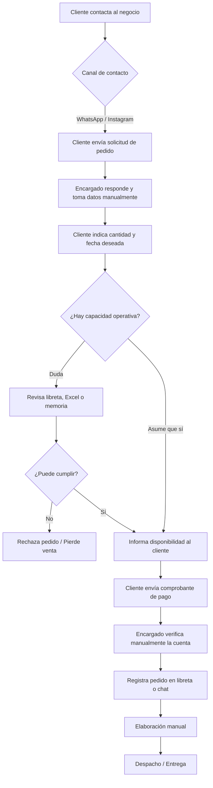
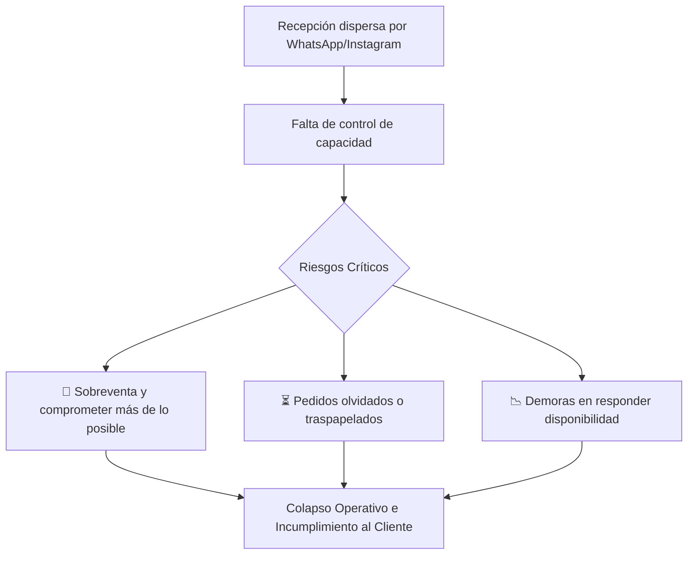
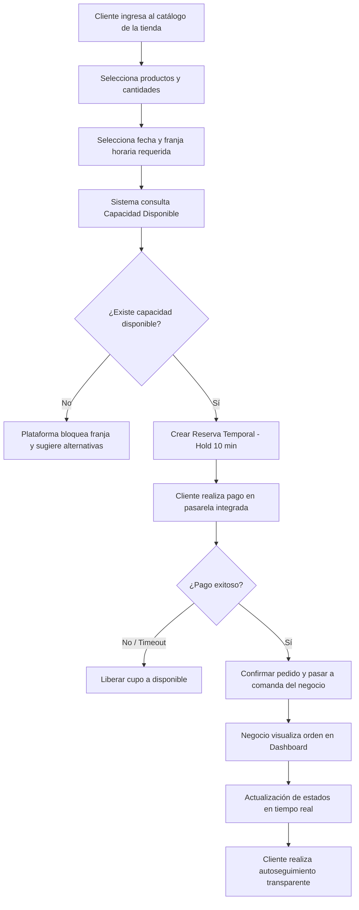

# Análisis AS-IS y TO-BE

### JaldiShop — Modelado de Procesos de Negocio

---

`📍 Docs` > `04-Diseño` > `Proceso` > **AS-IS vs TO-BE**  
[⬅ Alcance del MVP](../../03-requisitos/alcance-mvp.md) | [🏠 Índice General](../../../README.md) | [Sprint 01 ➡](../../06-scrum/sprint-01.md)

---

<b>📑 Tabla de Contenidos</b>

- [1. Objetivo](#1-objetivo)
- [2. Proceso AS-IS (Actual)](#2-proceso-as-is)
- [3. Problemas del Proceso AS-IS](#3-problemas-identificados-en-el-as-is)
- [4. Proceso TO-BE (Propuesto con JaldiShop)](#4-proceso-to-be)
- [5. Comparativa de Transformación](#5-comparación-as-is--to-be)
- [6. Responsabilidades de la Plataforma](#6-qué-gestiona-la-plataforma)

---

## 1. Objetivo

> [!NOTE]
> Representar cómo una MYPE gestiona actualmente sus pedidos de manera manual y fragmentada (AS-IS), frente a cómo operará de forma sincronizada y automatizada mediante **JaldiShop** (TO-BE).

---

## 2. Proceso AS-IS

Actualmente, los pedidos ingresan por múltiples canales (WhatsApp, Instagram, llamadas). El comerciante debe verificar manualmente inventarios y agendas sin validación automática de capacidad.

### Flujo AS-IS

---

## 3. Problemas Identificados en el AS-IS

---

## 4. Proceso TO-BE

Con **JaldiShop**, el catálogo es digital y el motor de capacidad valida la disponibilidad en tiempo real antes de permitir el checkout.

### Flujo TO-BE

---

## 5. Comparación AS-IS → TO-BE

| Dimensión Operativa | Proceso AS-IS (Actual) | Transformación JaldiShop | Proceso TO-BE (Propuesto) |
|---|---|:---:|---|
| **Canal de Pedidos** | Disperso en chats de WhatsApp/Instagram | Centralización | Catálogo web unificado por tienda |
| **Control de Capacidad** | Cálculo mental o en libretas | Automatización | Validación de cupos en tiempo real |
| **Protección de Sobreventa** | Inexistente (se aceptan pedidos a ciegas) | Bloqueo Inteligente | Cierre automático al saturar franja |
| **Confirmación de Pago** | Revisión manual de capturas | Integración | Pasarela con reserva temporal *Hold* |
| **Seguimiento del Cliente** | El cliente pregunta constantemente por chat | Autoseguimiento | Consulta de estado y tracking en vivo |

---

## 6. Qué gestiona la plataforma

* **Catálogo e Inventario:** Productos, precios y stock por tienda.
* **Motor de Capacidad:** Límites por día/franja y excepciones temporales.
* **Checkout y Pagos:** Bloqueo temporal anti-concurrencia y confirmación de órdenes.
* **Dashboard Comerciante:** Panel de control de pedidos y cambio de estados.
* **Tracking Cliente:** Vista pública para consultar avance del pedido.

---

[⬅ Alcance del MVP](../../03-requisitos/alcance-mvp.md) | [🏠 Volver al Índice General](../../../README.md) | [Sprint 01 ➡](../../06-scrum/sprint-01.md)