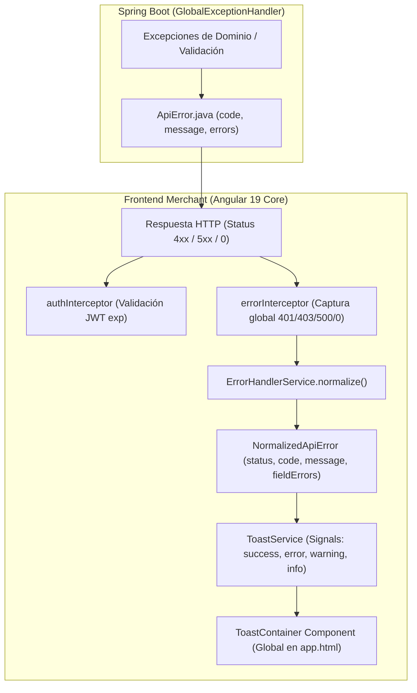

# 📡 Contrato de API y Estandarización de Errores HTTP

### JaldiShop — Arquitectura de Integración Frontend ↔ Backend (FE-03)

[](./contrato-api-errores.md)
[](./contrato-api-errores.md)

---

`📍 Docs` > `04-Diseño` > **Contrato de API y Errores HTTP**  
[🏠 Volver al Índice General](../../README.md) | [Sprint 02 ➡](../06-scrum/sprint-02.md)

---

## 1. Visión General

Para asegurar que todos los módulos presentes y futuros (**Catálogo, Inventario, Capacidad, Pedidos, Notificaciones y Configuración**) operen bajo el mismo estándar, se ha implementado un contrato unificado de errores HTTP y retroalimentación reactiva.



---

## 2. Estructura del Payload `ApiError`

### 2.1. Contrato Backend (`com.jaldishop.backend.shared.exception.ApiError.java`)
```json
{
  "code": "VALIDATION_ERROR",
  "message": "Los datos enviados no son válidos",
  "errors": {
    "name": "El nombre es obligatorio",
    "contactPhone": "El número celular debe tener formato peruano válido (+51 9XXXXXXXX)"
  }
}
```

### 2.2. Contrato Frontend (`src/app/core/models/api-error.models.ts`)
```typescript
export interface ApiError {
  code: string;
  message: string;
  errors?: Record<string, string>;
}

export interface NormalizedApiError {
  status: number;
  code: string;
  message: string;
  fieldErrors: Record<string, string>;
  timestamp: Date;
}
```

---

## 3. Matriz de Códigos de Estado y Comportamiento Estandarizado

| HTTP Status | Código `code` Backend | Significado | Comportamiento en Frontend |
|:---:|:---|:---|:---|
| **`400`** | `VALIDATION_ERROR` | Error de validación en formulario (`@Valid`) | `ErrorHandlerService` extrae `fieldErrors` para marcar controles específicos en formularios reactivos. |
| **`400`** | `MALFORMED_JSON` | Cuerpo de solicitud JSON no legible | Emite mensaje descriptivo al usuario. |
| **`401`** | `UNAUTHORIZED` / `INVALID_CREDENTIALS` | Token expirado, inválido o credenciales erróneas | `errorInterceptor` ejecuta `tokenService.removeToken()`, emite toast de advertencia y redirige a `/login?expired=true`. |
| **`403`** | `FORBIDDEN` | Usuario sin rol `MERCHANT` o sin permisos | `errorInterceptor` emite toast de acceso denegado. |
| **`404`** | `NOT_FOUND` / `RESOURCE_NOT_FOUND` | Tienda, pedido o producto inexistente | Devuelve `null` o normaliza el error para renderizar `@empty` o estado vacío. |
| **`409`** | `CONFLICT` / `CATEGORY_ALREADY_EXISTS` / `PRODUCT_SLUG_ALREADY_EXISTS` / `SKU_ALREADY_EXISTS` / `RESOURCE_CONFLICT` | Conflicto de unicidad (email, categoría, slug, SKU) | Muestra mensaje contextual de colisión de datos. |
| **`422`** | `RN-ORD-xx` / `RN-CAP-xx` / `RN-STR-xx` | Violación de Regla de Negocio (`BusinessRuleException`) | Presenta el mensaje exacto de la regla de negocio violada. |
| **`500`** | `INTERNAL_SERVER_ERROR` | Error no controlado en backend | `errorInterceptor` emite toast de error interno sin exponer trazas técnicas al usuario. |
| **`0`** | `NETWORK_ERROR` | Servidor caído o sin conexión a internet | `errorInterceptor` emite toast informativo: *"No hay conexión con el servidor. Revisa tu red."* |

---

## 4. Componentes Centrales Implementados

### 4.1. `ErrorHandlerService`
Servicio inyectable encargado de transformar cualquier `HttpErrorResponse` en un `NormalizedApiError` estructurado.

### 4.2. `ToastService` & `ToastContainer`
- **Servicio:** Basado en Angular Signals (`readonly toasts = signal<Toast[]>([])`).
- **Métodos:** `success(msg, title?)`, `error(msg, title?)`, `warning(msg, title?)`, `info(msg, title?)`, `dismiss(id)`, `clear()`.
- **UI:** Componente flotante posicionado en `fixed top-5 right-5` con animaciones CSS suaves (`animate-toast-slide`), auto-cierre en 4-5 segundos e íconos contextuales.

### 4.3. `authInterceptor` & `errorInterceptor`
- **Cadena:** Registrados en `app.config.ts` mediante `provideHttpClient(withInterceptors([authInterceptor, errorInterceptor]))`.
- **Seguridad:** `authInterceptor` evalúa `tokenService.hasValidToken()` y `isTokenExpired()` antes de adjuntar el header `Authorization: Bearer <token>`.

---

## 5. Cobertura de Pruebas Unitarias

```text
 ✓ src/app/core/services/error-handler.service.spec.ts (8 tests)
 ✓ src/app/core/services/toast.service.spec.ts (6 tests)
 ✓ src/app/core/interceptors/error-interceptor.spec.ts (3 tests)
 ✓ src/app/shared/components/toast-container/toast-container.spec.ts (3 tests)

Total Frontend: 224 tests passing (100%)
Total Backend:  239 tests passing (100%)
Total Global:   463 tests passing (100%)
```
