# Diagrama Entidad-Relación — JaldiShop

**Modelo Físico v1.6.1**
**Fuente:** `docs/04-diseno/modelo-er.md`
**Generado:** 2026-09-09

---

> **Nota:** Este diagrama es una representación visual del modelo físico documentado en `modelo-er.md`. Las definiciones físicas completas (tipos, constraints, índices, defaults) permanecen en dicho documento. Este diagrama muestra únicamente PK, FK y atributos relevantes para comprender las relaciones.

```mermaid
erDiagram

%% ============================================
%% USERS
%% ============================================
users {
    uuid id PK
    varchar email UK
    varchar password_encoded
    varchar first_name
    varchar last_name
    varchar phone
    varchar status
    timestamptz created_at
    timestamptz updated_at
}

%% ============================================
%% ROLES Y USER_ROLES
%% ============================================
roles {
    smallint id PK
    varchar name UK
}

user_roles {
    uuid user_id PK,FK
    smallint role_id PK,FK
}

users ||--o{ user_roles : "CASCADE"
roles ||--o{ user_roles : "RESTRICT"

%% ============================================
%% STORES
%% ============================================
stores {
    uuid id PK
    uuid merchant_user_id UK,FK
    varchar name
    varchar slug UK
    text description
    varchar contact_phone
    text address
    text address_reference
    numeric latitude
    numeric longitude
    boolean pickup_enabled
    boolean delivery_enabled
    numeric delivery_fee_amount
    char delivery_fee_currency
    boolean tax_applies
    numeric tax_rate
    varchar status
    timestamptz created_at
    timestamptz updated_at
}

users ||--o| stores : "UNIQUE + RESTRICT"

%% ============================================
%% CATEGORIES
%% ============================================
categories {
    uuid id PK
    uuid store_id FK
    varchar name
    varchar description
    varchar status
    timestamptz created_at
    timestamptz updated_at
}

stores ||--o{ categories : "RESTRICT"

%% ============================================
%% PRODUCTS
%% ============================================
products {
    uuid id PK
    uuid store_id FK
    uuid category_id FK
    varchar name
    varchar slug UK
    text description
    text image_url
    varchar status
    timestamptz created_at
    timestamptz updated_at
}

stores ||--o{ products : "RESTRICT"
categories ||--o{ products : "RESTRICT"

%% ============================================
%% PRODUCT_VARIANTS
%% ============================================
product_variants {
    uuid id PK
    uuid product_id FK
    varchar presentation_name
    varchar sku
    numeric price_amount
    char price_currency
    boolean tracks_inventory
    varchar status
    timestamptz created_at
    timestamptz updated_at
}

products ||--o{ product_variants : "CASCADE"

%% ============================================
%% VARIANT_ATTRIBUTES
%% ============================================
variant_attributes {
    uuid variant_id PK,FK
    varchar name PK
    text value
}

product_variants ||--o{ variant_attributes : "CASCADE"

%% ============================================
%% INVENTORIES
%% ============================================
inventories {
    uuid variant_id PK,FK
    integer quantity
    integer low_stock_threshold
    timestamptz updated_at
}

product_variants ||--o| inventories : "CASCADE"

%% ============================================
%% CARTS
%% ============================================
carts {
    uuid id PK
    uuid user_id FK
    uuid store_id FK
    timestamptz created_at
    timestamptz updated_at
}

users ||--o{ carts : "CASCADE"
stores ||--o{ carts : "CASCADE"

%% ============================================
%% CART_ITEMS
%% ============================================
cart_items {
    uuid cart_id PK,FK
    uuid variant_id PK,FK
    integer quantity
    numeric reference_price_amount
    char reference_price_currency
    timestamptz created_at
    timestamptz updated_at
}

carts ||--o{ cart_items : "CASCADE"
product_variants ||--o{ cart_items : "CASCADE"

%% ============================================
%% DISCOUNTS
%% ============================================
discounts {
    uuid id PK
    uuid store_id FK
    varchar name
    varchar type
    varchar modality
    numeric value
    varchar code
    numeric minimum_purchase_amount
    timestamptz starts_at
    timestamptz ends_at
    varchar status
    timestamptz created_at
    timestamptz updated_at
}

stores ||--o{ discounts : "RESTRICT"

%% ============================================
%% CAPACITY_CONFIGURATIONS
%% ============================================
capacity_configurations {
    uuid id PK
    uuid store_id FK
    integer day_of_week
    time start_time
    time end_time
    integer max_capacity
    varchar status
    timestamptz created_at
    timestamptz updated_at
}

stores ||--o{ capacity_configurations : "RESTRICT"

%% ============================================
%% CAPACITY_EXCEPTIONS
%% ============================================
capacity_exceptions {
    uuid id PK
    uuid store_id FK
    date service_date
    time start_time
    time end_time
    integer exception_capacity
    text reason
    varchar status
    timestamptz created_at
    timestamptz updated_at
}

stores ||--o{ capacity_exceptions : "RESTRICT"

%% ============================================
%% CAPACITY_RESERVATIONS
%% ============================================
capacity_reservations {
    uuid id PK
    uuid store_id FK
    uuid user_id FK
    date service_date
    time start_time
    time end_time
    varchar status
    timestamptz expires_at
    timestamptz payment_protection_expires_at
    timestamptz created_at
    timestamptz updated_at
}

stores ||--o{ capacity_reservations : "RESTRICT"
users ||--o{ capacity_reservations : "RESTRICT"

%% ============================================
%% PAYMENTS
%% ============================================
payments {
    uuid id PK
    uuid capacity_reservation_id UK,FK
    numeric amount
    char currency
    varchar status
    varchar refund_status
    numeric refund_amount
    varchar refund_reference
    timestamptz approved_at
    timestamptz refunded_at
    timestamptz created_at
    timestamptz updated_at
}

capacity_reservations ||--o| payments : "RESTRICT"

%% ============================================
%% PAYMENT_ATTEMPTS
%% ============================================
payment_attempts {
    uuid id PK
    uuid payment_id FK
    smallint attempt_number
    varchar provider
    varchar payment_method
    varchar idempotency_key
    varchar provider_payment_id
    varchar provider_status
    varchar provider_status_detail
    varchar status
    varchar error_code
    text error_message
    timestamptz created_at
    timestamptz completed_at
    timestamptz updated_at
}

payments ||--o{ payment_attempts : "CASCADE"

%% ============================================
%% ORDERS
%% ============================================
orders {
    uuid id PK
    varchar order_number UK
    uuid user_id FK
    uuid store_id FK
    uuid payment_id UK,FK
    uuid capacity_reservation_id UK,FK
    varchar status
    varchar delivery_mode
    date service_date
    time service_start_time
    time service_end_time
    varchar customer_name
    varchar customer_phone
    varchar customer_email
    text delivery_address
    text delivery_reference
    numeric delivery_latitude
    numeric delivery_longitude
    char currency
    numeric products_subtotal_amount
    numeric discount_amount
    varchar discount_code
    numeric delivery_fee_amount
    numeric included_tax_amount
    numeric total_amount
    timestamptz confirmed_at
    timestamptz updated_at
}

users ||--o{ orders : "RESTRICT"
stores ||--o{ orders : "RESTRICT"
payments ||--o| orders : "RESTRICT"
capacity_reservations ||--o| orders : "RESTRICT"

%% ============================================
%% ORDER_ITEMS
%% ============================================
order_items {
    uuid id PK
    uuid order_id FK
    uuid variant_id FK
    varchar product_name
    varchar variant_name
    jsonb attributes_snapshot
    integer quantity
    numeric unit_price_amount
    numeric subtotal_amount
}

orders ||--o{ order_items : "CASCADE"
product_variants ||--o{ order_items : "RESTRICT"

%% ============================================
%% ORDER_STATUS_HISTORY
%% ============================================
order_status_history {
    uuid id PK
    uuid order_id FK
    uuid changed_by_user_id FK
    varchar status
    text reason
    timestamptz changed_at
}

orders ||--o{ order_status_history : "CASCADE"
users ||--o{ order_status_history : "SET NULL"

%% ============================================
%% FAVORITES
%% ============================================
favorites {
    uuid user_id PK,FK
    uuid product_id PK,FK
    timestamptz created_at
}

users ||--o{ favorites : "CASCADE"
products ||--o{ favorites : "CASCADE"

%% ============================================
%% REVIEWS
%% ============================================
reviews {
    uuid id PK
    uuid user_id FK
    uuid product_id FK
    integer rating
    text comment
    varchar status
    timestamptz created_at
    timestamptz updated_at
}

users ||--o{ reviews : "RESTRICT"
products ||--o{ reviews : "RESTRICT"

%% ============================================
%% NOTIFICATIONS
%% ============================================
notifications {
    uuid id PK
    uuid user_id FK
    varchar type
    varchar title
    text message
    varchar status
    timestamptz created_at
    timestamptz read_at
}

users ||--o{ notifications : "CASCADE"
```

---

## Resumen de Relaciones

### Relaciones 1:1

| Relación | Tabla A | Tabla B | Notas |
|---|---|---|---|
| Merchant ↔ Store | users.merchant_user_id | stores.id | UNIQUE en stores.merchant_user_id |
| Payment ↔ Reservation | payments.capacity_reservation_id | capacity_reservations.id | UNIQUE en payments |
| Order ↔ Payment | orders.payment_id | payments.id | UNIQUE en orders |
| Order ↔ Reservation | orders.capacity_reservation_id | capacity_reservations.id | UNIQUE en orders |
| Inventory ↔ Variant | inventories.variant_id | product_variants.id | PK coincide con FK |

### Relaciones 1:N

| Tabla Padre | Tabla Hija | ON DELETE |
|---|---|---|
| users | user_roles | CASCADE |
| roles | user_roles | RESTRICT |
| stores | categories | RESTRICT |
| stores | products | RESTRICT |
| stores | carts | CASCADE |
| stores | discounts | RESTRICT |
| stores | capacity_configurations | RESTRICT |
| stores | capacity_exceptions | RESTRICT |
| stores | capacity_reservations | RESTRICT |
| stores | orders | RESTRICT |
| users | capacity_reservations | RESTRICT |
| users | orders | RESTRICT |
| users | carts | CASCADE |
| users | favorites | CASCADE |
| users | reviews | RESTRICT |
| users | notifications | CASCADE |
| users | order_status_history | SET NULL |
| categories | products | RESTRICT |
| products | product_variants | CASCADE |
| products | favorites | CASCADE |
| products | reviews | RESTRICT |
| product_variants | variant_attributes | CASCADE |
| product_variants | inventories | CASCADE |
| product_variants | cart_items | CASCADE |
| product_variants | order_items | RESTRICT |
| carts | cart_items | CASCADE |
| payments | payment_attempts | CASCADE |
| orders | order_items | CASCADE |
| orders | order_status_history | CASCADE |

---

## Convenciones del Diagrama

- **PK** = Primary Key
- **FK** = Foreign Key
- **UK** = UNIQUE constraint
- ** Compound PK** = Primary Key Compuesta
- Nombres de columnas según `modelo-er.md v1.6.1`
- Timestamps omitidos para legibilidad (`created_at`, `updated_at`, `changed_at`)
- Constraints CHECK no representados (consúltese `modelo-er.md`)

---

## Tablas con PK Compuesta

| Tabla | PK Compuesta |
|---|---|
| user_roles | (user_id, role_id) |
| variant_attributes | (variant_id, name) |
| cart_items | (cart_id, variant_id) |
| favorites | (user_id, product_id) |

---

## Notas sobre Cardinalidades

### users → stores

La relación `users ||--o| stores` indica:

- **users (lado N):** Un Usuario puede no administrar ninguna Tienda, o administrar como máximo una (UNIQUE en `stores.merchant_user_id`).
- **stores (lado 1):** Toda Tienda posee exactamente un `merchant_user_id NOT NULL`.

No existe el caso "Tienda sin merchant" en el modelo físico; toda Tienda requiere un `merchant_user_id` válido.

### product_variants → inventories

La relación `product_variants ||--o| inventories` indica:

- **1:0..1 opcional:** Cada Variant puede tener como máximo un Inventory asociado, pero no es obligatorio.
- **Invariante de aplicación:** `tracks_inventory = true` requiere que exista un Inventory asociado. `tracks_inventory = false` implica que el stock no participa comercialmente.
- La PK de `inventories` coincide con su FK a `product_variants`, garantizando máximo una fila.

### orders → order_status_history

- **Cardinalidad física:** `orders ||--o{ order_status_history` indica que un Order puede tener cero o muchos OrderStatusHistory.
- **Invariante de aplicación:** Al confirmarse un Pedido se genera inmediatamente el primer registro de historial con estado CONFIRMED. Por tanto, funcionalmente todo Pedido confirmado tiene al menos 1 registro de historial.
- La FK `order_status_history.order_id` es NOT NULL, garantizando que todo historial pertenece a un Pedido.

### ON DELETE RESTRICT — No es inconsistencia

Las relaciones con ON DELETE RESTRICT en orders:

- `orders.payment_id → payments.id`
- `orders.capacity_reservation_id → capacity_reservations.id`

indican que **no se pueden eliminar** Payments o CapacityReservations que tengan Pedidos asociados.

Esto es **intencional** para preservar el historial transaccional:

- Un Pago puede estar asociado a un Pedido confirmado → no se elimina.
- Una Reserva de Cupo puede estar asociada a un Pedido → no se elimina.

Cardinalidad (qué puede existir) y política de borrado (qué puede eliminarse) son concerns ortogonales.

---

**Siguiente paso:** Generar `V1__initial_schema.sql` basándose en este modelo.
