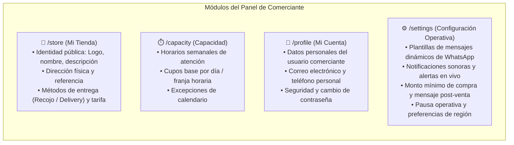

# Módulo de Configuración del Comerciante

### JaldiShop — Especificación Funcional y Diseño de `/settings` v1.0

[](./modulo-configuracion-merchant.md)
[](../06-scrum/sprint-03.md)
[](#)

---

`📍 Docs` > `04-Diseno` > **Módulo de Configuración del Comerciante**  
[⬅ Catálogo e Inventario](./modelo-er.md) | [🏠 Índice General](../../README.md) | [Sprint 03 ➡](../06-scrum/sprint-03.md)

---

## 1. Propósito y Contexto

> 📌 **Nota:** Este documento define el alcance funcional, la separación estricta de responsabilidades (evitando duplicidad con otros módulos del sidebar) y la arquitectura frontend para la pantalla de **Configuración (`/settings`)** en el panel del Comerciante de JaldiShop.

El objetivo de este módulo es centralizar las **preferencias operativas, automatizaciones de mensajería (WhatsApp), alertas en tiempo real y formatos regionales** del negocio sin solaparse con la gestión de identidad de la tienda (`/store`), el motor de cupos (`/capacity`) o los datos de usuario (`/profile`).

---

## 2. Matriz de Separación de Responsabilidades (Cero Duplicación)

Para garantizar un diseño modular y cohesivo, las configuraciones del comerciante se distribuyen de acuerdo a su dominio de responsabilidad:



| Módulo | Alcance y Responsabilidad | ¿Pertenece a `/settings`? |
|---|---|:---:|
| **Mi Tienda (`/store`)** | Nombre comercial, biografía, dirección física, switch de Delivery/Recojo, costo de envío e impuestos. | ❌ **No (Exclusivo de `/store`)** |
| **Capacidad (`/capacity`)** | Días laborables, slots de tiempo, cupos máximos por hora y días bloqueados. | ❌ **No (Exclusivo de `/capacity`)** |
| **Mi Cuenta (`/profile`)** | Nombre personal, correo de login, contraseña y credenciales. | ❌ **No (Exclusivo de `/profile`)** |
| **Configuración (`/settings`)** | Plantillas WhatsApp, avisos sonoros de pedidos, monto mínimo de compra, estado de tienda y región. | ✅ **Sí (Alcance de `/settings`)** |

---

## 3. Alcance Funcional en MVP (Sprint 3 / 4)

La pantalla se estructura en **6 pestañas modulares** diseñadas con componentes standalone de Angular y Signals:

### 3.1 Pestaña 1: Plantillas de Mensajes de WhatsApp
Permite al comerciante personalizar los mensajes rápidos que se envían al cliente vía enlace directo `wa.me/` al cambiar el estado de su pedido.

* **Etiquetas dinámicas soportadas:**
  * `{cliente}`: Primer nombre del comprador.
  * `{numero_pedido}`: Código legible de la orden (ej. `JAL-2026-0001`).
  * `{tienda}`: Nombre comercial de la tienda.
  * `{total}`: Monto final del pedido formateado (ej. `S/ 45.00`).
  * `{modalidad}`: `Delivery a domicilio` o `Recojo en tienda`.
* **Plantillas preconfiguradas editables:**
  1. **En Preparación:** Aviso de que la cocina/taller empezó a producir el pedido.
  2. **Listo para Recojo / Envío:** Confirmación de que el pedido está empacado para retiro o en manos del repartidor.
  3. **Completado / Agradecimiento:** Mensaje de cierre de servicio solicitando valoración.

### 3.2 Pestaña 2: Métodos de Pago y Pasarelas
Configura los métodos de cobro que se mostrarán al cliente en el Checkout:
* **Mercado Pago (Online):** Switch para cobros automáticos con tarjeta (Débito/Crédito), alternador de modo Sandbox (Pruebas) vs Producción y Public Key del comercio.
* **Billeteras Digitales (Yape / Plin):** Número celular del titular, nombre de la cuenta e instrucciones personalizadas.
* **Transferencias Bancarias:** Selección de banco (BCP, BBVA, Interbank, Scotiabank, BanBif), número de cuenta y CCI.
* **Pago Contra Entrega:** Toggle para aceptar efectivo o cobro al momento de la entrega/recojo.

### 3.3 Pestaña 3: Preferencias de Pedido & Checkout
Reglas operativas que guían el flujo de compra:
* **Monto Mínimo de Pedido:** Valor monetario mínimo opcional requerido para procesar pedidos de Delivery (ej. `S/ 15.00`).
* **Tiempo de Preparación Promedio:** Tiempo referencial de producción en minutos.
* **Mensaje de Agradecimiento e Instrucciones:** Texto personalizado que se muestra al cliente en la pantalla de éxito tras pagar su compra.

### 3.4 Pestaña 4: Notificaciones y Sonidos
Optimiza la operación en tiempo real en la cocina o mostrador:
* **Alerta Sonora de Pedido Nuevo:** Toggle para reproducir un tono de campana o notificación de audio en el navegador (Web Audio API) con control de volumen y botón de prueba.
* **Alerta de Stock Crítico:** Preferencia visual cuando un producto alcance un umbral mínimo de inventario (`low_stock_threshold`).
* **Resumen diario por correo:** Opción para recibir al cierre del día el total de pedidos completados.

### 3.5 Pestaña 5: Políticas y Términos de la Tienda
Garantiza transparencia y requisitos en la compra:
* **Política de Cancelación:** Términos de cancelación y tiempos de tolerancia antes de la preparación.
* **Política de Devoluciones y Reembolsos:** Reglas en caso de incidencias en el reparto o producto.
* **Exigir DNI / RUC del Comprador:** Switch para requerir documento de identidad en el checkout (útil para comprobantes).
* **Notas y Dedicatorias:** Permite una caja de texto opcional para indicaciones especiales.

### 3.6 Pestaña 6: General y Región
Preferencias generales de visualización y control:
* **Pausa Rápida de Tienda:** Switch para suspender temporalmente la recepción de nuevos pedidos (`stores.status = CLOSED / ACTIVE`) sin alterar el catálogo ni configuraciones.
* **Moneda Predeterminada:** Fijada en Soles Peruanos (`PEN - S/.`).
* **Zona Horaria:** Configurada en `America/Lima (UTC-5)`.

---

## 4. Funcionalidades Excluidas (Post-MVP)

Para mantener el foco en la validación del core de capacidad operativa de JaldiShop, quedan formalmente diferidas para fases posteriores:

| Funcionalidad | Motivo de Exclusión |
|---|---|
| **Facturación Electrónica (SUNAT / OSE)** | Requiere integración con certificados digitales y proveedores de facturación. |
| **Auditoría de Sesiones e IPs** | Complejidad innecesaria para comerciantes de tienda única en MVP. |
| **Impresión Térmica Automática (ESC/POS)** | Requiere comunicación con drivers y servicios locales de hardware. |
| **API Oficial de WhatsApp Cloud (Meta Graph)** | Costos fijos por conversación y verificación de empresa por Meta. Se utiliza `wa.me/`. |

---

## 5. Diseño de Componentes Frontend (`frontend-merchant`)

El módulo se implementará bajo la ruta `/settings` reemplazando el componente temporal `ComingSoon`:

```
src/app/features/settings/
├── settings.ts                      # Componente contenedor principal (Tabs y Signals)
├── settings.html                    # Layout con navegación de 6 pestañas
├── settings.css                     # Estilos utilitarios
└── components/
    ├── settings-header/             # Encabezado con título y descripción
    ├── settings-whatsapp-tab/       # Edición de plantillas dinámicas con vista previa
    ├── settings-payments-tab/       # Pasarelas Mercado Pago, Yape/Plin, Transferencias
    ├── settings-orders-tab/         # Monto mínimo y mensaje post-venta
    ├── settings-notifications-tab/  # Switches de sonido Web Audio y alertas
    ├── settings-policies-tab/       # Políticas de cancelación/reembolso y campos de checkout
    └── settings-general-tab/        # Estado de la tienda y preferencias regionales
```

---

[⬅ Catálogo e Inventario](./modelo-er.md) | [🏠 Volver al Índice General](../../README.md) | [Sprint 03 ➡](../06-scrum/sprint-03.md)
