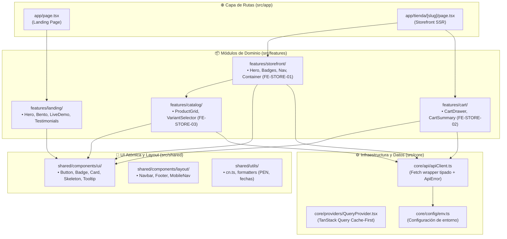

# Arquitectura y Diseño Técnico: Frontend Marketplace (Next.js 15)

### JaldiShop — Portal Público de Clientes y Storefront de Tiendas

[](https://nextjs.org/)
[](https://react.dev/)
[](https://www.typescriptlang.org/)
[](https://tailwindcss.com/)
[](https://tanstack.com/query)
[](https://motion.dev/)

---

`📍 Docs` > `05-Arquitectura` > **Frontend Marketplace**  
[🏠 Índice General](../../README.md) | [Arquitectura del Sistema ➡](./arquitectura-sistema.md) | [Sprint 04 ➡](../06-scrum/sprint-04.md)

---

## 1. Visión General del Marketplace

El **`frontend-marketplace`** es la aplicación orientada al cliente final (*Customer*) y visitantes públicos de JaldiShop. A diferencia del panel administrativo (`frontend-merchant` en Angular), el marketplace prioriza:
* **Velocidad extrema de carga (0 ms TBT, Core Web Vitals optimizados).**
* **SEO dinámico de primer nivel** (Metadatos por slug, OpenGraph dinámico para compartir en WhatsApp e Instagram).
* **Experiencia de usuario visual, apetitosa y emocional** al nivel de los SaaS modernos más reconocidos (*Linear, Stripe, Supabase*).
* **Control de disponibilidad y capacidad en tiempo real** (hold temporal de 10 min, cupos visibles por franja).

---

## 2. Principios de Diseño Arquitectónico (SOLID en React/Next.js)



### Aplicación de SOLID:
1. **S — Single Responsibility:** Las páginas de `src/app` solo resuelven rutas y metadatos; los componentes de `features/` solo renderizan vistas de su dominio; las peticiones HTTP residen exclusivamente en `services/`.
2. **O — Open/Closed:** El `StorefrontContainer` expone *slots* semánticos (`children`, `catalogSlot`, `cartSlot`), permitiendo que Katherine y Mia conecten sus módulos sin alterar el layout base.
3. **L — Liskov Substitution:** Todos los componentes UI atómicos (`Button`, `Card`, `Badge`) extienden interfaces HTML estándar (`React.ButtonHTMLAttributes`).
4. **I — Interface Segregation:** Tipos granulares (`PublicStore`, `StoreContact`, `StoreFulfillmentInfo`, `CartItemView`) en vez de interfaces monolíticas.
5. **D — Dependency Inversion:** Los hooks y componentes dependen de abstracciones (`storeService`, `apiClient`) y no de llamadas `fetch` acopladas.

---

## 3. Matriz de Componentes: Server Components (RSC) vs. Client Components

> 📌 **Regla de Oro:** *Server Components por defecto (0 KB JavaScript enviado al cliente), Client Components ('use client') solo en las hojas del árbol donde existe interactividad, animaciones de Framer Motion o hooks de estado.*

| Componente | Tipo | Motivo / Justificación |
|---|:---:|---|
| `app/layout.tsx` | **Server** | Root shell, carga de fuentes Inter, metadatos base. |
| `app/page.tsx` | **Server** | Ensambla las secciones de la Landing sin JS de servidor en cliente. |
| `app/tienda/[slug]/page.tsx` | **Server** | Fetch SSR de la tienda + `generateMetadata` dinámico para SEO. |
| `features/landing/components/HeroSection.tsx` | **Server** | Titular, subtítulo y estructura base. |
| `features/landing/components/LiveDemoWidget.tsx` | **Client (`'use client'`)** | `useState` para cambiar entre Pickup/Delivery y simular cupos en vivo. |
| `features/landing/components/BentoFeatures.tsx` | **Server** | Tarjetas informativas estáticas de alto impacto. |
| `shared/components/ui/MotionFade.tsx` | **Client (`'use client'`)** | Wrapper de Framer Motion (`whileInView`) para animaciones suaves al scroll. |
| `shared/components/layout/Navbar.tsx` | **Client (`'use client'`)** | Detección de scroll, menú responsive y modal `Ctrl+K`. |
| `features/cart/components/CartDrawer.tsx` | **Client (`'use client'`)** | Estado de apertura/cierre y modificación reactiva de cantidades. |

---

## 4. Estrategia de Peticiones y Cache-First (TanStack Query v5)

Se utiliza **TanStack Query v5** con el patrón **Stale-While-Revalidate**:
* **`staleTime: 5 minutos`:** Las consultas ya cacheadas se sirven al instante (**0 ms**), revalidando en segundo plano solo si están vencidas.
* **`gcTime: 30 minutos`:** La información permanece en memoria evitando descargas innecesarias al navegar entre páginas.
* **Prefetch & Hydration:** El servidor Next.js ejecuta `prefetchQuery` durante el SSR y lo inyecta mediante `<HydrationBoundary>`, eliminando skeletons en la primera carga.
* **Deduplicación automática:** Múltiples componentes que consumen el mismo slug ejecutan una sola petición HTTP compartida.

---

## 5. Propuestas de Alto Valor Agregado para el Marketplace

A continuación se detallan funcionalidades clave sugeridas para maximizar la conversión y robustez técnica:

### 🌟 1. OpenGraph Dinámico por Tienda (`opengraph-image.tsx`)
* Generación automática en el servidor de tarjetas visuales enriquecidas con el logo, nombre y badges de la tienda cuando los clientes compartan el enlace `jaldishop.com/tienda/mi-slug` por **WhatsApp, Facebook o Twitter/X**.

### 📱 2. WhatsApp Order Bridge (Respaldo de Conversión)
* Botón de contacto directo por WhatsApp preconfigurado con el resumen del carrito:
  > *"¡Hola Panadería Don Pepe! Me gustaría ordenar 2x Pan Francés (S/ 20.00) para retiro a las 10:00 AM. Mi pedido en JaldiShop: https://jaldishop.com/tienda/panaderia-don-pepe"*
* Sirve como canal de contingencia si el usuario prefiere coordinar directamente.

### 💾 3. Resiliencia de Carrito en `sessionStorage` / `localStorage`
* Si el comprador cierra la pestaña por error o regresa más tarde, el carrito local conserva los productos seleccionados sin obligar a reiniciar el proceso.

### 📍 4. Indicador de Distancia y Radio de Cobertura
* Integración con geolocalización del navegador para mostrar etiquetas contextuales: *"A 1.5 km de tu ubicación"* o *"Envío disponible a tu zona"*.

### ⚡ 5. Atajos de Teclado y Búsqueda Rápida (`⌘K` / `Ctrl+K`)
* Modal de búsqueda global flotante (estilo Spotlight/Raycast) para saltar rápidamente a cualquier tienda por nombre, rubro o slug.

### ♿ 6. Accesibilidad Completa (a11y) y Modo Oscuro Sutil
* Focos visibles de navegación con teclado, contraste de colores WCAG AA y soporte de tema oscuro/claro armónico.

---

## 6. Estructura de Directorios del Proyecto

```
frontend-marketplace/
├── src/
│   ├── app/
│   │   ├── layout.tsx                     # Shell raíz + HashScrollHandler + Footer
│   │   ├── page.tsx                       # Landing Page principal
│   │   ├── not-found.tsx                  # 404 global editorial
│   │   ├── globals.css                    # Tailwind CSS v4 + tokens de color
│   │   ├── accesibilidad/page.tsx         # Declaración de accesibilidad WCAG
│   │   ├── ayuda/page.tsx                 # Centro de Ayuda & FAQ
│   │   ├── sobre-nosotros/page.tsx        # Historia, misión y principios MYPE
│   │   ├── trabaja-con-nosotros/page.tsx  # Cultura y atracción de talento
│   │   ├── terminos/page.tsx              # Términos y Condiciones interactivos
│   │   ├── privacidad/page.tsx            # Política de Privacidad & ARCO
│   │   ├── libro-de-reclamaciones/page.tsx# Libro Virtual (D.S. 011-2011-PCM)
│   │   └── tienda/
│   │       └── [slug]/
│   │           ├── page.tsx               # Storefront dinámico SSR + metadata SEO
│   │           ├── loading.tsx
│   │           └── not-found.tsx
│   ├── features/
│   │   ├── landing/                       # Hero, Bento, Marquee, PeekSlider, Comparativa
│   │   ├── storefront/                    # StorefrontHero, StorefrontNav, CatalogContainer
│   │   ├── legal/                         # LegalLayout (Tabs/All), TLDR, ClaimsBookForm
│   │   ├── company/                       # CompanyLayout editorial para páginas corporativas
│   │   ├── catalog/                       # ProductGrid, VariantSelector (FE-STORE-03)
│   │   └── cart/                          # CartDrawer, Resumen (FE-STORE-02)
│   ├── shared/
│   │   ├── components/
│   │   │   ├── ui/                        # Button, Badge, Card, EmptyState, Container
│   │   │   └── layout/                    # Navbar (Buscador bimodal), Footer, HashScrollHandler
│   │   └── utils/
│   └── core/
│       ├── api/                           # apiClient.ts (Wrapper fetch tipado)
│       ├── config/                        # env.ts (Variables con fallback inteligente)
│       ├── providers/                     # QueryProvider.tsx (TanStack Query Cache-First)
│       └── types/
├── .env                                   # Variables locales para despliegue
├── .env.example                           # Plantilla con valores nulos para el equipo
├── .env.local                             # Variables para desarrollo local (Spring Boot 8080)
├── package.json
└── next.config.ts
```

---

## 7. Despliegue en Producción y Red Global

El Marketplace se encuentra desplegado de forma continua en **Vercel** bajo el dominio oficial:
👉 **`https://www.jaldishop.net/`**

* **Gestión de DNS:** Google Cloud DNS (Zona `jaldishop-net`) con DNSSEC habilitado.
* **Integración Backend:** Conectado a la API REST de Spring Boot en Render (`https://jaldishop-api.onrender.com/api/v1`) con orígenes CORS habilitados.
* **Integración Merchant:** Conexión bidireccional hacia Cloudflare Pages (`https://negocios-jaldishop.pages.dev`).
* **Suite de Pruebas:** 61 pruebas unitarias pasando al 100% en Vitest.
