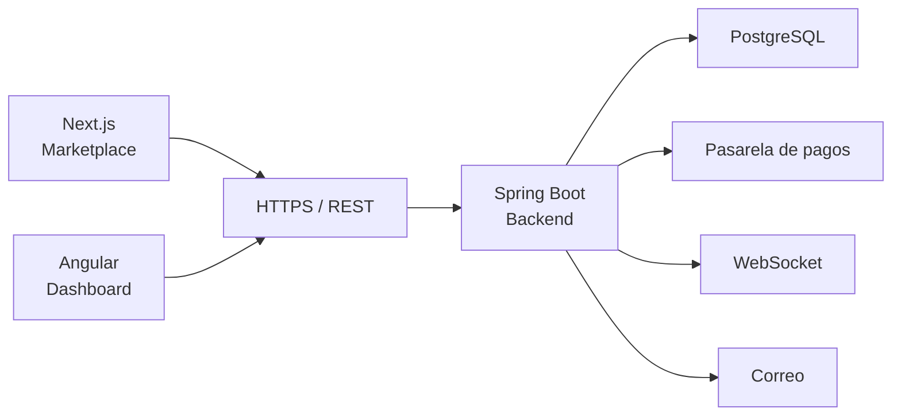
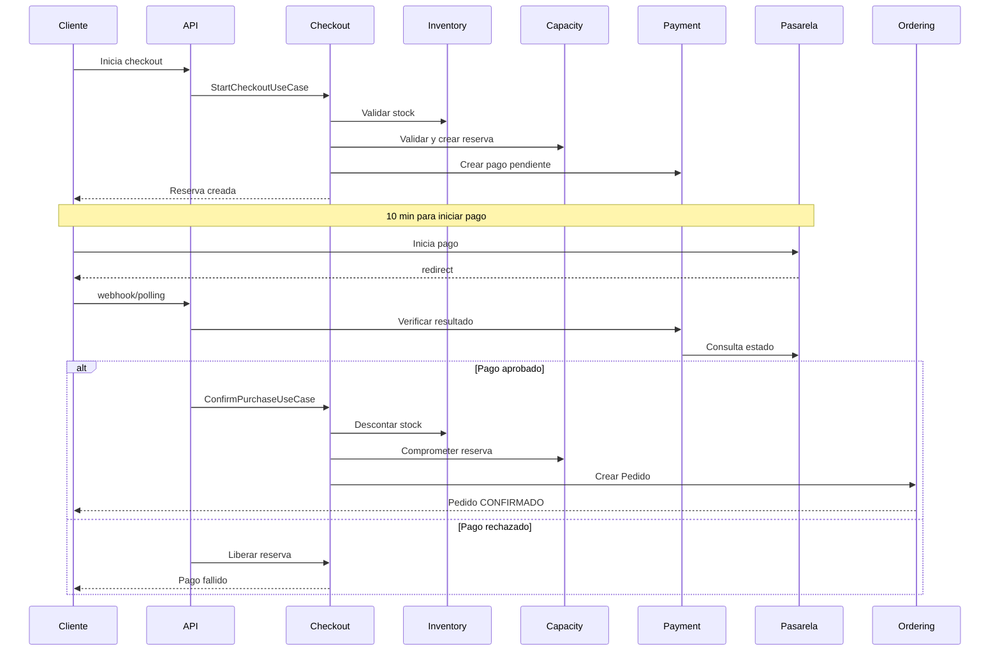

# Arquitectura del Sistema

### JaldiShop — Decisiones Arquitectónicas v0.2

[](./arquitectura-sistema.md)
[](./arquitectura-sistema.md)
[](../06-scrum/sprint-02.md)

---

`📍 Docs` > `05-Arquitectura` > **Arquitectura del Sistema**  
[⬅ Decisiones de Producto](../01-producto/decisiones-producto.md) | [🏠 Índice General](../../README.md) | [Modelo de Dominio ➡](../03-requisitos/modelo-dominio.md)

---

## 1. Propósito

Este documento describe la arquitectura de JaldiShop y registra las decisiones técnicas acordadas hasta la versión 0.2.

La arquitectura se mantiene como documentación viva durante el desarrollo. Las decisiones aún no cerradas se indican explícitamente como pendientes y podrán modificarse en versiones posteriores.

### 1.1 Objetivos Arquitectónicos

- Mantener separada la lógica de negocio de los mecanismos de infraestructura
- Evitar acoplamiento innecesario entre funcionalidades
- Facilitar el desarrollo paralelo del equipo
- Mantener una complejidad adecuada para el alcance del MVP
- Proteger las operaciones críticas de capacidad, inventario, pagos y pedidos
- Permitir sustituir integraciones externas sin afectar el núcleo del sistema
- Mantener una base que pueda evolucionar sin adoptar microservicios prematuramente

---

## 2. Estado de las Decisiones

| Tema | Estado v0.2 |
|---|---|
| Arquitectura cliente-servidor | Aprobado |
| Monolito modular | Aprobado |
| Organización interna por responsabilidades | Aprobado |
| Next.js para marketplace | Aprobado |
| Angular para dashboard | Aprobado |
| Spring Boot para backend | Aprobado |
| PostgreSQL | Aprobado |
| Persistencia con Spring Data JPA | Aprobado |
| Repositorios mediante contratos propios | Aprobado |
| Transacciones en capa de aplicación | Aprobado |
| Identificadores Long para entidades | Aprobado |
| Control de concurrencia | Aprobado |
| Checkout como orquestador | Aprobado |
| Mercado Pago como pasarela | Aprobado |
| Seguridad JWT/autorización | Aprobado |
| WebSocket y notificaciones | Aprobado |
| Patrones de diseño | Definido (limitado) |
| Modelo ER y relaciones JPA definitivas | Pendiente |
| Versionado de API | Aprobado |
| Manejo global de errores | Aprobado |

---

## 3. Estilo Arquitectónico

JaldiShop se implementa como un **monolito modular**.

El backend es una única aplicación Spring Boot desplegable, dividida internamente en módulos funcionales con responsabilidades delimitadas.

La organización interna está inspirada en principios de **Clean Architecture** y **arquitectura hexagonal**, aplicados de manera pragmática. No se pretende implementar una variante estricta que obligue a duplicar modelos o introducir abstracciones sin una necesidad real.

> 💡 **Spring MVC:** Spring MVC puede utilizarse técnicamente para implementar los controllers HTTP, pero MVC no representa la arquitectura general del backend.

### 3.1 Principios

1. Organizar primero por capacidad funcional y después por responsabilidad técnica
2. Mantener las reglas centrales del negocio dentro del dominio
3. Utilizar la capa de aplicación para coordinar casos de uso
4. Mantener persistencia e integraciones externas en infraestructura
5. Los Controllers se limitarán a responsabilidades HTTP
6. Un módulo no accederá directamente a los repositorios o infraestructura interna de otro módulo
7. No todos los módulos estarán obligados a implementar todas las capas si no las necesitan

### 3.2 Tecnologías Principales

| Componente | Tecnología |
|---|---|
| Backend | Spring Boot (Java) |
| Base de datos | PostgreSQL |
| Marketplace/Cliente | Next.js |
| Dashboard Comerciante | Angular |
| Canal principal | REST |
| Canal complementario | WebSocket/STOMP |

---

## 4. Arquitectura General

JaldiShop cuenta con dos aplicaciones frontend independientes:

- **Marketplace:** desarrollado con Next.js y orientado al cliente
- **Dashboard:** desarrollado con Angular y orientado al comerciante

Ambas aplicaciones consumen una API central desarrollada con Spring Boot.



> ⚠️ **Autoridad del Backend:** Las reglas críticas serán validadas en el backend; el frontend no será considerado autoridad para stock, capacidad, pagos, autorización o estados de pedidos.

---

## 5. Módulos Funcionales

Los módulos principales son:

```text
com.jaldishop
├── identity
├── store
├── catalog
├── inventory
├── capacity
├── cart
├── checkout
├── payment
├── ordering
├── notification
└── shared
```

### 5.1 Responsabilidades

| Módulo | Responsabilidad Principal |
|---|---|
| **identity** | Usuarios, roles, autenticación y autorización |
| **store** | Tienda y configuraciones propias del comercio |
| **catalog** | Categorías, productos, variantes y conceptos comerciales asociados |
| **inventory** | Stock y reglas de disponibilidad de inventario |
| **capacity** | Capacidad operativa, excepciones y reservas temporales |
| **cart** | Intención de compra y elementos del carrito |
| **checkout** | Orquestación del proceso de compra |
| **payment** | Pagos, intentos de pago e integración con la pasarela |
| **ordering** | Pedidos y su ciclo de vida |
| **notification** | Notificaciones persistentes y entrega en tiempo real |
| **shared** | Conceptos realmente compartidos entre módulos |

> 📌 **Nota:** La distribución de módulos es una decisión arquitectónica. No determina todavía los límites definitivos de agregados DDD ni las cardinalidades del modelo de datos.

### 5.2 Regla para Shared

> ⚠️ **Shared Module:** Un elemento solo pertenece a `shared` si:
> - Es realmente transversal
> - Es usado por múltiples módulos
> - No posee un dueño de dominio natural

Evitar que `shared` se convierta en un cajón de utilidades.

---

## 6. Arquitectura Interna de un Módulo

Cuando la complejidad lo requiera, un módulo podrá organizarse de la siguiente forma:

```text
module/
├── api/
├── application/
├── domain/
├── infrastructure/
└── web/
```

### 6.1 `domain/`

Contiene:
- Entidades
- Value Objects
- Invariantes
- Reglas de negocio
- Contratos de repositorio (interfaces)
- Conceptos propios del módulo

El dominio deberá evitar dependencias directas con Controllers, SDK de proveedores externos o detalles específicos de transporte HTTP.

### 6.2 `application/`

Contiene:
- Casos de uso (UseCases)
- Servicios de aplicación
- Coordinación de operaciones
- Comandos y resultados cuando sean necesarios
- Fronteras transaccionales

Ejemplos:
- `ReserveCapacityUseCase`
- `ConfirmPurchaseUseCase`
- `CancelOrderUseCase`

> 📌 **UseCases vs Servicios:** No se creará obligatoriamente una clase `UseCase` para cada operación CRUD trivial. Consultas y operaciones simples podrán agruparse en servicios de aplicación.

### 6.3 `infrastructure/`

Contiene implementaciones técnicas como:
- Spring Data JPA
- Adaptadores de repositorio
- Clientes HTTP
- Mercado Pago
- Correo electrónico
- Mecanismos externos de infraestructura

### 6.4 `web/`

Contiene la interfaz HTTP:
- `@RestController`
- Request DTOs
- Response DTOs
- Validación de entrada
- Traducción HTTP ↔ aplicación

Un Controller podrá depender de varios casos de uso relacionados. No contendrá reglas de negocio ni accederá directamente a repositorios.

### 6.5 `api/`

Será opcional y se utilizará cuando un módulo necesite exponer contratos Java estables a otros módulos.

> 📌 **Definición:** `api/` = contratos Java internos que otros módulos pueden consumir. `web/` = interfaz HTTP REST externa.

---

## 7. Comunicación Entre Módulos

Los módulos se comunicarán dentro del mismo proceso Spring Boot. Para el MVP no se utilizarán llamadas HTTP internas, Kafka ni RabbitMQ.

### 7.1 Comunicación Síncrona

Cuando un proceso necesite una respuesta inmediata se utilizarán contratos públicos de aplicación.

**Ejemplo correcto:**

```text
Checkout
    → InventoryOperations
    → InventoryApplicationService
    → InventoryRepository
    → Adapter JPA
```

**Ejemplo incorrecto:**

```text
Checkout
    → JpaInventoryRepository    ✗
    → InventoryJpaEntity        ✗
```

> ⚠️ **Regla:** Un módulo puede utilizar el contrato público/application API de otro módulo, pero no debe acceder directamente a sus repositories internos, JpaRepository, entidades JPA internas o implementaciones de infraestructura.

### 7.2 Contratos Públicos

Los contratos públicos deben ser pequeños y exponer únicamente las operaciones que realmente necesitan otros módulos.

No crear interfaces gigantes para cada módulo.

---

## 8. Controllers y Application

El flujo es:

```text
web → application → domain
```

**Controllers:**
- Reciben HTTP
- Validan formato de entrada
- Convierten request a command/query
- Ejecutan un caso de uso o application service
- Devuelven response DTO
- No contienen reglas de negocio
- No acceden a repositories

> 📌 **Regla:** Un Controller puede depender de múltiples casos de uso relacionados. No crear un UseCase por cada GET trivial.

---

## 9. Checkout

Checkout es un proceso de aplicación/orquestación, no una entidad de dominio.

**No describir Checkout como Facade Pattern.**

### 9.1 Casos de Uso Principales

```text
checkout/
├── application/
│   ├── StartCheckoutUseCase
│   └── ConfirmPurchaseUseCase
└── web/
    ├── CheckoutController
    ├── request/
    └── response/
```

Checkout puede coordinar:
- Cart
- Inventory
- Capacity
- Payment
- Ordering

Pero no debe acceder directamente a repositories internos de esos módulos.

---

## 10. Modelo Conceptual

> 💡 **Conceptos Diferenciados:**

| Concepto | Definición |
|---|---|
| **Carrito** | Intención de compra |
| **Reserva** | Retención temporal de capacidad |
| **Pago** | Intento/transacción financiera |
| **Pedido** | Compra confirmada |

> ⚠️ **Importante:** No existe Pedido antes de un pago aprobado y una confirmación exitosa de compra. `PENDIENTE_PAGO` no debe considerarse estado de Pedido.

---

## 11. Flujo Técnico de Checkout

### 11.1 Flujo Completo



### 11.2 StartCheckoutUseCase

```text
1. Valida carrito
2. Valida stock
3. Valida capacidad
4. Crea reserva temporal de capacidad
5. Crea registro local de pago/intento pendiente
6. Commit
```

### 11.3 ProcessPaymentResultUseCase

```text
1. Valida resultado
2. Procesa de forma idempotente
3. Actualiza el Pago local
```

### 11.4 ConfirmPurchaseUseCase

> ⏱️ **Flujo Crítico:** Pago aprobado → ConfirmPurchaseUseCase debe permanecer síncrono.

```text
1. Verifica pago aprobado
2. Evita doble confirmación
3. Verifica reserva de capacidad
4. Revalida stock
5. Crea Pedido
6. Descuenta inventario
7. Convierte capacidad reservada en comprometida
8. Commit todo o rollback todo
```

### 11.5 Operación Externa

La llamada al proveedor de pago ocurre **fuera** de una transacción larga de base de datos.

---

## 12. Pago Aprobado pero Compra No Confirmable

> ⚠️ **Regla Arquitectónica:** Un pago aprobado externamente no garantiza por sí mismo la creación de un Pedido.

Como el inventario no se reserva en el MVP, puede ocurrir que el pago sea aprobado pero el stock ya no esté disponible.

**En ese caso:**
- No crear Pedido
- Registrar la inconsistencia
- Iniciar una operación de compensación
- Solicitar void/refund al proveedor cuando corresponda

> 📌 **Nota:** Una compensación es una segunda operación de negocio, no un rollback de base de datos. Los nombres definitivos de estados de compensación/refund quedan pendientes de definir.

---

## 13. Payment Gateway

Se mantiene una abstracción:

```text
PaymentGateway
    ↑
    ├── MercadoPagoAdapter
    └── Future: CulqiAdapter, FakePaymentAdapter
```

> 💡 **Recomendado:** Mercado Pago como proveedor para el MVP actual.

El dominio/application de Payment no debe depender del SDK o DTO específicos de Mercado Pago.

---

## 14. Modelo de Capacidad

| Concepto | Definición |
|---|---|
| **1 pedido = 1 cupo** | Regla del MVP |
| **Por día o franja horaria** | Configuración flexible |

```text
Capacidad disponible =
    Capacidad efectiva
  - Capacidad reservada
  - Capacidad comprometida
```

> ⚠️ **Fuera del MVP:** Capacidad ponderada, múltiples recursos o estaciones.

---

## 15. Reserva Temporal de Capacidad

### 15.1 Duración

La reserva inicial dura **10 minutos**.

### 15.2 Lógica de los 10 Minutos

> ⏱️ **Importante:**
> - Los 10 minutos representan la ventana para **iniciar válidamente** el pago
> - Si el pago comenzó antes de la expiración, la reserva puede quedar protegida temporalmente mientras el proveedor procesa
> - Una reserva protegida por pago **no debe liberarse automáticamente** solo porque alcanzó el `expiresAt` original
> - El timeout máximo de procesamiento del pago queda pendiente de definir

### 15.3 Estados Conceptuales

**DECIDIDO PARA MVP:**

```
ACTIVA
    → PROTEGIDA_PAGO
    → COMPROMETIDA

ACTIVA
    → EXPIRADA

ACTIVA / PROTEGIDA_PAGO
    → LIBERADA
```

**Significado de cada estado:**

| Estado | Descripción |
|---|---|
| **ACTIVA** | La reserva está reteniendo capacidad durante la ventana normal de checkout. Tiene una expiración inicial de 10 minutos. |
| **PROTEGIDA_PAGO** | El usuario inició válidamente el proceso de pago antes de que expirara la reserva. La reserva continúa consumiendo capacidad mientras el proveedor procesa el pago, aunque se alcance el `expiresAt` original. |
| **COMPROMETIDA** | El pago fue aprobado y ConfirmPurchaseUseCase confirmó correctamente la compra. La capacidad deja de considerarse temporalmente reservada y pasa a capacidad comprometida por un Pedido. |
| **EXPIRADA** | La ventana inicial terminó sin que se iniciara válidamente el pago. Ya no consume capacidad. |
| **LIBERADA** | La reserva se libera explícitamente debido a una operación como: pago rechazado, pago cancelado, abandono/fallo controlado, cancelación aplicable u otra condición de negocio que determine liberación. |

> 💡 **Justificación de la distinción EXPIRADA vs LIBERADA:** Mantener la distinción proporciona trazabilidad. EXPIRADA = vencimiento temporal automático. LIBERADA = liberación causada por una operación/resultado explícito.

> ⚠️ **Representación técnica:** La representación mediante enum/JPA se realizará posteriormente. Los nombres conceptuales quedan cerrados para el MVP.

---

## 16. Locks y Concurrencia

> ⚠️ **DB Lock ≠ Reserva de Capacidad**

| Concepto | Duración |
|---|---|
| Lock PostgreSQL | Milisegundos (transacción corta) |
| Reserva de Capacidad | Hasta 10 minutos |

El lock de PostgreSQL dura únicamente la transacción corta necesaria para validar/crear/confirmar la reserva.

**Nunca mantener un lock de base de datos durante:**
- Los 10 minutos del checkout
- La llamada al proveedor de pagos

### 16.1 Estrategia de Inventory: Actualización Atómica Condicional

**DECIDIDO PARA MVP:**

La estrategia preferida para el consumo de stock es una actualización atómica condicional en PostgreSQL:

```sql
UPDATE inventory
SET stock = stock - :quantity
WHERE variant_id = :variantId
  AND stock >= :quantity;
```

**Interpretación:**
- 1 fila actualizada = stock descontado correctamente
- 0 filas actualizadas = stock insuficiente o recurso no disponible

**Justificación:**
- Evita el patrón inseguro: SELECT → validar en Java → otro proceso modifica → UPDATE
- El chequeo y la modificación se realizan como una única operación atómica

> ⚠️ **CHECK de integridad:** Agregar restricción `CHECK (stock >= 0)` o equivalente en PostgreSQL.

> 💡 **Alcance:** Esto se aplica principalmente a las operaciones críticas de consumo/descuento concurrente de stock. Las operaciones administrativas normales pueden utilizar persistencia JPA convencional.

### 16.2 Estrategia de Capacity: Bloqueo Pesimista

**DECIDIDO PARA MVP:**

```
BEGIN
  → localizar el registro estable correspondiente a la capacidad/periodo
  → adquirir lock (PESSIMISTIC WRITE)
  → calcular capacidad efectiva
  → considerar reservas activas/protegidas y capacidad comprometida
  → verificar disponibilidad
  → crear ReservaCapacidad
  → COMMIT
  → liberar lock
```

> ⚠️ **Pendiente:** El ER deberá determinar cuál será exactamente el registro estable que se bloqueará para representar una tienda + periodo/franja.

> 📌 **Nota:** No establecer SERIALIZABLE global.

### 16.3 Idempotencia

| Concepto | Propósito |
|---|---|
| **Transacción** | Evita guardar operación a medias |
| **Concurrencia** | Evita que dos operaciones distintas consuman el mismo recurso |
| **Idempotencia** | Evita ejecutar dos veces la misma operación lógica |

Para pagos/webhooks considerar:
- Identificador externo de pago único
- Identificador/evento de webhook único
- Una misma confirmación lógica no crea múltiples pedidos

---

## 17. Persistencia

### 17.1 PostgreSQL + JPA

Enfoque pragmático:
- Entidades de dominio pueden tener anotaciones JPA
- Application no depende directamente de JpaRepository
- Cada módulo mantiene sus contratos Repository
- Infrastructure implementa esos contratos con Spring Data JPA
- Controllers no retornan entidades JPA directamente
- Usar DTOs de entrada/salida

### 17.2 Referencias Entre Módulos

Para relaciones entre módulos, preferir referencias mediante ID cuando sea práctico:

```text
Inventory.variantId  (no una navegación JPA obligatoria hacia ProductVariant)
```

La base de datos podrá mantener Foreign Key aunque el modelo Java preserve el límite modular.

> ⚠️ **Pendiente:** Las relaciones JPA definitivas (@ManyToOne, @OneToMany) serán establecidas después de cerrar relaciones/aggregates y modelo ER.

### 17.3 Migraciones

Flyway como fuente de verdad del esquema:

```text
src/main/resources/db/migration/
    V1__initial_schema.sql
```

> 📌 **Regla:** Preferir `ddl-auto=validate` una vez existan migraciones. No usar `ddl-auto=update` como fuente final del esquema.

### 17.4 Identificadores

**DECIDIDO PARA MVP:**

Se utilizan identificadores `Long` (equivalentes a BIGINT/IDENTITY de PostgreSQL) como estrategia general para las entidades persistentes.

**Justificación:**
- JaldiShop se implementa como monolito modular
- Existe una única base de datos PostgreSQL
- No existe necesidad actual de generación distribuida de identificadores
- Simplifica implementación, debugging, consultas y explicación académica
- UUID no aporta una ventaja significativa para el alcance actual

> ⚠️ **IDs predecibles no sustituyen autorización:** Conocer `/orders/123` no implica poder acceder al pedido. La seguridad continúa dependiendo de autenticación, roles, ownership/resource authorization y reglas de negocio.

> ⚠️ **Anotaciones JPA concretas:** Aún no se definen anotaciones como `@GeneratedValue` concretas; esto dependerá del modelo ER final.

---

## 18. Snapshot del Pedido

> 💡 **Regla:** Una vez confirmado un Pedido, su información histórica relevante debe quedar congelada.

DetallePedido debe preservar al menos conceptualmente:
- Nombre/presentación adquirida
- Variante
- Precio aplicado
- Cantidad

También deben preservarse como snapshot cuando corresponda:
- ResumenMonetario
- Descuento aplicado
- Modalidad/dirección de entrega

> ⚠️ **Nota:** Cambios futuros del Producto o VarianteProducto no deben alterar pedidos históricos.

---

## 19. Seguridad

### 19.1 Registro y Roles

| Aspecto | Regla |
|---|---|
| Registro público | Crea Usuario con rol CUSTOMER |
| Roles múltiples | Un usuario puede tener varios roles |
| Crear tienda | Asigna también MERCHANT al usuario |
| CUSTOMER + MERCHANT | Los roles se acumulan, no se reemplazan |
| ADMIN | No es seleccionable desde registro público; se asigna de forma controlada |

**Modelo:**

```text
Usuario
    roles = CUSTOMER

    crear tienda
        ↓
    roles = CUSTOMER + MERCHANT
```

> ⚠️ **MVP:** 1 comerciante → máximo 1 tienda.

### 19.2 JWT

JWT stateless.

**Token mínimo:**
- userId/sub
- roles
- iat
- exp

**Identificadores:** Se utilizan identificadores `Long` (equivalentes a BIGINT/IDENTITY de PostgreSQL).

> ⏱️ **Duración del Access Token:** Pendiente de definir durante la implementación de seguridad. Puede ser 15 min, 1h u otro valor según necesidades del MVP.

> ⚠️ **Autorización:** No confiar en storeId enviado por frontend para autorización. No utilizar storeId dentro del JWT como única fuente de autorización.

> ⚠️ **Identificadores predecibles no sustituyen autorización:** Conocer `/orders/123` no implica poder acceder al pedido. La seguridad continúa dependiendo de autenticación, roles, ownership/resource authorization y reglas de negocio.

Cuando cambien roles relevantes (ej. CUSTOMER → CUSTOMER+MERCHANT), puede emitirse un nuevo token.

> 📌 **Fuera del MVP:** Refresh Token. No se implementará persistencia de refresh tokens, rotación, token families, reuse detection ni blacklist distribuida en el MVP inicial.

### 19.3 Spring Security

```text
Request
    → SecurityFilterChain
    → JwtAuthenticationFilter
    → JwtService
    → Authentication/SecurityContext
    → @PreAuthorize
    → Controller
    → UseCase
```

Utilizar @PreAuthorize para autorización general por rol.

> ⚠️ **Importante:** Role authorization ≠ resource/business authorization.

El UseCase debe validar también:
- Propiedad de tienda/recurso
- Que el recurso pertenece al usuario adecuado
- Estado operativo de la tienda
- Reglas de negocio

**Ejemplo:**

```text
MERCHANT
    → su Store
    → Product perteneciente a esa Store
```

Preferir consultas scoped:

```text
findByIdAndStoreId(...)
findByIdAndCustomerId(...)
```

### 19.4 CurrentUser

Abstracción tipo:

```text
CurrentUser
    - id()
    - roles()
```

La implementación conoce Spring Security. Application no debe utilizar `SecurityContextHolder` disperso en todos los casos de uso.

### 19.5 Estados de Usuario y Tienda

> ⚠️ **Diferenciación:** EstadoUsuario ≠ EstadoTienda

Un usuario con MERCHANT puede tener una tienda suspendida.

Por eso:

```text
@PreAuthorize("hasRole('MERCHANT')")
```

**no es suficiente** para operar. Los casos de uso que operen una tienda deben verificar también que la tienda se encuentre en un estado permitido/operativo.

### 19.6 Passwords

- Usar BCrypt mediante PasswordEncoder
- Nunca guardar passwords en texto plano
- Nunca incluir password/hash en responses

### 19.7 Webhooks

Los webhooks de Mercado Pago:
- No utilizan JWT de usuario JaldiShop
- Pueden estar permitidos desde la perspectiva de SecurityFilterChain
- Deben validar autenticidad/firma/datos con el mecanismo del proveedor

> ⚠️ **Regla:** No confiar en la página de éxito del frontend como fuente definitiva del estado del pago.

---

## 20. WebSocket y Notificaciones

### 20.1 Uso de WebSocket

| Canal | Uso |
|---|---|
| **REST** | Comandos y consultas |
| **WebSocket** | Comunicación de cambios ya ocurridos en tiempo real |

> ⚠️ **No usar WebSocket para:** crear pedidos, cambiar estados, configurar capacidad, realizar checkout.

**Tecnología inicial:** Spring WebSocket + STOMP

### 20.2 Notification como Módulo

Separar:

| Concepto | Definición |
|---|---|
| **Notification** | Concepto persistente del sistema |
| **WebSocket** | Mecanismo de entrega |

Una Notification puede existir aunque el usuario esté desconectado.

- REST permite consultar historial y marcar como leído
- WebSocket permite entrega inmediata

### 20.3 Eventos Internos

Usar eventos internos solamente para efectos secundarios inicialmente.

**Eventos iniciales:**
- OrderCreatedEvent
- OrderStatusChangedEvent

**Futuro:**
- LowStockEvent

> ⚠️ **No usar eventos para:** validar stock, validar capacidad, confirmar compra crítica (usar llamadas síncronas que necesitan respuesta inmediata).

**Mecanismo:** Spring Application Events para el MVP.

> 📌 **Fuera del MVP:** Kafka, RabbitMQ, Redis Streams, Transactional Outbox.

### 20.4 AFTER_COMMIT

```text
Order transaction
    → COMMIT
    → OrderStatusChangedEvent
    → AFTER_COMMIT
    → CreateNotification
    → Nueva transacción corta
    → Persistir Notification
    → Enviar WebSocket
```

> 💡 **Regla:** Persistencia primero → realtime después.

Si WebSocket falla, la Notification debe seguir persistida para que pueda consultarse después.

### 20.5 Destinos WebSocket

Para el MVP usar destinos privados por usuario:

```text
/user/queue/notifications
```

> ⚠️ **No utilizar:** `/topic/orders` global que exponga pedidos a todos los usuarios conectados.

### 20.6 Autenticación WebSocket

> ⚠️ **Importante:** El JwtAuthenticationFilter HTTP no representa toda la autenticación WebSocket.

Para STOMP CONNECT:

```text
CONNECT + JWT
    → WebSocket/STOMP authentication interceptor
    → Reutiliza JwtService
    → Crea Principal
    → Permite destinos privados por usuario
```

> 📌 **Regla:** No confiar en `userId` enviado libremente por frontend. La identidad del socket se deriva del JWT validado.

---

## 21. Patrones de Diseño

### 21.1 Patrones Adoptados

| Patrón | Propósito | Ejemplo |
|---|---|---|
| **Adapter** | Aislar integraciones externas | PaymentGateway ← MercadoPagoAdapter |
| **Observer/Eventos** | Notificar sin dependencias directas | OrderStatusChangedEvent → Notification |
| **Repository** | Separar persistencia de detalle JPA | ProductRepository ← JpaProductRepository |
| **Dependency Injection** | Inversificar dependencias | Constructor injection |

### 21.2 Patrones Candidatos (No Forzar)

> ⚠️ **No implementar por obligación:**
> - Strategy (solo si aparecen algoritmos realmente intercambiables)
> - Specification (candidato para búsqueda/filtros avanzados)

### 21.3 Patrones NO Adoptados Automáticamente

> ⚠️ **Aclaraciones:**
> - Tener un enum EstadoPedido **no implica** usar State Pattern
> - Tener clases llamadas `CreateProductCommand` **no implica** usar Command Pattern
> - Checkout **no debe describirse automáticamente** como Facade

---

## 22. API e Infraestructura Común

### 22.1 Versionado de API

Todas las rutas REST utilizarán prefijo:

```text
/api/v1
```

**Ejemplos:**
- `/api/v1/auth`
- `/api/v1/products`
- `/api/v1/cart`
- `/api/v1/checkout`
- `/api/v1/orders`

> 📌 **Nota:** No es necesario diseñar v2 ahora.

### 22.2 Manejo Global de Errores

```text
Domain/Application Exception
    → GlobalExceptionHandler
    → API Error Response
```

**Ejemplo conceptual:**

```json
{
  "code": "INSUFFICIENT_CAPACITY",
  "message": "No hay capacidad disponible para el horario seleccionado"
}
```

**Códigos HTTP:**

| Código | Uso |
|---|---|
| 400 | Errores de entrada/reglas aplicables |
| 401 | No autenticado |
| 403 | Autenticado sin permisos |
| 404 | Recurso no encontrado |
| 409 | Conflictos de estado/concurrencia |

> 📌 **Pendiente:** No es necesario cerrar ahora todos los códigos exactos de cada error.

### 22.3 Logging

**Reglas mínimas:**
- Logging básico del backend
- Registrar errores técnicos relevantes
- **No** registrar contraseñas
- **No** registrar JWT completos
- **No** registrar datos sensibles de tarjetas/pagos

> 📌 **Fuera del MVP:** Prometheus/Grafana/ELK/OpenTelemetry.

---

## 23. Decisiones que Siguen Pendientes

> ⚠️ **No cerrar todavía:**

- Cardinalidades finales
- Aggregates definitivos
- Relaciones JPA definitivas (@ManyToOne, @OneToMany, etc.)
- Entidad/fila concreta sobre la cual se aplicará el lock de Capacity
- Timeout máximo de procesamiento de pago en estado PROTEGIDA_PAGO
- Estados/modelo definitivo de refund y compensación
- Almacenamiento frontend definitivo del JWT
- Duración exacta del Access Token
- Representación JPA definitiva de los estados de ReservaCapacidad
- Implementación final de Specification
- Detalles derivados del futuro modelo ER

---

## 24. Fuera del MVP

> ⚠️ **No diseñar inicialmente:**

- Microservicios
- Kafka/RabbitMQ
- Transactional Outbox
- Redis/distributed locking
- Tracking GPS en vivo
- Cálculo avanzado de delivery
- Capacidad ponderada
- Múltiples recursos/estaciones
- Integración directa con redes sociales
- Facturación SUNAT
- Almacenamiento de tarjetas
- Múltiples tiendas por comerciante
- Refresh Token y mecanismos asociados
- Observabilidad distribuida
- Strategy/State/Factory forzados

> 📌 **Maps como mejora opcional (Could):** Maps NO es dependencia del flujo principal. El sistema funciona sin Maps. Si existe tiempo después de los requisitos principales, podrá incorporarse como mejora visible. No implementar: optimización avanzada de rutas, tracking GPS en vivo, cálculo complejo de rutas ni geofencing complejo.

---

## 25. Resumen de Decisiones v0.2

```text
CLIENTES
    ↓
Next.js Marketplace + Angular Dashboard
    ↓
HTTPS / REST + WebSocket/STOMP
    ↓
SPRING BOOT BACKEND
Monolito Modular
    ↓
┌─────────────────────────────────────┐
│  identity │ store │ catalog │       │
│  inventory │ capacity │ cart │      │
│  checkout │ payment │ ordering │    │
│  notification │ shared │           │
└─────────────────────────────────────┘
    ↓
PostgreSQL + Flyway
    ↓
Mercado Pago (PaymentGateway Adapter)
```

**Principios centrales:**

| Principio | Descripción |
|---|---|
| Monolito modular | Separación interna pragmática |
| Contratos | Comunicación entre módulos mediante APIs |
| PostgreSQL | Compartido con transacciones cortas |
| Concurrencia | Locks en recursos críticos |
| Idempotencia | Evitar efectos duplicados |
| Adapters | Integraciones externas aisladas |
| Compensación | Operaciones externas reversibles |

---

## 26. Historial del Documento

| Versión | Fecha | Descripción |
|---|---|---|
| 0.1 | 2026-09-03 | Arquitectura inicial: sistema, módulos, persistencia, transacciones, concurrencia, checkout y pagos |
| 0.2 | 2026-09-03 | Revisión y consolidación de: seguridad JWT/autorización, WebSocket/notificaciones, eventos internos, flujo crítico de pagos, compensaciones, reglas de capacidad, patrones de diseño, API versioning, errores/logging |

---

[⬅ Decisiones de Producto](../01-producto/decisiones-producto.md) | [🏠 Volver al Índice General](../../README.md) | [Modelo de Dominio ➡](../03-requisitos/modelo-dominio.md)
