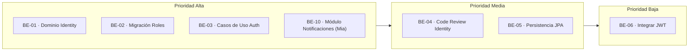

# Sprint 2: Backend Base

### JaldiShop — Gestión Ágil, Backlog y Entregables del Sprint 02

[](./sprint-02.md)
[](./sprint-02.md)
[](./sprint-02.md)

---

`📍 Docs` > `06-Scrum` > **Sprint 02**  
[⬅ Sprint 01](./sprint-01.md) | [🏠 Índice General](../../README.md) | [Alcance del MVP ➡](../03-requisitos/alcance-mvp.md)

---

## 1. Objetivo del Sprint

> 📌 **Nota:** Iniciar la implementación del backend de JaldiShop con el módulo Identity (autenticación y usuarios).

* **Fase:** Semana 3 — *Backend Base*.
* **Propósito:** Implementar el dominio, puertos, persistencia y autenticación JWT.
* **Meta Central:** Tener el módulo Identity completo y funcionando con JWT.

---

## 2. Backlog del Sprint



| Prioridad | Tarjeta | Responsable | Estado | Entregable |
|:---:|---|:---:|:---:|---|
| 🔴 **Alta** | BE-01 · Implementar dominio Identity | Josué | `COMPLETADO` | User, Role, enums y ports |
| 🔴 **Alta** | BE-02 · Preparar datos iniciales roles | Katherine | `PENDIENTE` | Diseño + migración V2__seed_roles.sql |
| 🔴 **Alta** | BE-03 · Casos de uso Auth (Registro y Login) | Josué | `COMPLETADO` | Flujos Registro/Login + DTOs + AuthController |
| 🔴 **Alta** | BE-10 · Implementar módulo de Notificaciones | Mia | `PENDIENTE` | Módulo Notification completo (dominio, JPA, casos de uso, REST, tests) |
| 🟠 **Media** | BE-04 · Code Review Identity | Equipo | `PENDIENTE` | Revisión cruzada antes de JPA |
| 🟠 **Media** | BE-05 · Persistencia JPA Identity | Josué | `COMPLETADO` | Entities + repositories + adapter |
| 🟢 **Baja** | BE-06 · Integrar JWT con UUID | Josué | `COMPLETADO` | Security/JWT funcionando |

---

## 3. Tarjetas de Trabajo

### 📋 BE-01 | Implementar dominio y puertos de Identity

**Responsable:** Josué  
**Entregable:** User, Role, enums y ports

**Objetivo:** Implementar el modelo de dominio inicial del módulo Identity siguiendo el modelo físico V1 ya validado. El dominio debe permanecer independiente de Spring, JPA, JWT y PostgreSQL.

**Checklist:**
- [x] Crear UserStatus (enum)
- [x] Crear RoleName (enum)
- [x] Crear Role (entidad)
- [x] Crear User (entidad)
- [x] Implementar User.create(...)
- [x] Generar UUID desde aplicación/dominio
- [x] Normalizar email
- [x] Implementar canAuthenticate()
- [x] Implementar getFullName()
- [x] Crear UserRepository (puerto)
- [x] Crear RoleRepository (puerto)
- [x] Crear UserTest
- [x] Crear RoleTest
- [x] Ejecutar tests
- [x] Abrir Pull Request

**Decisiones cerradas que aplican:**
- UUID generado por JPA, no PostgreSQL
- Email normalizado lowercase por aplicación
- roles.id es SMALLINT
- UserStatus: ACTIVE, INACTIVE, SUSPENDED
- RoleName: CUSTOMER, MERCHANT, ADMIN
- password_encoded VARCHAR(255) NOT NULL

---

### 📋 BE-02 | Preparar migración de roles iniciales

**Responsable:** Katherine  
**Entregable:** Diseño + migración V2__seed_roles.sql

**Objetivo:** La BD tiene la estructura roles, pero necesitamos garantizar que existan los roles iniciales: CUSTOMER, MERCHANT, ADMIN.

**Checklist:**
- [ ] Revisar tabla roles en modelo-er.md
- [ ] Confirmar IDs SMALLINT
- [ ] Definir IDs estables para CUSTOMER/MERCHANT/ADMIN
- [ ] Crear V2__seed_roles.sql
- [ ] No modificar V1
- [ ] Ejecutar Flyway
- [ ] Verificar flyway_schema_history
- [ ] Consultar roles insertados
- [ ] Documentar resultado
- [ ] Abrir Pull Request

**Decisión de IDs estables:**
```sql
-- IDs estables para catálogo de roles
-- 1 → CUSTOMER
-- 2 → MERCHANT  
-- 3 → ADMIN
INSERT INTO roles (id, name)
VALUES
    (1, 'CUSTOMER'),
    (2, 'MERCHANT'),
    (3, 'ADMIN');
```

---

### 📋 BE-03 | Diseñar e implementar casos de uso Registro y Login

**Responsable:** Josué (implementado en conjunto con BE-06)  
**Entregable:** Flujos Registro/Login + DTOs + Servicios + AuthController

**Objetivo:** Definir e implementar los casos de uso de Registration y Login en la capa de aplicación y web.

**Checklist:**
- [x] Documentar flujo Register Customer
- [x] Documentar flujo Register Merchant
- [x] Documentar flujo Login
- [x] Definir campos de RegisterRequest
- [x] Definir campos de LoginRequest
- [x] Definir AuthResult / UserResponse
- [x] Definir errores esperados
- [x] Definir asignación CUSTOMER/MERCHANT
- [x] Confirmar que ADMIN no tiene registro público
- [x] Documentar validación de UserStatus
- [x] Documentar comportamiento de email duplicado
- [x] Implementar RegisterCustomerService y AuthenticateUserService
- [x] Implementar AuthController REST con validaciones Bean Validation
- [x] Pasar a Code Review

**Flujo Register Customer (ejemplo):**
```
Register Customer
       ↓
validar request
       ↓
normalizar email
       ↓
¿email existente?
   ↙        ↘
 sí         no
409       encode password
              ↓
       obtener CUSTOMER
              ↓
          crear User
              ↓
            save
```

**Flujo Login (ejemplo):**
```
email + password
       ↓
buscar User
       ↓
PasswordEncoder.matches()
       ↓
¿ACTIVE?
       ↓
obtener roles
       ↓
JWT
       ↓
AuthResponse
```

---

### 📋 BE-04 | Code Review Identity

**Responsable:** Todo el equipo  
**Entregable:** Revisión cruzada antes de JPA

**Objetivo:** Revisar el código del dominio y puertos antes de proceder a la persistencia JPA.

**Checklist:**
- [ ] Revisar entidades de dominio
- [ ] Verificar independencia de Spring/JPA
- [ ] Validar tests unitarios
- [ ] Confirmar puertos correctos
- [ ] Aprobar para JPA

---

### 📋 BE-05 | Persistencia JPA Identity

**Responsable:** Josué  
**Entregable:** Entities + repositories + adapter

**Objetivo:** Implementar la capa de persistencia con JPA siguiendo el modelo físico V1.

**Checklist:**
- [x] Crear JPA Entities (User, Role)
- [x] Crear Repositorios JPA
- [x] Crear Adapter de puertos
- [x] Configurar schema en application.properties
- [x] Ejecutar tests de integración
- [x] Abrir Pull Request

---

### 📋 BE-06 | Integrar JWT con UUID

**Responsable:** Josué  
**Entregable:** Security/JJWT funcionando

**Objetivo:** Integrar JWT con la autenticación usando UUID como identificador.

**Checklist:**
- [x] Configurar Spring Security
- [x] Implementar JwtTokenProvider
- [x] Implementar JwtAuthenticationFilter
- [x] Configurar endpoints públicos/privados
- [x] Probar login completo
- [x] Probar access/refresh tokens
- [x] Abrir Pull Request

---

### 📋 BE-10 | Implementar módulo de Notificaciones

**Responsable:** Mia  
**Entregable:** Notification domain, JPA persistence, use cases, REST controller, tests y documentación

**Objetivo:**
Implementar la gestión básica de notificaciones persistentes de JaldiShop, permitiendo consultar las notificaciones de un usuario y marcarlas como leídas, sin acoplar todavía el módulo a eventos de Pedido, Inventario o WebSocket.

**Checklist:**
- [ ] Crear Notification domain
- [ ] Crear NotificationStatus
- [ ] Crear NotificationType
- [ ] Crear NotificationRepository port
- [ ] Crear NotificationEntity
- [ ] Crear NotificationJpaRepository
- [ ] Crear NotificationPersistenceMapper
- [ ] Crear NotificationRepositoryAdapter
- [ ] Caso de uso ListUserNotifications
- [ ] Caso de uso MarkNotificationAsRead
- [ ] Caso de uso CountUnreadNotifications
- [ ] Caso de uso CreateNotification
- [ ] DTO NotificationResponse
- [ ] Controller REST
- [ ] Tests dominio
- [ ] Tests application
- [ ] Tests mapper
- [ ] Tests repository/adapters
- [ ] Tests endpoint
- [ ] Documentar endpoints
- [ ] Abrir Pull Request

**Decisiones cerradas que aplican (modelo-er.md Sección 31):**
- Tabla: `notifications` (ya creada en `V1__initial_schema.sql`)
- ID: `UUID` generado por JPA/aplicación
- `user_id`: `UUID` (FK -> `users.id`, `ON DELETE CASCADE`)
- `NotificationType`: `NEW_ORDER`, `ORDER_STATUS_CHANGED`, `LOW_STOCK`, `SYSTEM` (VARCHAR(30) NOT NULL)
- `NotificationStatus`: `UNREAD`, `READ` (VARCHAR(30) NOT NULL)
- Restricciones semánticas:
  - `status = 'UNREAD'` $\rightarrow$ `read_at IS NULL`
  - `status = 'READ'` $\rightarrow$ `read_at IS NOT NULL`
- `title`: `VARCHAR(180) NOT NULL`
- `message`: `TEXT NOT NULL`
- Índices existentes en PostgreSQL:
  - `INDEX(user_id, created_at DESC)`
  - `INDEX(user_id, created_at DESC) WHERE status = 'UNREAD'`
- Estructura de paquetes canónica: `com.jaldishop.backend.notification` (`domain`, `application`, `infrastructure.persistence`, `web`)

---

## 4. Estado de Avance del Sprint

| Métrica | Estado Actual |
|---|:---:|
| Entregables completados | 4 / 7 (57%) |
| Entregables en desarrollo activo | 0 / 7 (0%) |
| Entregables pendientes | 3 / 7 (43%) |
| **Estado General** | `EN PROGRESO AVANZADO` |

---

## 5. Decisiones Cerradas del Modelo que Aplian a Este Sprint

| Decisión | Valor | Documento |
|---|---|---|
| UUID generado por JPA | `GenerationType.UUID` | modelo-er.md |
| Email normalizado | lowercase, trim antes de persistir | modelo-er.md |
| roles.id | SMALLINT | modelo-er.md |
| UserStatus | ACTIVE, INACTIVE, SUSPENDED | modelo-er.md |
| RoleName | CUSTOMER, MERCHANT, ADMIN | modelo-er.md |
| password_encoded | VARCHAR(255) NOT NULL | modelo-er.md |
| Flyway | Utilizado desde migración inicial | modelo-er.md |
| Rollback | Forward-only + backup/restore | modelo-er.md |

---

## 6. Dependencias entre Tarjetas

```mermaid
graph TD
    BE01[BE-01 · Dominio Identity] --> BE04[BE-04 · Code Review]
    BE02[BE-02 · Migración Roles] --> BE04
    BE03[BE-03 · Casos de Uso Auth] --> BE04
    BE04 --> BE05[BE-05 · Persistencia JPA]
    BE05 --> BE06[BE-06 · Integrar JWT]
    BE01 --> BE10[BE-10 · Notificaciones (Mia)]
```

**Notas:**
- BE-01, BE-02 y BE-03 pueden ejecutarse en paralelo
- BE-04 requiere que las tres tarjetas anteriores estén completas
- BE-05 depende de BE-04
- BE-06 depende de BE-05
- BE-10 puede desarrollarse de forma independiente tras contar con el dominio de Identity (user_id)

---

[⬅ Volver a Sprint 01](./sprint-01.md) | [🏠 Volver al Índice General](../../README.md) | [Modelo ER ➡](../04-diseno/modelo-er.md)
