# Sprint 2: Backend Base

### JaldiShop — Gestión Ágil, Backlog y Entregables del Sprint 02

[](./sprint-02.md)
[](./sprint-02.md)
[](./sprint-02.md)

---

`📍 Docs` > `06-Scrum` > **Sprint 02**  
[⬅ Sprint 01](./sprint-01.md) | [🏠 Índice General](../../README.md) | [Alcance del MVP ➡](../03-requisitos/alcance-mvp.md)

---

## 1. Objetivo del Sprint

> 📌 **Nota:** Iniciar la implementación del backend de JaldiShop con el módulo Identity (autenticación y usuarios), Store base, Notificaciones y el área privada de Frontend Merchant.

* **Fase:** Semana 3 — *Backend Base & Frontend Merchant Core*.
* **Propósito:** Implementar el dominio, puertos, persistencia, autenticación JWT, gestión de Tienda, Notificaciones persistentes y panel Merchant.
* **Meta Central:** Tener la base sólida operativa completa de Backend y Frontend Merchant verificada con tests.

---

## 2. Backlog del Sprint

```mermaid
flowchart LR
    subgraph BACKEND["Backend (Spring Boot)"]
        BE1["BE-01 · Dominio Identity ✅"]
        BE2["BE-02 · Migración Roles ✅"]
        BE3["BE-03 · Casos de Uso Auth ✅"]
        BE5["BE-05 · Persistencia JPA ✅"]
        BE6["BE-06 · Integrar JWT ✅"]
        BE11["BE-11 · Módulo Tienda ✅"]
        BE10["BE-10 · Notificaciones ✅"]
    end

    subgraph FRONTEND["Frontend Merchant (Angular)"]
        FE1["FE-01 · Auth & Onboarding ✅"]
        FE2["FE-02 · Dashboard & Store ✅"]
        FE3["FE-03 · Estandarizar API/Errores ✅"]
        FE4["FE-04 · Mi Perfil Merchant ✅"]
    end

    BACKEND --> FRONTEND
```



| Prioridad | Tarjeta | Responsable | Estado | Entregable |
|:---:|---|:---:|:---:|---|
| 🔴 **Alta** | BE-01 · Implementar dominio Identity | Josué | `COMPLETADO` | User, Role, enums y ports |
| 🔴 **Alta** | BE-02 · Preparar datos iniciales roles | Katherine | `COMPLETADO` | V2__seed_roles.sql aplicado |
| 🔴 **Alta** | BE-03 · Casos de uso Auth (Registro y Login) | Josué | `COMPLETADO` | Flujos Registro/Login + DTOs + AuthController |
| 🔴 **Alta** | BE-10 · Implementar módulo de Notificaciones | Mia | `COMPLETADO` | Notification (dominio, JPA, casos de uso, REST, 15 tests) |
| 🔴 **Alta** | BE-11 · Implementar módulo base de Tienda | Josué | `COMPLETADO` | Store completo (dominio, JPA, casos de uso, REST, 29 tests) |
| 🔴 **Alta** | FE-01 · Auth & Onboarding Comerciante | Josué | `COMPLETADO` | Login, Register 3-pasos, ForgotPassword, Shared 404/403, 31 tests |
| 🔴 **Alta** | FE-02 · Dashboard y Gestión de Tienda | Josué | `COMPLETADO` | MerchantLayout, Sidebar, Header, Mi Tienda, Subcomponentes, 42 tests |
| 🔴 **Alta** | FE-03 · Estandarizar Manejo de API y Errores | Josué | `COMPLETADO` | ApiError, ErrorHandlerService, ToastService, ToastContainer, ErrorInterceptor, 62 tests |
| 🔴 **Alta** | FE-04 · Mi Perfil Merchant | Josué | `COMPLETADO` | ProfileService, UserProfile, GET/PUT /users/me, Mi Perfil, 67 tests |
| 🟠 **Media** | BE-04 · Code Review Identity | Equipo | `COMPLETADO` | Revisión cruzada aprobada |
| 🟠 **Media** | BE-05 · Persistencia JPA Identity | Josué | `COMPLETADO` | Entities + repositories + adapter |
| 🟢 **Baja** | BE-06 · Integrar JWT con UUID | Josué | `COMPLETADO` | Security/JWT funcionando |

---

## 3. Tarjetas de Trabajo

### 📋 BE-01 | Implementar dominio y puertos de Identity

**Responsable:** Josué  
**Entregable:** User, Role, enums y ports

**Objetivo:** Implementar el modelo de dominio inicial del módulo Identity siguiendo el modelo físico V1 ya validado. El dominio debe permanecer independiente de Spring, JPA, JWT y PostgreSQL.

**Checklist:**
- [x] Crear UserStatus (enum)
- [x] Crear RoleName (enum)
- [x] Crear Role (entidad)
- [x] Crear User (entidad)
- [x] Implementar User.create(...)
- [x] Generar UUID desde aplicación/dominio
- [x] Normalizar email
- [x] Implementar canAuthenticate()
- [x] Implementar getFullName()
- [x] Crear UserRepository (puerto)
- [x] Crear RoleRepository (puerto)
- [x] Crear UserTest
- [x] Crear RoleTest
- [x] Ejecutar tests
- [x] Abrir Pull Request

**Decisiones cerradas que aplican:**
- UUID generado por JPA, no PostgreSQL
- Email normalizado lowercase por aplicación
- roles.id es SMALLINT
- UserStatus: ACTIVE, INACTIVE, SUSPENDED
- RoleName: CUSTOMER, MERCHANT, ADMIN
- password_encoded VARCHAR(255) NOT NULL

---

### 📋 BE-02 | Preparar migración de roles iniciales

**Responsable:** Katherine  
**Entregable:** Diseño + migración V2__seed_roles.sql

**Objetivo:** La BD tiene la estructura roles, pero necesitamos garantizar que existan los roles iniciales: CUSTOMER, MERCHANT, ADMIN.

**Checklist:**
- [x] Revisar tabla roles en modelo-er.md
- [x] Confirmar IDs SMALLINT
- [x] Definir IDs estables para CUSTOMER/MERCHANT/ADMIN
- [x] Crear V2__seed_roles.sql
- [x] No modificar V1
- [x] Ejecutar Flyway
- [x] Verificar flyway_schema_history
- [x] Consultar roles insertados
- [x] Documentar resultado
- [x] Abrir Pull Request

**Decisión de IDs estables:**
```sql
-- IDs estables para catálogo de roles
-- 1 → CUSTOMER
-- 2 → MERCHANT  
-- 3 → ADMIN
INSERT INTO roles (id, name)
VALUES
    (1, 'CUSTOMER'),
    (2, 'MERCHANT'),
    (3, 'ADMIN');
```

---

### 📋 BE-03 | Diseñar e implementar casos de uso Registro y Login

**Responsable:** Josué (implementado en conjunto con BE-06)  
**Entregable:** Flujos Registro/Login + DTOs + Servicios + AuthController

**Objetivo:** Definir e implementar los casos de uso de Registration y Login en la capa de aplicación y web.

**Checklist:**
- [x] Documentar flujo Register Customer
- [x] Documentar flujo Register Merchant
- [x] Documentar flujo Login
- [x] Definir campos de RegisterRequest
- [x] Definir campos de LoginRequest
- [x] Definir AuthResult / UserResponse
- [x] Definir errores esperados
- [x] Definir asignación CUSTOMER/MERCHANT
- [x] Confirmar que ADMIN no tiene registro público
- [x] Documentar validación de UserStatus
- [x] Documentar comportamiento de email duplicado
- [x] Implementar RegisterCustomerService y AuthenticateUserService
- [x] Implementar RegisterMerchantService con onboarding atómico transaccional y upgrade de rol
- [x] Implementar AuthController REST con endpoints /register, /login y /register/merchant
- [x] Implementar suite de pruebas unitarias y web de Auth (UserTest, RegisterMerchantServiceTest, AuthControllerTest)
- [x] Integrar flujo de onboarding frontend merchant (Wizard 3 pasos, AuthService REST, TokenService con sessionStorage y 21 tests Vitest pasando)
- [x] Pasar a Code Review

**Flujo Register Customer (ejemplo):**
```
Register Customer
       ↓
validar request
       ↓
normalizar email
       ↓
¿email existente?
   ↙        ↘
 sí         no
409       encode password
              ↓
       obtener CUSTOMER
              ↓
          crear User
              ↓
            save
```

**Flujo Login (ejemplo):**
```
email + password
       ↓
buscar User
       ↓
PasswordEncoder.matches()
       ↓
¿ACTIVE?
       ↓
obtener roles
       ↓
JWT
       ↓
AuthResponse
```

**Flujo Register Merchant (Onboarding Atómico con Tienda - RN-STR-03):**
```
Register Merchant (Datos Comerciante + Datos Tienda)
       ↓
validar request (Bean Validation)
       ↓
normalizar email y slug (lowercase)
       ↓
¿email existente? ── sí ──> 409 Conflict (EMAIL_ALREADY_EXISTS)
       ↓ no
¿slug existente en stores? ── sí ──> 409 Conflict (STORE_SLUG_ALREADY_EXISTS)
       ↓ no
encode password (BCrypt)
       ↓
obtener rol MERCHANT (RoleRepository)
       ↓
crear User con rol MERCHANT (User.create)
       ↓
guardar User (UserRepository.save)
       ↓
crear Store con merchant_user_id (Store.create)
       ↓
guardar Store (StoreRepository.save)
       ↓
generar JWT para el comerciante
       ↓
MerchantAuthResponse (201 CREATED)
```

**Reglas de Asignación de Roles (CUSTOMER vs MERCHANT vs ADMIN):**
- **Inmutabilidad por cliente:** Ningún DTO de registro recibe el parámetro `role`. El rol nunca lo decide el cliente para evitar escalamiento de privilegios.
- **Asignación de CUSTOMER:** El endpoint público `POST /api/v1/auth/register` asigna única y automáticamente el rol `CUSTOMER`.
- **Asignación de MERCHANT:** El endpoint `POST /api/v1/auth/register/merchant` asigna el rol `MERCHANT` de forma atómica únicamente si se registra y valida la información de su primera y única tienda (`RN-STR-03`).
- **Exclusión de ADMIN:** No existe endpoint de registro público para `ADMIN`. Solo se precarga por migraciones SQL o se gestiona internamente.

---

### 📋 BE-04 | Code Review Identity

**Responsable:** Todo el equipo  
**Entregable:** Revisión cruzada antes de JPA

**Objetivo:** Revisar el código del dominio y puertos antes de proceder a la persistencia JPA.

**Checklist:**
- [x] Revisar entidades de dominio
- [x] Verificar independencia de Spring/JPA
- [x] Validar tests unitarios
- [x] Confirmar puertos correctos
- [x] Aprobar para JPA

---

### 📋 BE-05 | Persistencia JPA Identity

**Responsable:** Josué  
**Entregable:** Entities + repositories + adapter

**Objetivo:** Implementar la capa de persistencia con JPA siguiendo el modelo físico V1.

**Checklist:**
- [x] Crear JPA Entities (User, Role)
- [x] Crear Repositorios JPA
- [x] Crear Adapter de puertos
- [x] Configurar schema en application.properties
- [x] Ejecutar tests de integración
- [x] Abrir Pull Request

---

### 📋 BE-06 | Integrar JWT con UUID

**Responsable:** Josué  
**Entregable:** Security/JJWT funcionando

**Objetivo:** Integrar JWT con la autenticación usando UUID como identificador.

**Checklist:**
- [x] Configurar Spring Security
- [x] Implementar JwtTokenProvider
- [x] Implementar JwtAuthenticationFilter
- [x] Configurar endpoints públicos/privados
- [x] Probar login completo
- [x] Probar access/refresh tokens
- [x] Abrir Pull Request

---

### 📋 BE-10 | Implementar módulo de Notificaciones

**Responsable:** Mia  
**Entregable:** Notification domain, JPA persistence, use cases, REST controller, tests y documentación

**Objetivo:**
Implementar la gestión básica de notificaciones persistentes de JaldiShop, permitiendo consultar las notificaciones de un usuario y marcarlas como leídas, sin acoplar todavía el módulo a eventos de Pedido, Inventario o WebSocket.

**Checklist:**
- [x] Crear Notification domain
- [x] Crear NotificationStatus
- [x] Crear NotificationType
- [x] Crear NotificationRepository port
- [x] Crear NotificationEntity
- [x] Crear NotificationJpaRepository
- [x] Crear NotificationPersistenceMapper
- [x] Crear NotificationRepositoryAdapter
- [x] Caso de uso ListUserNotifications
- [x] Caso de uso MarkNotificationAsRead
- [x] Caso de uso CountUnreadNotifications
- [x] Caso de uso CreateNotification
- [x] DTO NotificationResponse
- [x] Controller REST
- [x] Tests dominio
- [x] Tests application
- [x] Tests mapper
- [x] Tests repository/adapters
- [x] Tests endpoint
- [x] Documentar endpoints
- [x] Abrir Pull Request

**Decisiones cerradas que aplican (modelo-er.md Sección 31):**
- Tabla: `notifications` (ya creada en `V1__initial_schema.sql`)
- ID: `UUID` generado por JPA/aplicación
- `user_id`: `UUID` (FK -> `users.id`, `ON DELETE CASCADE`)
- `NotificationType`: `NEW_ORDER`, `ORDER_STATUS_CHANGED`, `LOW_STOCK`, `SYSTEM` (VARCHAR(30) NOT NULL)
- `NotificationStatus`: `UNREAD`, `READ` (VARCHAR(30) NOT NULL)
- Restricciones semánticas:
  - `status = 'UNREAD'` $\rightarrow$ `read_at IS NULL`
  - `status = 'READ'` $\rightarrow$ `read_at IS NOT NULL`
- `title`: `VARCHAR(180) NOT NULL`
- `message`: `TEXT NOT NULL`
- Índices existentes en PostgreSQL:
  - `INDEX(user_id, created_at DESC)`
  - `INDEX(user_id, created_at DESC) WHERE status = 'UNREAD'`
- Estructura de paquetes canónica: `com.jaldishop.backend.notification` (`domain`, `application`, `infrastructure.persistence`, `web`)

---

### 📋 BE-11 | Implementar módulo base de Tienda

**Responsable:** Josué  
**Entregable:** Módulo Store completo (dominio, JPA, casos de uso, REST, 29 tests)

**Objetivo:** Implementar la gestión base de Tiendas de JaldiShop, permitiendo la creación/onboarding por parte de usuarios con rol `MERCHANT`, consulta de la tienda propia y actualización de configuración, aplicando la regla de negocio `1 merchant = 1 store` (RN-STR-03) y unicidad de slug.

**Checklist:**
- [x] Revisar stores en V1 (`V1__initial_schema.sql` y `modelo-er.md`)
- [x] Crear StoreStatus (enum con `ACTIVE`, `INACTIVE`, `SUSPENDED`, `CLOSED`)
- [x] Crear Store (entidad de dominio pura con invariantes y métodos de negocio)
- [x] Crear StoreRepository (puerto de dominio)
- [x] Tests de dominio (`StoreTest.java` - 13 tests)
- [x] Crear StoreEntity (entidad JPA con mapeo exacto de DDL)
- [x] Crear StoreJpaRepository (Spring Data JPA)
- [x] Crear StorePersistenceMapper (conversión bidireccional limpia)
- [x] Crear StoreRepositoryAdapter (adaptador de infraestructura con `@Repository`)
- [x] Tests persistencia (`StorePersistenceMapperTest.java` - 3 tests)
- [x] CreateStoreService (con validación de `1 merchant = 1 store` y slug)
- [x] GetMyStoreService (consulta de tienda propia por `merchantUserId`)
- [x] UpdateStoreService (actualización de perfil y configuración de entrega)
- [x] CreateStoreRequest (DTO de entrada con Bean Validation)
- [x] UpdateStoreRequest (DTO de entrada)
- [x] StoreResponse (DTO de salida con factory `fromDomain`)
- [x] StoreController (controlador REST en `/api/v1/stores`)
- [x] Validar rol `MERCHANT` (rechaza `CUSTOMER` con 403 Forbidden)
- [x] Validar `1 merchant = 1 store` (rechaza con 409 Conflict)
- [x] Generar slug (autogeneración en formato kebab-case si viene nulo)
- [x] Manejar slug duplicado (rechaza con 409 Conflict)
- [x] Tests application (`CreateStoreServiceTest`, `GetMyStoreServiceTest`, `UpdateStoreServiceTest` - 8 tests)
- [x] Tests endpoint (`StoreControllerTest` - 5 tests)
- [x] Documentar API
- [x] Pasar a Code Review / PR

**Endpoints expuestos:**
* `POST /api/v1/stores`: Crea tienda para el comerciante autenticado (201 CREATED). Valida rol `MERCHANT`, unicidad de tienda y slug.
* `GET /api/v1/stores/me`: Obtiene la tienda del comerciante autenticado (200 OK / 404 NOT FOUND).
* `PUT /api/v1/stores/me`: Actualiza perfil y opciones de delivery (200 OK / 400 BAD REQUEST / 404 NOT FOUND).

---

### 📋 FE-01 | Auth & Onboarding del Comerciante

**Responsable:** Josué  
**Entregable:** Login, Register 3-Pasos, Forgot Password, Vistas de Error (404/403), DTOs y Servicios Core

**Objetivo:** Construir la base del frontend Angular Standalone para la autenticación, registro modular por pasos de comerciantes y manejo global de errores de acceso.

**Checklist:**
- [x] Crear arquitectura base Angular 20 Standalone con Signals
- [x] Implementar `TokenService` con `sessionStorage` (Sección 19.2.1)
- [x] Implementar `AuthService` conectando con `/api/v1/auth/register-merchant` y `/login`
- [x] Implementar `MerchantGuard` protegiendo rutas y redirigiendo a `/unauthorized` o `/login`
- [x] Formulario de Login con validación reactiva y manejo de errores
- [x] Wizard de Registro en 3 pasos:
  - [x] Paso 1: Datos de Acceso (`RegisterStep1Account`)
  - [x] Paso 2: Información del Negocio (`RegisterStep2Business`)
  - [x] Paso 3: Identidad y Capacidad (`RegisterStep3Brand`) con visualizador interactivo de bloques
- [x] Flujo de Recuperación de Contraseña (`ForgotPassword`) con validación y estados de envío
- [x] Vistas compartidas de error: `NotFound` (404) y `Unauthorized` (403)
- [x] Diseño enriquecido con Tailwind CSS, paleta cálida JaldiShop y Material Symbols
- [x] Cobertura de pruebas unitarias en Vitest (31 tests pasando al 100%)

---

### 📋 FE-02 | Dashboard y Gestión de Tienda del Comerciante

**Responsable:** Josué  
**Entregable:** MerchantLayout, Sidebar, Header, Mi Tienda, Editar Tienda, Integración API Store

**Objetivo:** Implementar el área privada base de JaldiShop Merchant para que un comerciante autenticado pueda acceder a su panel, visualizar la información real de su tienda y modificar su configuración mediante los endpoints existentes del módulo Store.

**Checklist:**
- [x] Crear `MerchantLayout` (contenedor base autenticado)
- [x] Crear `Sidebar` responsive con navegación (`/dashboard`, `/store`, `/orders`, `/capacity`, `/settings`)
- [x] Crear `Header` responsive con perfil de comerciante y estado del negocio
- [x] Proteger rutas hijas privadas bajo `MerchantGuard` (rol `MERCHANT`)
- [x] Implementar vista inicial de `Dashboard` (resumen operativo y accesos rápidos)
- [x] Implementar servicio `StoreService` consumiendo `GET /api/v1/stores/me` y `PUT /api/v1/stores/me`
- [x] Crear vista "Mi tienda" (`Store`):
  - [x] Mostrar datos generales (nombre, slug, bio, contacto, estado operativo)
  - [x] Mostrar configuración de entrega (recojo en tienda, delivery propio, costo base, IGV)
  - [x] Vista previa pública en vivo con enlace copiable y feedback
- [x] Crear formulario y sincronización reactiva (`Store`):
  - [x] Formulario reactivo tipado con `NonNullableFormBuilder` y validaciones
  - [x] Consumir `PUT /api/v1/stores/me` con feedback inmediato y manejo de estados
- [x] Manejar estados de UI: Loading spinner, Empty state (`@empty`), Error / Success alerts
- [x] Manejo granular de respuestas HTTP y retroalimentación reactiva
- [x] Integrar acción de `Logout` en el Layout (limpieza de token y redirección a `/login`)
- [x] Adaptar `NotFound` (404) para redirigir a `/dashboard` si el usuario está autenticado
- [x] Mantener módulos futuros (Pedidos, Capacidad, Productos) completamente desacoplados
- [x] Agregar tests unitarios en Vitest para componentes y servicios (42 tests pasando al 100%)
- [x] Validar diseño responsive (Mobile, Tablet, Desktop)

---

### 📋 FE-03 | Estandarizar Manejo de API y Errores del Frontend Merchant

**Responsable:** Josué  
**Entregable:** `ApiError`, `ErrorHandlerService`, `ToastService`, `ToastContainer`, `errorInterceptor`, Documentación

**Objetivo:** Centralizar el consumo de la API y el tratamiento de errores HTTP para que los próximos módulos de Catálogo, Inventario, Capacidad, Pedidos y Notificaciones utilicen el mismo contrato predecible.

**Checklist:**
- [x] Definir modelo `ApiError` y `NormalizedApiError` del frontend (`src/app/core/models/api-error.models.ts`)
- [x] Centralizar interpretación de errores HTTP (`ErrorHandlerService.normalize()`)
- [x] Estandarizar 400 Validation Error (extracción de `fieldErrors`)
- [x] Estandarizar 401 Unauthorized (limpieza de token y redirección a `/login?expired=true`)
- [x] Estandarizar 403 Forbidden (notificación de acceso denegado)
- [x] Estandarizar 404 Not Found (recurso inexistente o ruta no encontrada)
- [x] Estandarizar 409 Conflict (conflictos de duplicados de negocio)
- [x] Estandarizar 422 Unprocessable Content (reglas de negocio `BusinessRuleException`)
- [x] Estandarizar error de red / status 0 (`NETWORK_ERROR`)
- [x] Evitar manejo duplicado de errores por componente mediante `errorInterceptor`
- [x] Crear feedback/toast reutilizable (`ToastService` con Signals + `ToastContainer` global)
- [x] Revisar `authInterceptor` y validar expiración de JWT (`isTokenExpired()` en `TokenService`)
- [x] Agregar tests unitarios en Vitest (62 tests pasando al 100%)
- [x] Documentar contrato frontend ↔ backend ([`docs/04-diseno/contrato-api-errores.md`](../04-diseno/contrato-api-errores.md))

---

### 📋 FE-04 | Mi Perfil Merchant

**Responsable:** Josué  
**Entregable:** `ProfileService`, `UserProfile`, `UpdateUserRequest`, `GET /users/me`, `PUT /users/me`, Pantalla `/profile`, Subcomponentes y 67 tests

**Objetivo:** Permitir al comerciante visualizar sus datos de cuenta y credenciales, modificar su información personal (nombre, apellidos, teléfono/WhatsApp) mediante un formulario reactivo con Signals, y ver reflejada su identidad en el Header y Sidebar de la aplicación.

**Checklist:**
- [x] Endpoints Backend `GET /api/v1/users/me` y `PUT /api/v1/users/me` (`UserController`, `GetMyProfileService`, `UpdateProfileService`)
- [x] DTOs de Backend `UserProfileResponse` y `UpdateUserRequest` con Bean Validation
- [x] Modelo Frontend `UserProfile` y `UpdateUserProfileRequest` (`src/app/core/models/user-profile.models.ts`)
- [x] Servicio Frontend `ProfileService` con Signals reactivos (`currentProfile`, `isLoading`, `fullName`, `userInitials`)
- [x] Pantalla principal `Profile` (`/profile`) con layout responsivo de 2 columnas
- [x] Tarjeta de Información Personal `ProfileInfoCard` con formulario reactivo (`NonNullableFormBuilder`) y validaciones
- [x] Tarjeta de Seguridad y Resumen de Cuenta `ProfileSecurityCard` con iniciales, estado en línea, badges y cierre de sesión
- [x] Integración de usuario real en `Header` (avatar con iniciales y enlace a `/profile`)
- [x] Integración de usuario real en `Sidebar` (pie lateral con iniciales, nombre y rol)
- [x] Manejo de estados de carga (`isLoading`), fallbacks dinámicos y directiva `@empty`
- [x] Integración con `ToastService` global (`¡Tu información personal se ha guardado correctamente!`)
- [x] Tests unitarios en Vitest (67 tests pasando al 100% en 27 suites)

---

## 4. Estado de Avance del Sprint

| Métrica | Estado Actual |
|---|:---:|
| Entregables completados | 12 / 12 (100%) |
| Entregables en desarrollo activo | 0 / 12 (0%) |
| Entregables pendientes | 0 / 12 (0%) |
| **Estado General** | `COMPLETADO CON ÉXITO` |

---

## 5. Decisiones Cerradas del Modelo que Aplian a Este Sprint

| Decisión | Valor | Documento |
|---|---|---|
| UUID generado por JPA | `GenerationType.UUID` | modelo-er.md |
| Email normalizado | lowercase, trim antes de persistir | modelo-er.md |
| roles.id | SMALLINT | modelo-er.md |
| UserStatus | ACTIVE, INACTIVE, SUSPENDED | modelo-er.md |
| RoleName | CUSTOMER, MERCHANT, ADMIN | modelo-er.md |
| StoreStatus | ACTIVE, INACTIVE, SUSPENDED, CLOSED | modelo-er.md |
| Regla 1 merchant = 1 store | Restricción UNIQUE(merchant_user_id) | modelo-er.md / RN-STR-03 |
| password_encoded | VARCHAR(255) NOT NULL | modelo-er.md |
| Flyway | Utilizado desde migración inicial | modelo-er.md |
| Rollback | Forward-only + backup/restore | modelo-er.md |

---

## 6. Dependencias entre Tarjetas

```mermaid
graph TD
    BE01[BE-01 · Dominio Identity] --> BE04[BE-04 · Code Review]
    BE02[BE-02 · Migración Roles] --> BE04
    BE03[BE-03 · Casos de Uso Auth] --> BE04
    BE04 --> BE05[BE-05 · Persistencia JPA]
    BE05 --> BE06[BE-06 · Integrar JWT]
    BE06 --> BE11[BE-11 · Módulo Base Store (Josué)]
    BE01 --> BE10[BE-10 · Notificaciones (Mia)]
```

**Notas:**
- BE-01, BE-02 y BE-03 pueden ejecutarse en paralelo
- BE-04 requiere que las tres tarjetas anteriores estén completas
- BE-05 depende de BE-04
- BE-06 depende de BE-05
- BE-11 utiliza el `merchantUserId` y la seguridad JWT establecida en BE-06
- BE-10 puede desarrollarse de forma independiente tras contar con el dominio de Identity (user_id)

---

[⬅ Volver a Sprint 01](./sprint-01.md) | [🏠 Volver al Índice General](../../README.md) | [Modelo ER ➡](../04-diseno/modelo-er.md)
