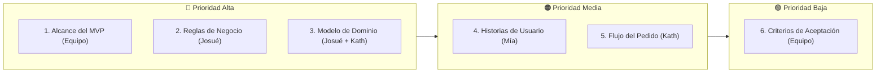

# Sprint 2: Definición del Producto

### JaldiShop — Gestión Ágil, Backlog y Entregables del Sprint 02

---

`📍 Docs` > `06-Scrum` > **Sprint 02**  
[⬅ Sprint 01](./sprint-01.md) | [🏠 Índice General](../../README.md) | [Alcance del MVP ➡](../03-requisitos/alcance-mvp.md)

---

## 1. Objetivo del Sprint

> 📌 **Nota:** Salir con el **MVP completamente definido**, los **requisitos cerrados** y el **modelo de datos/dominio listo** para comenzar el desarrollo del backend.

* **Fase:** Semana 2 — *Definición del Producto*.
* **Propósito:** Pasar de la investigación al diseño funcional y técnico de JaldiShop.
* **Meta Central:** Responder con exactitud a la pregunta: **¿Qué construirá exactamente JaldiShop v1?** (Sin más hipótesis, solo decisiones cerradas).

---

## 2. Backlog del Sprint

| Prioridad | Historia / Entregable | Responsable(s) | Estado | Documento Asociado |
|:---:|---|:---:|:---:|---|
| 🔴 **Alta** | Definir alcance del MVP | Todo el equipo | `APROBADO` | [`docs/03-requisitos/alcance-mvp.md`](../03-requisitos/alcance-mvp.md) |
| 🔴 **Alta** | Consolidar reglas de negocio | Josué | `EN PROGRESO` | `docs/03-requisitos/reglas-negocio.md` |
| 🔴 **Alta** | Modelar entidades principales (Dominio) | Josué + Katherine | `EN PROGRESO` | `docs/05-arquitectura/modelo-dominio.md` |
| 🟠 **Media** | Crear historias de usuario | Mía | `EN PROGRESO` | `docs/03-requisitos/historias-usuario.md` |
| 🟠 **Media** | Diseñar flujo completo del pedido | Katherine | `EN PROGRESO` | `docs/04-design/flujos/flujo-pedido.md` |
| 🟢 **Baja** | Definir criterios de aceptación | Todo el equipo | `EN PROGRESO` | `docs/03-requisitos/criterios-aceptacion.md` |

---

## 3. Tarjetas de Trabajo (Trello / Tablero Ágil)

### 📋 Tarjeta 1: Alcance del MVP
* **Objetivo:** Decidir qué entra y qué queda fuera de JaldiShop v1.
* **Checklist:**
  - [x] Lista de funcionalidades incluidas (Must Have).
  - [x] Lista de funcionalidades fuera del MVP.
  - [x] Justificación técnica/operativa de cada exclusión.
  - [x] Validación y aprobación del equipo.
  - [x] Publicar `alcance-mvp.md`.

---

### 📋 Tarjeta 2: Reglas de Negocio Oficiales
* **Objetivo:** Convertir el modelo de capacidad y hallazgos en reglas oficiales y numeradas (RN-01 a RN-15).
* **Checklist:**
  - [ ] Consolidar reglas RN-01 a RN-15.
  - [ ] Eliminar reglas duplicadas provenientes de los Casos A, B y C.
  - [ ] Clasificar reglas por módulo (Capacidad, Pedidos, Checkout, Cancelaciones).
  - [ ] Revisión cruzada con Katherine y Mía.
  - [ ] Publicar `reglas-negocio.md`.

---

### 📋 Tarjeta 3: Modelo de Dominio
* **Objetivo:** Descubrir y modelar las entidades, atributos y agregados antes de diseñar el diagrama ER físico.
* **Checklist:**
  - [ ] Identificar entidades principales (`Tienda`, `Producto`, `CapacidadBase`, `Excepcion`, `ReservaHold`, `Pedido`).
  - [ ] Definir responsabilidades e invariantes por entidad.
  - [ ] Establecer relaciones y cardinalidades.
  - [ ] Detectar agregados y límites transaccionales.
  - [ ] Publicar `modelo-dominio.md`.

---

### 📋 Tarjeta 4: Historias de Usuario
* **Objetivo:** Traducir necesidades del negocio en especificaciones funcionales ágiles.
* **Checklist:**
  - [ ] Cliente (6–8 historias).
  - [ ] Comerciante (8–10 historias).
  - [ ] Administrador (3–5 historias).
  - [ ] Priorización MoSCoW.
  - [ ] Publicar `historias-usuario.md`.

---

### 📋 Tarjeta 5: Flujo Principal del Pedido
* **Objetivo:** Dejar completamente definido el recorrido secuencial del usuario y los eventos del sistema.
* **Checklist:**
  - [ ] Selección de producto y franja.
  - [ ] Validación de capacidad en tiempo real.
  - [ ] Reserva temporal (Hold de 10 min).
  - [ ] Procesamiento de pago.
  - [ ] Confirmación y emisión de comanda.
  - [ ] Máquina de estados del pedido.
  - [ ] Escenarios de cancelación.
  - [ ] Publicar `flujo-pedido.md`.

---

### 📋 Tarjeta 6: Criterios de Aceptación
* **Objetivo:** Evitar ambigüedades funcionales mediante escenarios BDD (Dado / Cuando / Entonces).
* **Checklist:**
  - [ ] Escenario: Último cupo disponible (Concurrencia $\rightarrow$ solo un pedido confirmado).
  - [ ] Escenario: Franja horaria agotada ($\rightarrow$ bloqueo y sugerencia de alternativas).
  - [ ] Escenario: Pago exitoso ($\rightarrow$ cupo pasa a comprometido).
  - [ ] Escenario: Reserva expirada ($\rightarrow$ cupo liberado a disponible).
  - [ ] Escenario: Cancelación antes / durante preparación.
  - [ ] Publicar `criterios-aceptacion.md`.

---

## 4. Estado de Avance del Sprint

| Métrica | Estado Actual |
|---|:---:|
| Entregables completados | 1 / 6 (17%) |
| Entregables en desarrollo activo | 5 / 6 (83%) |
| **Estado General** | `EN PROGRESO ACTIVO` |

---

[⬅ Volver a Sprint 01](./sprint-01.md) | [🏠 Volver al Índice General](../../README.md) | [Alcance del MVP ➡](../03-requisitos/alcance-mvp.md)
