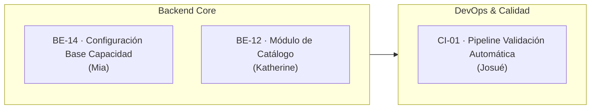
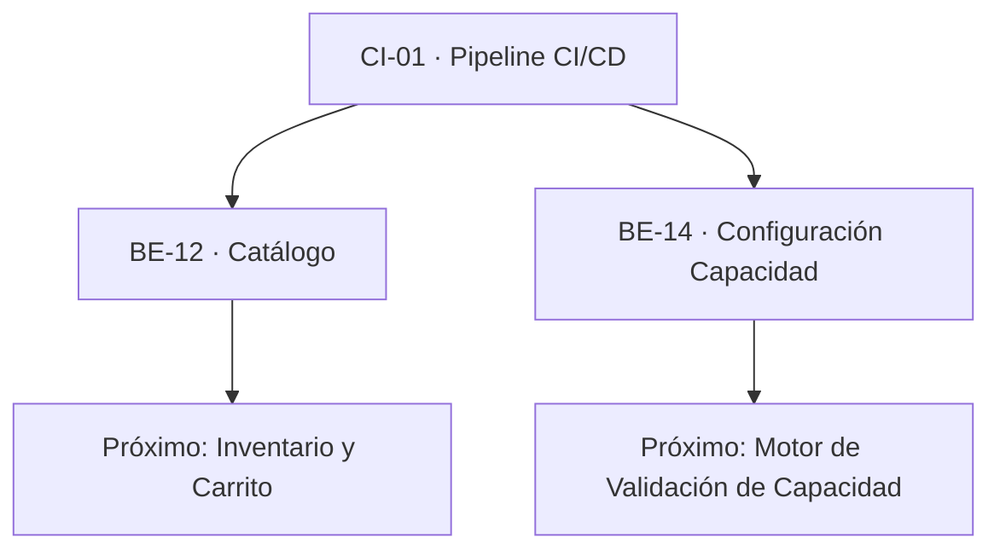

# Sprint 3: Catálogo, Capacidad y CI/CD

### JaldiShop — Gestión Ágil, Backlog y Entregables del Sprint 03

---

`📍 Docs` > `06-Scrum` > **Sprint 03**  
[⬅ Sprint 02](./sprint-02.md) | [🏠 Índice General](../../README.md) | [Alcance del MVP ➡](../03-requisitos/alcance-mvp.md)

---

## 1. Objetivo del Sprint

> 📌 **Nota:** Implementar el núcleo de negocio de JaldiShop compuesto por la configuración operativa de capacidad por franjas, el catálogo de productos con variantes y la infraestructura de CI/CD para aseguramiento continuo de la calidad.

* **Fase:** *Catálogo, Capacidad Operativa y Pipeline CI/CD*.
* **Propósito:** Desarrollar los módulos de dominio de `CapacityConfiguration` y `Catalog` (Categorías, Productos, Variantes) y establecer el pipeline de GitHub Actions para validación automática de pull requests.
* **Meta Central:** Disponer de los contratos REST y lógica de dominio de Catálogo y Capacidad listos para su consumo por los módulos de Carrito/Inventario y Frontend.

---

## 2. Backlog del Sprint

| Prioridad | Tarjeta | Responsable | Estado | Entregable |
|:---:|---|:---:|:---:|---|
| 🔴 **Alta** | **BE-14** · Implementar configuración base de Capacidad | Mia | `EN PROGRESO` | Dominio CapacityConfiguration, JPA, CRUD REST, validaciones de franjas y tests |
| 🔴 **Alta** | **BE-12** · Implementar módulo de Catálogo | Katherine | `EN PROGRESO` | Categorías, Productos, Variantes, SKUs, Slugs, JPA, REST y tests |
| 🔴 **Alta** | **CI-01** · Pipeline de validación automática | Josué | `COMPLETADO` | Workflow `.github/workflows/ci.yml` con verificación Backend (Maven) y Frontend (Node/Vitest) |

---

## 3. Tarjetas de Trabajo

### 📋 BE-14 | Implementar configuración base de Capacidad

**Responsable:** Mia  
**Entregable:** Dominio `CapacityConfiguration`, persistencia JPA, casos de uso, REST controller, validaciones de solapamiento y suite de tests.

**Objetivo:** Permitir al comerciante configurar la capacidad operativa base de su tienda por día de la semana y franja horaria, respetando las reglas de negocio definidas en el modelo de capacidad de JaldiShop.

**Checklist:**
- [ ] Implementar dominio `CapacityConfiguration`
- [ ] Crear puerto de repositorio `CapacityConfigurationRepository`
- [ ] Crear entidad JPA `CapacityConfigurationEntity`
- [ ] Crear `CapacityConfigurationJpaRepository`
- [ ] Crear `CapacityConfigurationPersistenceMapper`
- [ ] Crear `CapacityConfigurationRepositoryAdapter`
- [ ] Caso de uso Crear configuración de capacidad
- [ ] Caso de uso Consultar configuración de Store
- [ ] Caso de uso Actualizar configuración
- [ ] Caso de uso Activar/desactivar configuración
- [ ] Validar `day_of_week` (1=Lunes a 7=Domingo)
- [ ] Validar `start_time` / `end_time` (`start_time < end_time`)
- [ ] Validar capacidad máxima (entero positivo mayor a cero)
- [ ] Validar pertenencia a Store (`store_id` coincidente con el merchant)
- [ ] Validar no solapamiento de franjas horarias en el mismo día
- [ ] Crear DTOs de entrada y salida (`CreateCapacityConfigRequest`, `CapacityConfigResponse`, etc.)
- [ ] Crear endpoints REST Merchant (`/api/v1/capacity-configurations/**`)
- [ ] Tests de dominio
- [ ] Tests de aplicación
- [ ] Tests de persistencia
- [ ] Tests web
- [ ] Documentar contrato REST

---

### 📋 BE-12 | Implementar módulo de Catálogo

**Responsable:** Katherine  
**Entregable:** Dominio `Category`, `Product`, `ProductVariant`, persistencia JPA, casos de uso de gestión, REST controller y tests.

**Objetivo:** Implementar la gestión del catálogo de cada tienda mediante categorías, productos y variantes, estableciendo la base necesaria para Inventario y Carrito de compras.

**Checklist:**
- [ ] Implementar dominio `Category`
- [ ] Implementar dominio `Product`
- [ ] Implementar dominio `ProductVariant`
- [ ] Crear puertos de repositorio (`CategoryRepository`, `ProductRepository`, `ProductVariantRepository`)
- [ ] Crear entidades JPA (`CategoryEntity`, `ProductEntity`, `ProductVariantEntity`)
- [ ] Crear repositorios JPA (`CategoryJpaRepository`, `ProductJpaRepository`, `ProductVariantJpaRepository`)
- [ ] Crear mappers de persistencia
- [ ] Crear adaptadores de infraestructura
- [ ] Implementar casos de uso para gestión de categorías
- [ ] Implementar casos de uso para gestión de productos
- [ ] Implementar casos de uso para gestión de variantes
- [ ] Validar pertenencia de recursos a la tienda del comerciante (`store_id`)
- [ ] Implementar reglas de slug único de producto por tienda
- [ ] Implementar reglas de generación y unicidad de SKU
- [ ] Respetar estados definidos en el esquema físico V1 (`ACTIVE`, `INACTIVE`, `ARCHIVED`)
- [ ] Crear DTOs de entrada y salida con Bean Validation
- [ ] Crear endpoints REST Merchant para Catálogo (`/api/v1/categories/**`, `/api/v1/products/**`)
- [ ] Agregar tests de dominio
- [ ] Agregar tests de aplicación
- [ ] Agregar tests de persistencia
- [ ] Agregar tests web
- [ ] Documentar contrato REST

---

### 📋 CI-01 | Pipeline de validación automática

**Responsable:** Josué  
**Entregable:** Archivo `.github/workflows/ci.yml` configurado con jobs paralelos para Backend y Frontend Merchant, protegiendo ramas clave.

**Objetivo:** Automatizar la compilación y ejecución de pruebas de todo el proyecto en Pull Requests para detectar regresiones de forma temprana antes de integrar cambios a `develop` o `main`.

**Checklist:**
- [x] Crear archivo `.github/workflows/ci.yml`
- [x] **Backend Job:**
  - [x] Configurar runner `ubuntu-latest`
  - [x] Configurar JDK 21 (Eclipse Temurin)
  - [x] Configurar caché de dependencias Maven
  - [x] Ejecutar compilación y verificación (`./mvnw clean test`)
- [x] **Frontend Merchant Job:**
  - [x] Configurar Node.js (v20 / v22)
  - [x] Configurar caché de dependencias npm
  - [x] Ejecutar instalación limpia (`npm ci`)
  - [x] Ejecutar suite de pruebas (`npm test -- --watch=false`)
  - [x] Ejecutar compilación de producción (`npm run build`)
- [x] **Integración & Verificación:**
  - [x] Configurar triggers para Pull Requests hacia `develop` y `main`
  - [x] Configurar triggers para pushes en `develop` y `main`
  - [x] Probar ejecución exitosa del pipeline
  - [x] Probar detección de fallo ante errores de compilación o tests
  - [x] Documentar flujo de CI en la guía del repositorio

---

## 4. Estado de Avance del Sprint

| Métrica | Estado Actual |
|---|:---:|
| Entregables completados | 1 / 3 (33%) |
| Entregables en desarrollo activo | 2 / 3 (67%) |
| Entregables pendientes | 0 / 3 (0%) |
| **Estado General** | `EN PROGRESO` |

---

## 5. Decisiones Cerradas del Modelo que Aplican a Este Sprint

| Decisión | Valor | Documento |
|---|---|---|
| UUID para llaves primarias | `UUID` v4 generado en aplicación/JPA | modelo-er.md |
| Unicidad de SKU | `UNIQUE(store_id, sku)` | modelo-er.md |
| Unicidad de Slug de Producto | `UNIQUE(store_id, slug)` | modelo-er.md |
| Días de la semana | `SMALLINT` (1 = Lunes, 7 = Domingo) | modelo-er.md / modelo-capacidad-v1.md |
| No solapamiento de franjas | `start_time < end_time` sin superposición por tienda/día | modelo-capacidad-v1.md |
| CI Runner | GitHub Actions `ubuntu-latest` | arquitectura-sistema.md |

---

## 6. Dependencias entre Tarjetas

---

[⬅ Volver a Sprint 02](./sprint-02.md) | [🏠 Volver al Índice General](../../README.md) | [Modelo ER ➡](../04-diseno/modelo-er.md)
