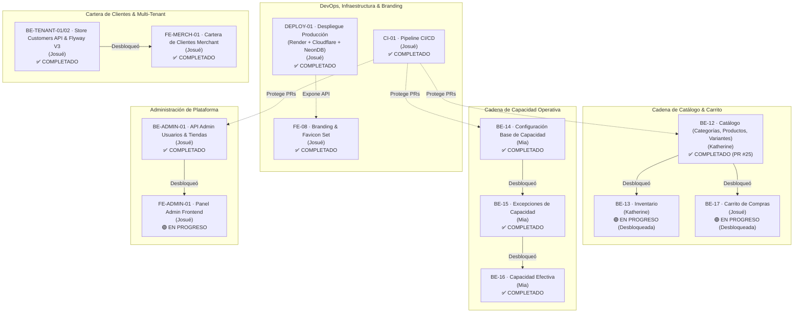
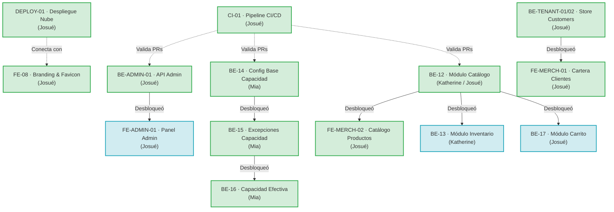

# Sprint 3: Catálogo, Capacidad y CI/CD

### JaldiShop — Gestión Ágil, Backlog y Entregables del Sprint 03

---

`📍 Docs` > `06-Scrum` > **Sprint 03**  
[⬅ Sprint 02](./sprint-02.md) | [🏠 Índice General](../../README.md) | [Alcance del MVP ➡](../03-requisitos/alcance-mvp.md)

---

## 1. Objetivo del Sprint

> 📌 **Nota:** Implementar el núcleo transaccional y operativo de JaldiShop. Se desarrollan en paralelo la cadena de catálogo (Categorías, Productos, Variantes, Inventario y Carrito) y la cadena de capacidad operativa (Configuración base, Excepciones y Capacidad efectiva), asegurando la calidad mediante el pipeline automatizado de CI/CD.

* **Fase:** *Catálogo, Capacidad Operativa, Inventario, Carrito y Pipeline CI/CD*.
* **Propósito:** Construir los dominios centrales de `Catalog`, `Inventory`, `Cart`, `CapacityConfiguration` y `CapacityException` respetando las dependencias de negocio para desbloquear flujos transaccionales.
* **Meta Central:** Disponer de los contratos REST y servicios de aplicación de Catálogo y Capacidad listos para su integración en Checkout y Frontend.

---

## 2. Backlog del Sprint y Cadena de Desbloqueo

| Prioridad | Tarjeta | Responsable | Estado | Dependencia | Entregable |
|:---:|---|:---:|:---:|:---:|---|
| 🔴 **Alta** | **CI-01** · Pipeline de validación automática | Josué | `COMPLETADO` | Ninguna | Workflow GitHub Actions con validación paralela Maven y Vitest |
| 🔴 **Alta** | **DEPLOY-01** · Despliegue en la Nube y Ambientes | Josué | `COMPLETADO` | CI-01 | Backend en Render API, Frontend en Cloudflare Pages y NeonDB |
| 🔴 **Alta** | **FE-08** · Identidad Visual, Favicon y Branding | Josué | `COMPLETADO` | Ninguna | Set de favicon SVG/PNG, manifest e integración en todas las vistas de auth/dashboard |
| 🔴 **Alta** | **BE-ADMIN-01** · Administración base de Usuarios y Tiendas | Josué | `COMPLETADO` | Ninguna | Endpoints `/api/v1/admin/**` (Listar, Detalle, Filtros, Suspender, Reactivar, Reglas de RBAC y tests) *(Desbloqueó FE-ADMIN-01)* |
| 🔴 **Alta** | **BE-14** · Configuración base de Capacidad | Mia | `COMPLETADO` | Ninguna | Dominio CapacityConfiguration, JPA, CRUD REST, validaciones *(Desbloqueó BE-15)* |
| 🔴 **Alta** | **BE-12** · Implementar módulo de Catálogo | Katherine / Josué | `COMPLETADO` | Ninguna | Categorías, Productos, Variantes, SKUs, Slugs, JPA, REST, Ownership RBAC, 409 Conflicts y tests *(Desbloqueó BE-13 y BE-17)* |
| 🔴 **Alta** | **BE-TENANT-01/02** · Aislamiento y Cartera de Clientes de Tienda | Josué | `COMPLETADO` | Ninguna | Migración V3, `StoreCustomer`, proyección SQL agregada y endpoint `/api/v1/merchant/customers` |
| 🔴 **Alta** | **FE-MERCH-01** · Vista de Gestión de Clientes Merchant | Josué | `COMPLETADO` | BE-TENANT-02 | Vista `/customers`, Cache First, Signals, KPIs, exportación CSV, WhatsApp y Design System v2.1 |
| 🔴 **Alta** | **FE-ADMIN-01** · Panel de Administración en Frontend | Josué | `EN PROGRESO` | BE-ADMIN-01 | Módulo `/admin/*` en `frontend-merchant` con Guards, vistas de usuarios, comerciantes y tiendas |
| 🟡 **Media** | **BE-15** · Implementar Excepciones de Capacidad | Mia | `COMPLETADO` | BE-14 | Dominio CapacityException, JPA, reglas de reemplazo y REST *(Desbloqueó BE-16)* |
| 🟡 **Media** | **BE-13** · Implementar módulo de Inventario | Katherine | `EN PROGRESO` | BE-12 | Control de existencias, umbral bajo, tracking por variante y REST *(Desbloqueada)* |
| 🟡 **Media** | **BE-17** · Implementar módulo de Carrito | Josué | `EN PROGRESO` | BE-12 | Carrito por User + Store, gestión de ítems y reglas de aislamiento *(Desbloqueada)* |
| 🔵 **Baja** | **BE-16** · Cálculo y consulta de Capacidad Efectiva | Mia | `COMPLETADO` | BE-15 | Motor de resolución base vs excepción, endpoint REST y consulta de capacidad efectiva |

---

## 3. Tarjetas de Trabajo

### 📋 CI-01 | Pipeline de validación automática

**Responsable:** Josué  
**Estado:** `COMPLETADO` ✅  
**Entregable:** Archivo `.github/workflows/ci.yml` configurado con jobs paralelos para Backend y Frontend Merchant, protegiendo ramas clave.

**Objetivo:** Automatizar la compilación y ejecución de pruebas de todo el proyecto en Pull Requests para detectar regresiones de forma temprana antes de integrar cambios a `develop` o `main`.

**Checklist:**
- [x] Crear archivo `.github/workflows/ci.yml`
- [x] **Backend Job:**
  - [x] Configurar runner `ubuntu-latest` con servicio PostgreSQL 16
  - [x] Configurar JDK 21 (Eclipse Temurin)
  - [x] Configurar caché de dependencias Maven
  - [x] Ejecutar compilación y verificación (`./mvnw clean test`) con 120 tests pasando
- [x] **Frontend Merchant Job:**
  - [x] Configurar Node.js (v22.x)
  - [x] Configurar caché de dependencias npm
  - [x] Ejecutar instalación limpia (`npm ci`)
  - [x] Ejecutar suite de pruebas (`npm test -- --watch=false`) con 67 tests pasando
  - [x] Ejecutar compilación de producción (`npm run build`)
- [x] **Integración & Verificación:**
  - [x] Configurar triggers para Pull Requests hacia `develop` y `main`
  - [x] Configurar triggers para pushes en `develop` y `main`
  - [x] Probar ejecución exitosa del pipeline
  - [x] Documentar reglas de branch protection en GitHub

---

### 📋 DEPLOY-01 | Despliegue en la Nube y Ambientes Multi-Entorno

**Responsable:** Josué  
**Estado:** `COMPLETADO` ✅  
**Entregable:** Infraestructura en la nube con Backend Spring Boot en Render Web Service (`https://jaldishop-api.onrender.com/api/v1`), Base de datos PostgreSQL en NeonDB y Frontend Merchant en Cloudflare Pages (`https://negocios-jaldishop.pages.dev/`), junto con Dockerfiles y perfiles multi-entorno (`development` vs `production`).

**Objetivo:** Disponer de entornos en la nube totalmente funcionales e independientes para desarrollo (`localhost`) y producción, asegurando la accesibilidad pública de la plataforma.

**Checklist:**
- [x] Configuración de Dockerfile multi-stage y Docker Compose para backend
- [x] Aprovisionamiento de base de datos Neon Serverless PostgreSQL (`postgresql+sslmode`)
- [x] Despliegue de servicio web en Render (`https://jaldishop-api.onrender.com`)
- [x] Configuración de variables de entorno seguras (`SPRING_DATASOURCE_URL`, `JWT_SECRET`, etc.) en Render
- [x] Despliegue de Frontend Merchant en Cloudflare Pages (`https://negocios-jaldishop.pages.dev`)
- [x] Configuración de perfiles de Angular (`src/environments/environment.ts` vs `environment.development.ts`)
- [x] Verificación de conectividad CORS entre Cloudflare Pages y Render API

---

### 📋 FE-08 | Identidad Visual, Favicon y Branding Oficial

**Responsable:** Josué  
**Estado:** `COMPLETADO` ✅  
**Entregable:** Reemplazo integral de iconos genéricos, SVGs de prueba e imágenes externas temporales por el set oficial de logotipos y favicon JaldiShop en todas las vistas públicas y autenticadas.

**Objetivo:** Consolidar la identidad visual del producto con recursos locales optimizados (SVG vectorial, PNG 96x96, Apple Touch Icon, Web App Manifest) en toda la interfaz de usuario.

**Checklist:**
- [x] Incorporación del set de favicon en `public/` (`favicon.ico`, `favicon.svg`, `favicon-96x96.png`, `apple-touch-icon.png`, `site.webmanifest`, Web App Manifests 192/512)
- [x] Configuración de etiquetas `<head>` en `src/index.html` con iconos y manifest
- [x] Actualización del sidebar principal (`merchant-layout`) con logo JaldiShop SVG
- [x] Actualización de pantallas de autenticación:
  - [x] Login (`form-panel` y `brand-panel`) con insignia "Panel Comerciante" y logo oficial
  - [x] Registro Paso 1 (`register-brand-panel`)
  - [x] Registro Paso 2 (`register-step2-brand`)
  - [x] Registro Paso 3 (`register-step3-brand`)
  - [x] Recuperación de contraseña (`forgot-password`)
- [x] Actualización de componentes compartidos:
  - [x] Header legal (`legal-header`)
  - [x] Pantalla 404 No Encontrado (`not-found`)
  - [x] Pantalla 403 No Autorizado (`unauthorized`)
- [x] Verificación de suite de tests en frontend: 107 tests pasando al 100%

---

### 📋 BE-12 | Implementar módulo de Catálogo

**Responsable:** Katherine / Josué  
**Estado:** `COMPLETADO` ✅ *(Integrado en PR #25 + Refactoring de Seguridad & Semántica)*  
**Entregable:** Dominio `Category`, `Product`, `ProductVariant`, persistencia JPA, casos de uso de gestión, REST controllers con RBAC StoreContextService, mapeo de conflictos 409 y 239 tests pasando.  
**Desbloqueó:** **BE-13** (Inventario) y **BE-17** (Carrito).

**Descripción:**  
Implementar el módulo de catálogo de JaldiShop para permitir que cada comerciante gestione las categorías, productos y variantes pertenecientes a su tienda. Este módulo sirve como base para Inventario, Carrito y las interfaces de catálogo.

**Checklist:**
- [x] Implementar `Category`
- [x] Implementar `Product`
- [x] Implementar `ProductVariant`
- [x] Implementar puertos de repositorio (`CategoryRepository`, `ProductRepository`, `ProductVariantRepository`)
- [x] Implementar entidades JPA (`CategoryEntity`, `ProductEntity`, `ProductVariantEntity`)
- [x] Resolver conflicto de doble mapeo de `variant_id` en JPA
- [x] Implementar `JpaRepository`
- [x] Implementar mappers de persistencia
- [x] Implementar adapters de persistencia
- [x] Casos de uso de categorías (Crear, Listar por Tienda, Actualizar, Cambiar Estado)
- [x] Casos de uso de productos (Crear con Variantes, Listar por Tienda/Categoría, Actualizar, Cambiar Estado)
- [x] Casos de uso de variantes (Agregar Variante, Actualizar Precio/SKU, Desactivar)
- [x] Validar pertenencia y ownership de Store con `StoreContextService` en todos los endpoints
- [x] Implementar reglas de slug único de producto por tienda (`ConflictException` 409)
- [x] Implementar reglas de generación y unicidad de SKU por tienda (`ConflictException` 409)
- [x] Implementar validación ISO de monedas de 3 letras (`@Pattern(regexp = "^[A-Z]{3}$")`)
- [x] Respetar estados definidos en el modelo (`ACTIVE`, `INACTIVE`)
- [x] Implementar DTOs con Bean Validation
- [x] Implementar endpoints REST Merchant (`/api/v1/merchants/stores/{storeId}/categories/**`, `/api/v1/merchants/stores/{storeId}/products/**`)
- [x] Tests de dominio
- [x] Tests de aplicación
- [x] Tests de persistencia
- [x] Tests web con MockMvc y manejo global de excepciones
- [x] Documentar endpoints y contratos REST

---

### 📋 BE-14 | Configuración base de Capacidad

**Responsable:** Mia  
**Estado:** `COMPLETADO` ✅  
**Entregable:** Dominio `CapacityConfiguration`, persistencia JPA, casos de uso, REST controller, validaciones de franjas y suite de tests.  
**Desbloqueó:** **BE-15** (Excepciones de Capacidad).

**Descripción:**  
Permitir al comerciante configurar la capacidad operativa base de su tienda por día de la semana y franja horaria, respetando las reglas de negocio definidas en el modelo de capacidad de JaldiShop.

**Checklist Trello:**
- [x] Implementación completada
- [x] Tests completados
- [x] Code Review realizado
- [x] Correcciones solicitadas realizadas
- [x] PR aprobado
- [x] Merge a `main` / `develop`

---

### 📋 BE-15 | Implementar Excepciones de Capacidad

**Responsable:** Mia  
**Estado:** `COMPLETADO` ✅ *(Integrado en PR #19)*  
**Entregable:** Dominio `CapacityException`, persistencia JPA, casos de uso de gestión, validación de reglas de sobreescritura, endpoints REST (`/api/v1/capacity-exceptions/**`) y suite de tests completa.  
**Desbloqueó:** **BE-16** (Cálculo de Capacidad Efectiva).

**Descripción:**  
Permitir que un comerciante establezca una capacidad diferente para una fecha o franja específica sin modificar su configuración base (ej. feriados, eventos especiales, días de mantenimiento).

**Checklist:**
- [x] Implementar `CapacityException`
- [x] Implementar reglas e invariantes de dominio
- [x] Implementar Repository Port (`CapacityExceptionRepository`)
- [x] Implementar JPA Entity (`CapacityExceptionEntity`)
- [x] Implementar `CapacityExceptionJpaRepository`
- [x] Implementar mapper de persistencia
- [x] Implementar Repository Adapter
- [x] Caso de uso Crear excepción
- [x] Caso de uso Consultar excepciones por Store
- [x] Caso de uso Actualizar excepción
- [x] Caso de uso Activar / Desactivar excepción
- [x] Validar Store (`store_id` del merchant)
- [x] Validar fecha (`exception_date >= today`)
- [x] Validar rango horario (`start_time < end_time` si aplica a franja parcial)
- [x] Validar capacidad (`capacity >= 0`)
- [x] **Aplicar regla central:** la excepción *reemplaza* la capacidad base para esa fecha/franja, **no se suma a ella**
- [x] Implementar DTOs con Bean Validation
- [x] Implementar endpoints REST (`/api/v1/capacity-exceptions/**`)
- [x] Tests de dominio
- [x] Tests de aplicación
- [x] Tests de persistencia
- [x] Tests web
- [x] Documentar especificación de API (`docs/04-diseno/api-capacity-exceptions.md`)

---

### 📋 BE-16 | Cálculo y consulta de Capacidad Efectiva

**Responsable:** Mia  
**Estado:** `COMPLETADO` ✅  
**Entregable:** Servicio de aplicación para resolución de capacidad efectiva (excepción vs base) y endpoint REST de consulta para comerciantes.

**Descripción:**  
Implementar el servicio que determine qué capacidad corresponde realmente a una tienda para una fecha y franja determinadas, resolviendo la jerarquía entre configuración base y excepciones aplicables.

**Checklist:**
- [x] Recibir Store + fecha + franja horaria
- [x] Determinar configuración base aplicable según `day_of_week`
- [x] Buscar excepción aplicable para la fecha exacta y franja
- [x] **Priorizar excepción cuando exista** frente a la base
- [x] Calcular `effectiveCapacity` final
- [x] Manejar capacidad 0 (tienda cerrada o bloqueada ese día/franja)
- [x] Manejar fecha sin configuración base ni excepción (cerrado por defecto)
- [x] Manejar franja no disponible / fuera de horario
- [x] Exponer consulta desde Application Service
- [x] Crear endpoint REST de consulta de capacidad efectiva (`GET /api/v1/capacity/effective`)
- [x] Tests sin excepción (aplica base)
- [x] Tests con excepción (sobreescribe base)
- [x] Tests con capacidad 0
- [x] Tests sin configuración
- [x] Tests de límites de franja
- [x] *(Nota: Todavía NO debe implementar el hold/reserva temporal de 10 minutos; eso corresponde a Checkout/Holds).*

---

### 📋 BE-13 | Implementar módulo de Inventario

**Responsable:** Katherine  
**Estado:** `BLOQUEADA POR BE-12` 🔒  
**Entregable:** Dominio `Inventory`, control de stock por variante, umbrales de alerta y endpoints REST Merchant.

**Descripción:**  
Implementar la gestión de inventario asociada a las variantes de productos (`ProductVariant`), permitiendo controlar existencias actuales y umbrales de stock bajo para notificaciones oportunas.

**Checklist:**
- [ ] Implementar dominio `Inventory`
- [ ] Asociar `Inventory` con `ProductVariant` (1 a 1 por variante rastreable)
- [ ] Implementar Repository Port (`InventoryRepository`)
- [ ] Implementar JPA Entity (`InventoryEntity`)
- [ ] Implementar `InventoryJpaRepository`
- [ ] Implementar mapper y adapter de persistencia
- [ ] Caso de uso Consultar stock de producto/variante
- [ ] Caso de uso Actualizar stock disponible (ajuste manual)
- [ ] Caso de uso Configurar umbral de stock bajo (`low_stock_threshold`)
- [ ] Validar `stock_quantity >= 0`
- [ ] Respetar bandera `tracks_inventory` de `ProductVariant` (ignorar si es falso)
- [ ] Impedir operaciones sobre variantes de otra Store
- [ ] Implementar DTOs de entrada y salida
- [ ] Implementar endpoints REST Merchant (`/api/v1/inventory/**`)
- [ ] Tests de dominio
- [ ] Tests de aplicación
- [ ] Tests de persistencia
- [ ] Tests web
- [ ] *(Nota: Todavía NO incluye descontar stock por compra; eso se conectará en ConfirmPurchase/Checkout).*

---

### 📋 BE-17 | Implementar módulo de Carrito

**Responsable:** Josué  
**Estado:** `BLOQUEADA POR BE-12` 🔒  
**Entregable:** Dominio `Cart`, `CartItem`, persistencia JPA, casos de uso de gestión de carrito cliente y endpoints REST Customer.

**Descripción:**  
Implementar el carrito de compra del cliente para una tienda específica, permitiendo agregar, modificar y administrar variantes de productos antes de proceder a la selección de horario y Checkout.

**Checklist:**
- [ ] Implementar dominio `Cart`
- [ ] Implementar dominio `CartItem`
- [ ] Implementar Repository Port (`CartRepository`)
- [ ] Implementar persistencia JPA (`CartEntity`, `CartItemEntity`, `CartJpaRepository`)
- [ ] Implementar mapper y adapter de persistencia
- [ ] Caso de uso Obtener carrito activo del usuario para la tienda
- [ ] Caso de uso Agregar variante al carrito
- [ ] Caso de uso Modificar cantidad de ítem
- [ ] Caso de uso Eliminar ítem del carrito
- [ ] Caso de uso Vaciar carrito
- [ ] Validar `quantity > 0`
- [ ] Validar existencia y estado activo de `ProductVariant`
- [ ] Validar pertenencia de productos a la misma `Store`
- [ ] Impedir mezclar productos de distintas tiendas en un mismo carrito
- [ ] Mantener un único carrito activo por tupla `(User, Store)`
- [ ] **Regla de negocio:** El carrito **NO reserva inventario ni capacidad**
- [ ] Crear DTOs de entrada y salida
- [ ] Implementar endpoints REST Customer (`/api/v1/cart/**`)
- [ ] Tests de dominio
- [ ] Tests de aplicación
- [ ] Tests de persistencia
- [ ] Tests web

---

### 📋 BE-ADMIN-01 | Implementar administración base de Usuarios y Tiendas

**Responsable:** Josué  
**Estado:** `COMPLETADO` ✅  
**Entregable:** Endpoints REST de administración (`/api/v1/admin/users/**`, `/api/v1/admin/stores/**`), control de acceso por rol `ADMIN`, métodos de suspensión/activación, filtros combinados y 206 tests unitarios.  
**Desbloqueó:** **FE-ADMIN-01** (Panel de Administración Frontend).

**Descripción:**  
Implementar las consultas y acciones administrativas básicas de JaldiShop para que los usuarios con rol `ADMIN` puedan supervisar usuarios, comerciantes y tiendas de la plataforma, además de gestionar sus estados (`ACTIVE`, `SUSPENDED`).

**Checklist:**
- [x] Implementar listado global de usuarios (`GET /api/v1/admin/users`)
- [x] Implementar consulta de usuario por ID (`GET /api/v1/admin/users/{id}`)
- [x] Permitir búsqueda/filtros básicos (`query`, `role`, `status`)
- [x] Mostrar roles y estado del usuario
- [x] Relacionar comerciante con su tienda (`store` resumen cuando corresponda)
- [x] Implementar suspensión de usuario (`PATCH /api/v1/admin/users/{id}/suspend`)
- [x] Implementar reactivación de usuario (`PATCH /api/v1/admin/users/{id}/activate`)
- [x] Implementar regla de seguridad: El admin no puede auto-suspenderse (`NO_SELF_SUSPENSION` / `409 Conflict`)
- [x] Implementar listado global de tiendas (`GET /api/v1/admin/stores`)
- [x] Implementar consulta de tienda por ID (`GET /api/v1/admin/stores/{id}`)
- [x] Permitir búsqueda/filtros básicos en tiendas (`query`, `status`)
- [x] Relacionar tienda con datos de su comerciante propietario (`owner`)
- [x] Implementar suspensión de tienda (`PATCH /api/v1/admin/stores/{id}/suspend`)
- [x] Implementar reactivación de tienda (`PATCH /api/v1/admin/stores/{id}/activate`)
- [x] Proteger rutas con `@PreAuthorize("hasRole('ADMIN')")` y `SecurityConfig`
- [x] Seeds actualizados con contraseñas BCrypt válidas (`V2__seed_roles.sql`)
- [x] Documentación y colección Postman completada (`docs/04-diseno/api-admin.md`)

---

### 📋 FE-MERCH-02 | Catálogo de Productos y Disponibilidad en Frontend Merchant

**Responsable:** Josué  
**Estado:** `COMPLETADO` ✅  
**Entregable:** Módulo `/products` en `frontend-merchant` con arquitectura modular en Angular Standalone, Signals reactivas, estrategia Cache First, selector de modo Grid (3 columnas) vs Lista, barra de filtros con categorías dinámicas, buscador en tiempo real, badges de estado y canales, reutilización de `<app-pagination>` y 249 tests unitarios pasando.

**Descripción:**  
Permitir a los comerciantes gestionar su catálogo de productos de forma visual y ágil, visualizando recetas, disponibilidad, cupos por turno, insumos faltantes y estados de activación/pausa de manera reactiva y optimizada.

**Checklist:**
- [x] Modelos TypeScript de catálogo (`ProductCategory`, `Product`, `ProductVariant`, `ProductViewMode`)
- [x] Servicio `ProductService` con estrategia Cache First, Signals computadas y filtros reactivos
- [x] Componente `ProductsHeader` con métrica de productos activos y acciones de disponibilidad
- [x] Componente `ProductsAlertBanner` para avisos de insumos agotados y cupos limitados
- [x] Componente `ProductsFilterBar` con pills de categoría dinámicas y conmutador Grid/Lista
- [x] Componente `ProductsGrid` y `ProductCard` con badges flotantes, precios y micro-barras de capacidad
- [x] Componente `ProductsList` para vista alternativa en tabla
- [x] Integración de paginación reutilizando `<app-pagination>`
- [x] Integración de rutas (`/products`) en `app.routes.ts`
- [x] Pruebas unitarias de componentes y servicio pasando al 100%

---

### 📋 FE-ADMIN-01 | Panel de Administración en Frontend

**Responsable:** Josué  
**Estado:** `EN PROGRESO / READY` 🟢 *(Desbloqueada tras merge de BE-ADMIN-01)*  
**Entregable:** Módulo `/admin/*` en `frontend-merchant` con layout dedicado, navegación, protección por `adminGuard`, tablas de datos reactivas, filtros y modales de confirmación.

**Descripción:**  
Construir el panel administrativo web en Angular para que los usuarios con rol `ADMIN` puedan gestionar y supervisar usuarios, comerciantes y tiendas desde una interfaz intuitiva y protegida.

**Checklist:**
- [ ] Implementar `adminGuard` para restringir rutas `/admin/*` únicamente a usuarios con rol `ADMIN`
- [ ] Implementar `AdminService` con consumo de endpoints `/api/v1/admin/**`
- [ ] Implementar `AdminLayoutComponent` (Header y Sidebar diferenciados para admin)
- [ ] Implementar vista de Dashboard Admin (`/admin/dashboard`)
- [ ] Implementar vista de Usuarios (`/admin/users`) con filtros por texto, rol y estado
- [ ] Implementar vista de Comerciantes (`/admin/merchants`) filtrado automático por rol `MERCHANT`
- [ ] Implementar vista de Tiendas (`/admin/stores`) con filtros y detalle de propietario
- [ ] Implementar modales de confirmación para suspensión y reactivación
- [ ] Redirección inteligente al iniciar sesión según rol (`ADMIN` -> `/admin/dashboard`, `MERCHANT` -> `/dashboard`)
- [ ] Pruebas unitarias de Guards, Servicios y Componentes

---

## 4. Estado de Avance del Sprint

| Métrica | Estado Actual | Detalle |
|---|:---:|---|
| Entregables completados | **11 / 14 (79%)** | `CI-01`, `DEPLOY-01`, `FE-08`, `BE-ADMIN-01`, `BE-14`, `BE-15`, `BE-16`, `BE-12`, `BE-TENANT-01/02`, `FE-MERCH-01`, `FE-MERCH-02` |
| Entregables en desarrollo activo | **3 / 14 (21%)** | `FE-ADMIN-01`, `BE-13` *(Desbloqueada)*, `BE-17` *(Desbloqueada)* |
| Entregables pendientes / bloqueados | **0 / 14 (0%)** | *Todas las tarjetas del backlog se encuentran desbloqueadas* |
| **Estado General** | `EN PROGRESO` | Catálogo visual, disponibilidad y cartera de clientes 100% operativos |

---

## 5. Decisiones Cerradas del Modelo que Aplican a Este Sprint

| Decisión | Valor | Regla de Negocio | Documento |
|---|---|---|---|
| UUID para llaves primarias | `UUID` v4 generado en aplicación/JPA | Identificadores globales únicos en todas las entidades | modelo-er.md |
| Unicidad de SKU | `UNIQUE(store_id, sku)` | No se pueden repetir SKUs dentro de la misma tienda (409 Conflict) | modelo-er.md |
| Unicidad de Slug de Producto | `UNIQUE(store_id, slug)` | URLs amigables únicas por tienda (409 Conflict) | modelo-er.md |
| Aislamiento de Carrito | 1 Carrito activo por `(user_id, store_id)` | No mezclar tiendas en un mismo pedido | modelo-er.md |
| Carrito sin reserva | Solo informativo | No descuenta stock ni bloquea capacidad | alcance-mvp.md |
| Prioridad de Capacidad | `Excepción > Configuración Base` | La excepción sustituye por completo la capacidad base | modelo-capacidad-v1.md |
| Control de Acceso RBAC | `ADMIN` vs `MERCHANT` vs `CUSTOMER` | Solo `ADMIN` accede a `/api/v1/admin/**` y `/admin/*` | api-admin.md |
| Aislamiento Multitenant | `store_customers (store_id, user_id)` | Registro y lectura aislada de cartera de clientes de cada tienda | api-admin.md |
| Multi-Entorno Frontend | `environment.ts` (Render) vs `development.ts` (Localhost) | Conexión a la nube en producción y mock local en dev | arquitectura-sistema.md |
| CI Runner | GitHub Actions `ubuntu-latest` | Build & Test automatizado con PostgreSQL 16 y Node 22 | arquitectura-sistema.md |

---

## 6. Diagrama de Dependencias y Bloqueos

---

[⬅ Volver a Sprint 02](./sprint-02.md) | [🏠 Volver al Índice General](../../README.md) | [Modelo ER ➡](../04-diseno/modelo-er.md)
