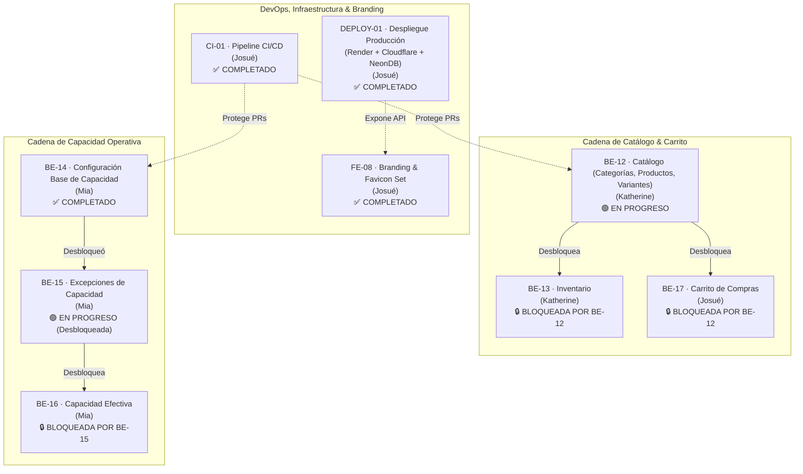
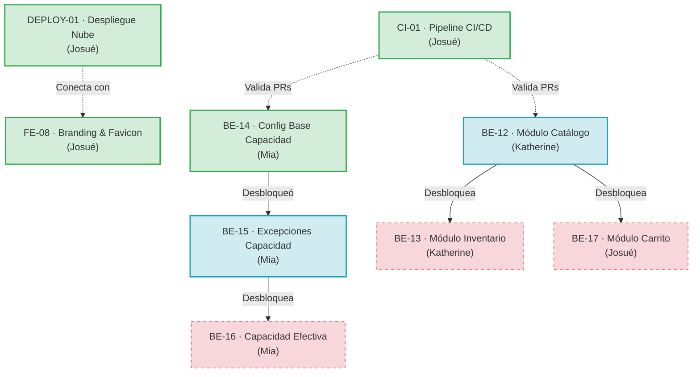

# Sprint 3: Catálogo, Capacidad y CI/CD

### JaldiShop — Gestión Ágil, Backlog y Entregables del Sprint 03

---

`📍 Docs` > `06-Scrum` > **Sprint 03**  
[⬅ Sprint 02](./sprint-02.md) | [🏠 Índice General](../../README.md) | [Alcance del MVP ➡](../03-requisitos/alcance-mvp.md)

---

## 1. Objetivo del Sprint

> 📌 **Nota:** Implementar el núcleo transaccional y operativo de JaldiShop. Se desarrollan en paralelo la cadena de catálogo (Categorías, Productos, Variantes, Inventario y Carrito) y la cadena de capacidad operativa (Configuración base, Excepciones y Capacidad efectiva), asegurando la calidad mediante el pipeline automatizado de CI/CD.

* **Fase:** *Catálogo, Capacidad Operativa, Inventario, Carrito y Pipeline CI/CD*.
* **Propósito:** Construir los dominios centrales de `Catalog`, `Inventory`, `Cart`, `CapacityConfiguration` y `CapacityException` respetando las dependencias de negocio para desbloquear flujos transaccionales.
* **Meta Central:** Disponer de los contratos REST y servicios de aplicación de Catálogo y Capacidad listos para su integración en Checkout y Frontend.

---

## 2. Backlog del Sprint y Cadena de Desbloqueo

| Prioridad | Tarjeta | Responsable | Estado | Dependencia | Entregable |
|:---:|---|:---:|:---:|:---:|---|
| 🔴 **Alta** | **CI-01** · Pipeline de validación automática | Josué | `COMPLETADO` | Ninguna | Workflow GitHub Actions con validación paralela Maven y Vitest |
| 🔴 **Alta** | **DEPLOY-01** · Despliegue en la Nube y Ambientes | Josué | `COMPLETADO` | CI-01 | Backend en Render API, Frontend en Cloudflare Pages y NeonDB |
| 🔴 **Alta** | **FE-08** · Identidad Visual, Favicon y Branding | Josué | `COMPLETADO` | Ninguna | Set de favicon SVG/PNG, manifest e integración en todas las vistas de auth/dashboard |
| 🔴 **Alta** | **BE-14** · Configuración base de Capacidad | Mia | `COMPLETADO` | Ninguna | Dominio CapacityConfiguration, JPA, CRUD REST, validaciones *(Desbloqueó BE-15)* |
| 🔴 **Alta** | **BE-12** · Implementar módulo de Catálogo | Katherine | `EN PROGRESO` | Ninguna | Categorías, Productos, Variantes, SKUs, Slugs, JPA, REST y tests *(Desbloquea BE-13 y BE-17)* |
| 🟡 **Media** | **BE-15** · Implementar Excepciones de Capacidad | Mia | `EN PROGRESO` | BE-14 | Dominio CapacityException, JPA, reglas de reemplazo y REST *(Desbloquea BE-16)* |
| 🟡 **Media** | **BE-13** · Implementar módulo de Inventario | Katherine | `BLOQUEADA` | BE-12 | Control de existencias, umbral bajo, tracking por variante y REST |
| 🟡 **Media** | **BE-17** · Implementar módulo de Carrito | Josué | `BLOQUEADA` | BE-12 | Carrito por User + Store, gestión de ítems y reglas de aislamiento |
| 🔵 **Baja** | **BE-16** · Cálculo y consulta de Capacidad Efectiva | Mia | `BLOQUEADA` | BE-15 | Motor de resolución base vs excepción y cálculo de slots disponibles |

---

## 3. Tarjetas de Trabajo

### 📋 CI-01 | Pipeline de validación automática

**Responsable:** Josué  
**Estado:** `COMPLETADO` ✅  
**Entregable:** Archivo `.github/workflows/ci.yml` configurado con jobs paralelos para Backend y Frontend Merchant, protegiendo ramas clave.

**Objetivo:** Automatizar la compilación y ejecución de pruebas de todo el proyecto en Pull Requests para detectar regresiones de forma temprana antes de integrar cambios a `develop` o `main`.

**Checklist:**
- [x] Crear archivo `.github/workflows/ci.yml`
- [x] **Backend Job:**
  - [x] Configurar runner `ubuntu-latest` con servicio PostgreSQL 16
  - [x] Configurar JDK 21 (Eclipse Temurin)
  - [x] Configurar caché de dependencias Maven
  - [x] Ejecutar compilación y verificación (`./mvnw clean test`) con 120 tests pasando
- [x] **Frontend Merchant Job:**
  - [x] Configurar Node.js (v22.x)
  - [x] Configurar caché de dependencias npm
  - [x] Ejecutar instalación limpia (`npm ci`)
  - [x] Ejecutar suite de pruebas (`npm test -- --watch=false`) con 67 tests pasando
  - [x] Ejecutar compilación de producción (`npm run build`)
- [x] **Integración & Verificación:**
  - [x] Configurar triggers para Pull Requests hacia `develop` y `main`
  - [x] Configurar triggers para pushes en `develop` y `main`
  - [x] Probar ejecución exitosa del pipeline
  - [x] Documentar reglas de branch protection en GitHub

---

### 📋 DEPLOY-01 | Despliegue en la Nube y Ambientes Multi-Entorno

**Responsable:** Josué  
**Estado:** `COMPLETADO` ✅  
**Entregable:** Infraestructura en la nube con Backend Spring Boot en Render Web Service (`https://jaldishop-api.onrender.com/api/v1`), Base de datos PostgreSQL en NeonDB y Frontend Merchant en Cloudflare Pages (`https://negocios-jaldishop.pages.dev/`), junto con Dockerfiles y perfiles multi-entorno (`development` vs `production`).

**Objetivo:** Disponer de entornos en la nube totalmente funcionales e independientes para desarrollo (`localhost`) y producción, asegurando la accesibilidad pública de la plataforma.

**Checklist:**
- [x] Configuración de Dockerfile multi-stage y Docker Compose para backend
- [x] Aprovisionamiento de base de datos Neon Serverless PostgreSQL (`postgresql+sslmode`)
- [x] Despliegue de servicio web en Render (`https://jaldishop-api.onrender.com`)
- [x] Configuración de variables de entorno seguras (`SPRING_DATASOURCE_URL`, `JWT_SECRET`, etc.) en Render
- [x] Despliegue de Frontend Merchant en Cloudflare Pages (`https://negocios-jaldishop.pages.dev`)
- [x] Configuración de perfiles de Angular (`src/environments/environment.ts` vs `environment.development.ts`)
- [x] Verificación de conectividad CORS entre Cloudflare Pages y Render API

---

### 📋 FE-08 | Identidad Visual, Favicon y Branding Oficial

**Responsable:** Josué  
**Estado:** `COMPLETADO` ✅  
**Entregable:** Reemplazo integral de iconos genéricos, SVGs de prueba e imágenes externas temporales por el set oficial de logotipos y favicon JaldiShop en todas las vistas públicas y autenticadas.

**Objetivo:** Consolidar la identidad visual del producto con recursos locales optimizados (SVG vectorial, PNG 96x96, Apple Touch Icon, Web App Manifest) en toda la interfaz de usuario.

**Checklist:**
- [x] Incorporación del set de favicon en `public/` (`favicon.ico`, `favicon.svg`, `favicon-96x96.png`, `apple-touch-icon.png`, `site.webmanifest`, Web App Manifests 192/512)
- [x] Configuración de etiquetas `<head>` en `src/index.html` con iconos y manifest
- [x] Actualización del sidebar principal (`merchant-layout`) con logo JaldiShop SVG
- [x] Actualización de pantallas de autenticación:
  - [x] Login (`form-panel` y `brand-panel`) con insignia "Panel Comerciante" y logo oficial
  - [x] Registro Paso 1 (`register-brand-panel`)
  - [x] Registro Paso 2 (`register-step2-brand`)
  - [x] Registro Paso 3 (`register-step3-brand`)
  - [x] Recuperación de contraseña (`forgot-password`)
- [x] Actualización de componentes compartidos:
  - [x] Header legal (`legal-header`)
  - [x] Pantalla 404 No Encontrado (`not-found`)
  - [x] Pantalla 403 No Autorizado (`unauthorized`)
- [x] Verificación de suite de tests en frontend: 107 tests pasando al 100%

---

### 📋 BE-12 | Implementar módulo de Catálogo

**Responsable:** Katherine  
**Estado:** `READY / EN PROGRESO` 🟢  
**Entregable:** Dominio `Category`, `Product`, `ProductVariant`, persistencia JPA, casos de uso de gestión, REST controller y tests.  
**Desbloquea:** **BE-13** (Inventario) y **BE-17** (Carrito).

**Descripción:**  
Implementar el módulo de catálogo de JaldiShop para permitir que cada comerciante gestione las categorías, productos y variantes pertenecientes a su tienda. Este módulo servirá como base para Inventario, Carrito y las interfaces de catálogo.

**Checklist:**
- [ ] Implementar `Category`
- [ ] Implementar `Product`
- [ ] Implementar `ProductVariant`
- [ ] Implementar puertos de repositorio (`CategoryRepository`, `ProductRepository`, `ProductVariantRepository`)
- [ ] Implementar entidades JPA (`CategoryEntity`, `ProductEntity`, `ProductVariantEntity`)
- [ ] Implementar `JpaRepository`
- [ ] Implementar mappers de persistencia
- [ ] Implementar adapters de persistencia
- [ ] Casos de uso de categorías (Crear, Listar por Tienda, Actualizar, Cambiar Estado)
- [ ] Casos de uso de productos (Crear con Variantes, Listar por Tienda/Categoría, Actualizar, Cambiar Estado)
- [ ] Casos de uso de variantes (Agregar Variante, Actualizar Precio/SKU, Desactivar)
- [ ] Validar pertenencia a Store (`store_id` del merchant)
- [ ] Implementar reglas de slug único de producto por tienda
- [ ] Implementar reglas de generación y unicidad de SKU por tienda
- [ ] Respetar estados definidos en el modelo (`ACTIVE`, `INACTIVE`, `ARCHIVED`)
- [ ] Implementar DTOs con Bean Validation
- [ ] Implementar endpoints REST Merchant (`/api/v1/categories/**`, `/api/v1/products/**`)
- [ ] Tests de dominio
- [ ] Tests de aplicación
- [ ] Tests de persistencia
- [ ] Tests web
- [ ] Documentar endpoints y contratos REST

---

### 📋 BE-14 | Configuración base de Capacidad

**Responsable:** Mia  
**Estado:** `COMPLETADO` ✅  
**Entregable:** Dominio `CapacityConfiguration`, persistencia JPA, casos de uso, REST controller, validaciones de franjas y suite de tests.  
**Desbloqueó:** **BE-15** (Excepciones de Capacidad).

**Descripción:**  
Permitir al comerciante configurar la capacidad operativa base de su tienda por día de la semana y franja horaria, respetando las reglas de negocio definidas en el modelo de capacidad de JaldiShop.

**Checklist Trello:**
- [x] Implementación completada
- [x] Tests completados
- [x] Code Review realizado
- [x] Correcciones solicitadas realizadas
- [x] PR aprobado
- [x] Merge a `main` / `develop`

---

### 📋 BE-15 | Implementar Excepciones de Capacidad

**Responsable:** Mia  
**Estado:** `EN PROGRESO` 🟢 *(Desbloqueada tras merge de BE-14)*  
**Entregable:** Dominio `CapacityException`, persistencia JPA, casos de uso, validación de reglas de sobreescritura y endpoints REST.  
**Desbloquea:** **BE-16** (Cálculo de Capacidad Efectiva).

**Descripción:**  
Permitir que un comerciante establezca una capacidad diferente para una fecha o franja específica sin modificar su configuración base (ej. feriados, eventos especiales, días de mantenimiento).

**Checklist:**
- [ ] Implementar `CapacityException`
- [ ] Implementar reglas e invariantes de dominio
- [ ] Implementar Repository Port (`CapacityExceptionRepository`)
- [ ] Implementar JPA Entity (`CapacityExceptionEntity`)
- [ ] Implementar `CapacityExceptionJpaRepository`
- [ ] Implementar mapper de persistencia
- [ ] Implementar Repository Adapter
- [ ] Caso de uso Crear excepción
- [ ] Caso de uso Consultar excepciones por Store y rango de fechas
- [ ] Caso de uso Actualizar excepción
- [ ] Caso de uso Desactivar/eliminar según modelo
- [ ] Validar Store (`store_id` del merchant)
- [ ] Validar fecha (`exception_date >= today`)
- [ ] Validar rango horario (`start_time < end_time` si aplica a franja parcial)
- [ ] Validar capacidad (`capacity >= 0`)
- [ ] **Aplicar regla central:** la excepción *reemplaza* la capacidad base para esa fecha/franja, **no se suma a ella**
- [ ] Implementar DTOs con Bean Validation
- [ ] Implementar endpoints REST (`/api/v1/capacity-exceptions/**`)
- [ ] Tests de dominio
- [ ] Tests de aplicación
- [ ] Tests de persistencia
- [ ] Tests web

---

### 📋 BE-16 | Cálculo y consulta de Capacidad Efectiva

**Responsable:** Mia  
**Estado:** `BLOQUEADA POR BE-15` 🔒  
**Entregable:** Servicio de dominio/aplicación para resolución de capacidad efectiva y endpoint de consulta para clientes y comerciantes.

**Descripción:**  
Implementar el servicio que determine qué capacidad corresponde realmente a una tienda para una fecha y franja determinadas, resolviendo la jerarquía entre configuración base y excepciones aplicables.

**Checklist:**
- [ ] Recibir Store + fecha + franja horaria
- [ ] Determinar configuración base aplicable según `day_of_week`
- [ ] Buscar excepción aplicable para la fecha exacta y franja
- [ ] **Priorizar excepción cuando exista** frente a la base
- [ ] Calcular `effectiveCapacity` final
- [ ] Manejar capacidad 0 (tienda cerrada o bloqueada ese día/franja)
- [ ] Manejar fecha sin configuración base ni excepción (cerrado por defecto)
- [ ] Manejar franja no disponible / fuera de horario
- [ ] Exponer consulta desde Application Service
- [ ] Crear endpoint REST de consulta de capacidad efectiva
- [ ] Tests sin excepción (aplica base)
- [ ] Tests con excepción (sobreescribe base)
- [ ] Tests con capacidad 0
- [ ] Tests sin configuración
- [ ] Tests de límites de franja
- [ ] *(Nota: Todavía NO debe implementar el hold/reserva temporal de 10 minutos; eso corresponde a Checkout/Holds).*

---

### 📋 BE-13 | Implementar módulo de Inventario

**Responsable:** Katherine  
**Estado:** `BLOQUEADA POR BE-12` 🔒  
**Entregable:** Dominio `Inventory`, control de stock por variante, umbrales de alerta y endpoints REST Merchant.

**Descripción:**  
Implementar la gestión de inventario asociada a las variantes de productos (`ProductVariant`), permitiendo controlar existencias actuales y umbrales de stock bajo para notificaciones oportunas.

**Checklist:**
- [ ] Implementar dominio `Inventory`
- [ ] Asociar `Inventory` con `ProductVariant` (1 a 1 por variante rastreable)
- [ ] Implementar Repository Port (`InventoryRepository`)
- [ ] Implementar JPA Entity (`InventoryEntity`)
- [ ] Implementar `InventoryJpaRepository`
- [ ] Implementar mapper y adapter de persistencia
- [ ] Caso de uso Consultar stock de producto/variante
- [ ] Caso de uso Actualizar stock disponible (ajuste manual)
- [ ] Caso de uso Configurar umbral de stock bajo (`low_stock_threshold`)
- [ ] Validar `stock_quantity >= 0`
- [ ] Respetar bandera `tracks_inventory` de `ProductVariant` (ignorar si es falso)
- [ ] Impedir operaciones sobre variantes de otra Store
- [ ] Implementar DTOs de entrada y salida
- [ ] Implementar endpoints REST Merchant (`/api/v1/inventory/**`)
- [ ] Tests de dominio
- [ ] Tests de aplicación
- [ ] Tests de persistencia
- [ ] Tests web
- [ ] *(Nota: Todavía NO incluye descontar stock por compra; eso se conectará en ConfirmPurchase/Checkout).*

---

### 📋 BE-17 | Implementar módulo de Carrito

**Responsable:** Josué  
**Estado:** `BLOQUEADA POR BE-12` 🔒  
**Entregable:** Dominio `Cart`, `CartItem`, persistencia JPA, casos de uso de gestión de carrito cliente y endpoints REST Customer.

**Descripción:**  
Implementar el carrito de compra del cliente para una tienda específica, permitiendo agregar, modificar y administrar variantes de productos antes de proceder a la selección de horario y Checkout.

**Checklist:**
- [ ] Implementar dominio `Cart`
- [ ] Implementar dominio `CartItem`
- [ ] Implementar Repository Port (`CartRepository`)
- [ ] Implementar persistencia JPA (`CartEntity`, `CartItemEntity`, `CartJpaRepository`)
- [ ] Implementar mapper y adapter de persistencia
- [ ] Caso de uso Obtener carrito activo del usuario para la tienda
- [ ] Caso de uso Agregar variante al carrito
- [ ] Caso de uso Modificar cantidad de ítem
- [ ] Caso de uso Eliminar ítem del carrito
- [ ] Caso de uso Vaciar carrito
- [ ] Validar `quantity > 0`
- [ ] Validar existencia y estado activo de `ProductVariant`
- [ ] Validar pertenencia de productos a la misma `Store`
- [ ] Impedir mezclar productos de distintas tiendas en un mismo carrito
- [ ] Mantener un único carrito activo por tupla `(User, Store)`
- [ ] **Regla de negocio:** El carrito **NO reserva inventario ni capacidad**
- [ ] Crear DTOs de entrada y salida
- [ ] Implementar endpoints REST Customer (`/api/v1/cart/**`)
- [ ] Tests de dominio
- [ ] Tests de aplicación
- [ ] Tests de persistencia
- [ ] Tests web

---

## 4. Estado de Avance del Sprint

| Métrica | Estado Actual | Detalle |
|---|:---:|---|
| Entregables completados | **4 / 9 (44%)** | `CI-01`, `DEPLOY-01`, `FE-08`, `BE-14` |
| Entregables en desarrollo activo | **2 / 9 (22%)** | `BE-12`, `BE-15` (Desbloqueada) |
| Entregables pendientes / bloqueados | **3 / 9 (33%)** | `BE-13`, `BE-17`, `BE-16` |
| **Estado General** | `EN PROGRESO` | Cadena central en ejecución |

---

## 5. Decisiones Cerradas del Modelo que Aplican a Este Sprint

| Decisión | Valor | Regla de Negocio | Documento |
|---|---|---|---|
| UUID para llaves primarias | `UUID` v4 generado en aplicación/JPA | Identificadores globales únicos en todas las entidades | modelo-er.md |
| Unicidad de SKU | `UNIQUE(store_id, sku)` | No se pueden repetir SKUs dentro de la misma tienda | modelo-er.md |
| Unicidad de Slug de Producto | `UNIQUE(store_id, slug)` | URLs amigables únicas por tienda | modelo-er.md |
| Aislamiento de Carrito | 1 Carrito activo por `(user_id, store_id)` | No mezclar tiendas en un mismo pedido | modelo-er.md |
| Carrito sin reserva | Solo informativo | No descuenta stock ni bloquea capacidad | alcance-mvp.md |
| Prioridad de Capacidad | `Excepción > Configuración Base` | La excepción sustituye por completo la capacidad base | modelo-capacidad-v1.md |
| Multi-Entorno Frontend | `environment.ts` (Render) vs `development.ts` (Localhost) | Conexión a la nube en producción y mock local en dev | arquitectura-sistema.md |
| CI Runner | GitHub Actions `ubuntu-latest` | Build & Test automatizado con PostgreSQL 16 y Node 22 | arquitectura-sistema.md |

---

## 6. Diagrama de Dependencias y Bloqueos

---

[⬅ Volver a Sprint 02](./sprint-02.md) | [🏠 Volver al Índice General](../../README.md) | [Modelo ER ➡](../04-diseno/modelo-er.md)
