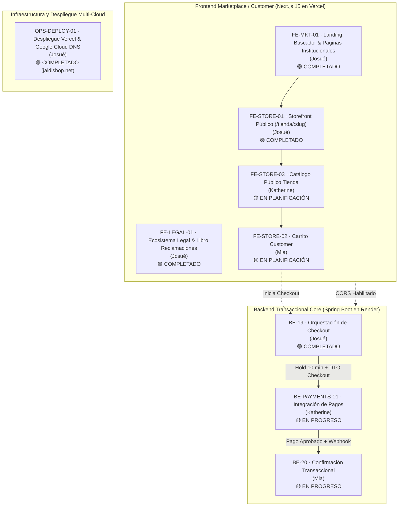

# Sprint 4: Checkout, Pagos, Confirmación Transaccional y Storefront Público

### JaldiShop — Gestión Ágil, Backlog y Entregables del Sprint 04

---

`📍 Docs` > `06-Scrum` > **Sprint 04**  
[⬅ Sprint 03](./sprint-03.md) | [🏠 Índice General](../../README.md) | [Alcance del MVP ➡](../03-requisitos/alcance-mvp.md)

---

## 1. Objetivo del Sprint

> 📌 **Nota:** Consolidar el flujo transaccional de compra y la experiencia pública del cliente (*Customer*). Se integran la orquestación del Checkout (validación simultánea de carrito, inventario y reserva de capacidad), el procesamiento seguro de pagos con Mercado Pago, la confirmación transaccional atómica de compras y la navegación del Storefront público y Carrito.

* **Fase:** *Orquestación de Checkout, Pagos (Mercado Pago), Confirmación Transaccional, Storefront Público y Carrito Customer*.
* **Propósito:** Conectar los módulos independientes construidos en sprints previos (`Cart`, `Inventory`, `CapacityReservation`) en un flujo de compra robusto, transaccional e idempotente que culmine en pedidos confirmados.
* **Meta Central:** Disponer del circuito completo de compra operativo de extremo a extremo: desde la selección de productos y fechas en el Storefront hasta el cobro, hold de capacidad y creación de pedidos confirmados.

---

## 2. Matriz de Asignación y Responsabilidades

| Responsable | Tarjeta | Tipo | Justificación / Por qué |
|:---:|---|:---:|---|
| **Josué** | **BE-19** · Orquestación de Checkout | Backend | Es integración entre módulos. Tras trabajar Identity, Store y Cart, coordina la orquestación entre `Cart` + `Inventory` + `CapacityReservation` sin apropiarse de la lógica interna de esos módulos. |
| **Mia** | **BE-20** · Confirmación Transaccional de Compra | Backend | Viene directamente de su trabajo con `Capacity/Reservations`. Aquí la reserva pasa a estado comprometido (`COMMITTED`) de forma atómica cuando la compra se confirma. |
| **Katherine** | **BE-PAYMENTS-01** · Integración de Pagos | Backend | Viene de `Inventory` y permite repartir el backend crítico entre los tres. Trabaja Mercado Pago, intentos, idempotencia, estados de pago y webhooks. |
| **Josué** | **FE-STORE-01** · Storefront Público | Frontend | Inicia la estructura del marketplace / storefront público conectando la identidad de la tienda, layout base y SSR con Next.js 15. |
| **Josué** | **FE-LEGAL-01** · Ecosistema Legal y Reclamaciones | Frontend | Garantiza el cumplimiento normativo (D.S. 011-2011-PCM, Ley 29733) y optimiza la UX de Términos y Privacidad con lectura por pestañas y PDF. |
| **Josué** | **FE-MKT-01** · Landing Page & Búsqueda Bimodal | Frontend | Implementa la experiencia principal del Marketplace: buscador en tiempo real, HUD en desktop, Drawer móvil, carruseles y páginas corporativas. |
| **Josué** | **OPS-DEPLOY-01** · Despliegue Multi-Cloud & DNS | DevOps | Despliega el Marketplace en Vercel, enlaza Google Cloud DNS (`jaldishop.net`), configura CORS en Spring Boot y aísla entornos. |
| **Mia** | **FE-STORE-02** · Carrito Customer | Frontend | Está directamente relacionado con el flujo previo a reserva/checkout y permite conectar su conocimiento de capacidad y validaciones con la experiencia del cliente. |
| **Katherine** | **FE-STORE-03** · Catálogo Público de la Tienda | Frontend | Es la continuación natural de `BE-12 Catalog`: conoce a profundidad las categorías, productos y variantes que expone el backend. |

---

## 3. Backlog del Sprint y Cadena Transaccional

---

## 4. Tarjetas de Trabajo Detalladas

### 📋 BE-19 | Orquestación de Checkout

**Responsable:** Josué  
**Estado:** `COMPLETADO` 🟢  
**Entregable:** Caso de uso `CheckoutService`, DTOs de entrada/salida (`InitiateCheckoutRequest`, `CheckoutResponse`), endpoint REST `POST /api/v1/checkout`, validaciones orquestadas entre `Cart`, `Catalog`, `Store` y `CapacityReservation`, hold de capacidad de 10 minutos y 100% tests unitarios/MockMvc pasando.

**Descripción:**  
Implementar el caso de uso de Checkout encargado de coordinar la validación del carrito, inventario y capacidad operativa antes de iniciar el proceso de pago.  
Checkout actúa como orquestador entre módulos y **no debe duplicar las reglas internas** de `Cart`, `Inventory` o `Capacity`.  
El flujo valida que el carrito sea válido, comprueba el estado activo de productos y variantes, verifica la capacidad efectiva para la fecha/franja seleccionada y genera una reserva temporal de capacidad de 10 minutos.  
Al finalizar correctamente, el checkout queda preparado para iniciar un intento de pago con Mercado Pago.

**Checklist:**
- [x] Definir contrato/DTO de inicio de Checkout (`InitiateCheckoutRequest`, `CheckoutResponse`)
- [x] Obtener usuario autenticado desde JWT (`@AuthenticationPrincipal JwtPrincipal`)
- [x] Obtener y validar carrito activo del Customer (`CartRepository.findByUserIdAndStoreId`)
- [x] Validar que el carrito tenga productos (`CART_EMPTY`)
- [x] Validar que todos los productos correspondan a la misma Store (`VARIANT_STORE_MISMATCH`)
- [x] Validar estado/vigencia de productos y variantes (`VARIANT_INACTIVE`, `PRODUCT_INACTIVE`)
- [x] Consultar capacidad efectiva para fecha/franja seleccionada
- [x] Solicitar creación de reserva temporal de capacidad (`CreateCapacityReservationService`)
- [x] Utilizar hold de capacidad de 10 minutos (`CapacityReservation.RESERVATION_TTL`)
- [x] Manejar capacidad agotada (`CAPACITY_EXHAUSTED`, `CAPACITY_UNAVAILABLE`)
- [x] Manejar validaciones de entrega y retiro (`DELIVERY_NOT_AVAILABLE`, `PICKUP_NOT_AVAILABLE`, `DELIVERY_ADDRESS_REQUIRED`)
- [x] Manejar carrito inválido o vacío (`CART_EMPTY`)
- [x] Evitar duplicar reglas pertenecientes a Inventory/Capacity/Cart (respetando los límites de Katherine y Mia)
- [x] Definir respuesta de Checkout con información necesaria para Payment (`CheckoutPricing`, `CheckoutCustomerResponse`, `CheckoutItemResponse`)
- [x] Implementar manejo de errores mediante contrato ApiError (`GlobalExceptionHandler`)
- [x] Implementar endpoint de inicio de Checkout (`POST /api/v1/checkout`)
- [x] Agregar pruebas unitarias del caso de uso (`CheckoutServiceTest`)
- [x] Agregar pruebas de controlador con MockMvc (`CheckoutControllerTest`)
- [x] Probar escenario exitoso (PICKUP y DELIVERY con cálculo de tarifa e IGV)
- [x] Probar capacidad agotada
- [x] Probar carrito vacío / tienda inactiva
- [x] Documentar contrato y flujo de Checkout

> ⚠️ **Fuera de alcance:** Cobrar con Mercado Pago, crear Pedido, descontar definitivamente inventario o comprometer definitivamente capacidad (asignadas a Katherine en `BE-PAYMENTS-01` y Mia en `BE-20`).

---

### 📋 BE-20 | Confirmación Transaccional de Compra

**Responsable:** Mia  
**Estado:** `EN PROGRESO` 🟡  
**Entregable:** Caso de uso `ConfirmPurchaseService`, transacción ACID atómica, descuento definitivo de stock, transición de reserva a `COMMITTED`, creación de `Order` en estado `CONFIRMADO` y suite de tests de idempotencia.

**Descripción:**  
Implementar el caso de uso responsable de convertir una compra con pago aprobado en una operación confirmada de JaldiShop.  
La confirmación debe ejecutarse de forma transaccional y coordinar `Payment`, `Capacity`, `Inventory` y `Ordering`, garantizando que una misma operación no produzca pedidos duplicados ni efectos repetidos.  
Solo una operación con pago aprobado y reserva válida/protegida puede generar un Pedido.

**Checklist:**
- [ ] Crear caso de uso `ConfirmPurchase`
- [ ] Definir comando/contrato de confirmación
- [ ] Obtener y validar `Payment`
- [ ] Verificar que `Payment` esté `APPROVED`
- [ ] Verificar que la operación no haya sido confirmada previamente
- [ ] Obtener la reserva de capacidad asociada
- [ ] Validar estado permitido de la reserva
- [ ] Validar vigencia/protección de la reserva
- [ ] Revalidar inventario antes de confirmar
- [ ] Aplicar actualización atómica del inventario
- [ ] Impedir stock negativo
- [ ] Cambiar reserva a estado `COMMITTED` / COMPROMETIDA
- [ ] Crear `Order` únicamente después del pago aprobado
- [ ] Crear `Order` inicialmente en estado `CONFIRMED` / CONFIRMADO
- [ ] Crear `OrderItems` a partir de la información correspondiente
- [ ] Asociar `Order` con `Payment`
- [ ] Asociar `Order` con `CapacityReservation`
- [ ] Garantizar idempotencia de la confirmación
- [ ] Evitar creación de `Orders` duplicados
- [ ] Ejecutar cambios locales dentro de una transacción
- [ ] Manejar fallo de inventario durante confirmación
- [ ] Manejar reserva inválida/expirada
- [ ] Manejar `Payment` no aprobado
- [ ] Agregar pruebas unitarias
- [ ] Agregar pruebas transaccionales/integración
- [ ] Probar confirmación repetida/idempotencia
- [ ] Documentar flujo de `ConfirmPurchase`

> ⚠️ **Fuera de alcance:** Llamar a Mercado Pago, procesar tarjeta, implementar UI o realizar automáticamente refund ante cualquier inconsistencia. La compensación/reconciliación se trata separadamente.

---

### 📋 BE-PAYMENTS-01 | Integración de Pagos

**Responsable:** Katherine  
**Estado:** `EN PROGRESO` 🟡  
**Entregable:** Módulo `Payment` y `PaymentAttempt`, adapter SDK/REST de Mercado Pago Sandbox, endpoint de webhook con validación de firma, control de idempotencia y protección de reserva.

**Descripción:**  
Implementar el módulo de pagos del MVP utilizando Mercado Pago como proveedor externo.  
El módulo debe administrar `Payment` y `PaymentAttempt`, iniciar el pago utilizando una reserva de capacidad válida, manejar los estados del proveedor y procesar de manera idempotente la confirmación recibida.  
El procesamiento externo no debe mantener abierta una transacción de base de datos mientras se espera la respuesta de Mercado Pago.

**Checklist:**
- [ ] Configurar integración sandbox/test de Mercado Pago
- [ ] Configurar credenciales mediante variables de entorno
- [ ] Implementar `Payment`
- [ ] Implementar `PaymentAttempt`
- [ ] Implementar repositorios/puertos necesarios
- [ ] Implementar adapter del proveedor Mercado Pago
- [ ] Crear `Payment` a partir de un Checkout válido
- [ ] Crear `PaymentAttempt` por cada intento
- [ ] Implementar `Idempotency-Key`
- [ ] Persistir identificadores devueltos por Mercado Pago
- [ ] Manejar estado `CREATED`
- [ ] Manejar estado `PROCESSING`
- [ ] Manejar estado `APPROVED`
- [ ] Manejar estado `REJECTED`
- [ ] Manejar estado `ERROR`
- [ ] Proteger la reserva cuando comienza un pago válido
- [ ] Aplicar ventana de protección de pago definida por el MVP
- [ ] Implementar recepción de webhook/notificación del proveedor
- [ ] Validar y procesar webhook de forma idempotente
- [ ] Evitar duplicar `PaymentAttempts` por reintentos del proveedor
- [ ] Preparar llamada a `ConfirmPurchase` cuando el pago sea aprobado
- [ ] Manejar aprobación tardía después de expirar la protección
- [ ] No crear `Order` directamente desde el adapter de Mercado Pago
- [ ] No almacenar datos sensibles de tarjeta
- [ ] Implementar manejo de errores del proveedor
- [ ] Agregar pruebas unitarias
- [ ] Agregar pruebas de integración con respuestas simuladas del proveedor
- [ ] Documentar variables de entorno
- [ ] Documentar flujo `Payment` → `ConfirmPurchase`

---

### 📋 FE-STORE-01 | Storefront Público

**Responsable:** Josué  
**Estado:** `COMPLETADO` 🟢  
**Entregable:** Módulo de Storefront público por slug de tienda (`/tienda/[slug]`), layout responsive, consumo de endpoints públicos de Store (`storeService`), Server Components con SSR y OpenGraph dinámico, badges de fulfillment, navegación pegajosa, empty states, 404 con `notFound()`, y suite de pruebas unitarias en Vitest.

**Descripción:**  
Implementar la estructura pública de una tienda dentro de `frontend-marketplace`, permitiendo que cualquier visitante acceda mediante el slug de la Store y visualice su identidad comercial, badges de capacidad y navegación pública.  
Esta tarjeta establece el contenedor/layout de la tienda. El catálogo detallado se desarrolla independientemente en `FE-STORE-03`.

**Checklist:**
- [x] Crear ruta pública basada en slug de Store (`/tienda/[slug]`)
- [x] Crear layout del Storefront con Next.js 15 Server Components
- [x] Consultar información pública de Store desde backend (`storeService.getStoreBySlug`)
- [x] Mostrar nombre comercial
- [x] Mostrar logo y avatar optimizados
- [x] Mostrar banner editorial con gradientes y blur
- [x] Mostrar descripción comercial
- [x] Mostrar información básica disponible de la tienda (horarios, cupos, contacto)
- [x] Crear navegación pública de la tienda (`StorefrontNav`)
- [x] Preparar área/contenedor para catálogo (`CatalogContainer`)
- [x] Preparar acceso visual al carrito (`CartDrawer`)
- [x] Implementar loading state (`loading.tsx`)
- [x] Implementar empty state cuando no hay productos (`EmptyState.tsx`)
- [x] Implementar Store no encontrada (404) mediante `notFound()` de Next.js
- [x] Implementar manejo mediante contrato ApiError (`ApiException` unificado)
- [x] Adaptar diseño a desktop (HUD, sticky bar, grilla multi-columna)
- [x] Adaptar diseño a tablet
- [x] Adaptar diseño a mobile (drawer touch, espaciados generosos)
- [x] Evitar información administrativa del Merchant (completamente aislada)
- [x] Integrar endpoints reales del backend de Spring Boot en Render
- [x] Agregar pruebas completas de componentes/servicios en Vitest (61/61 pasando)

---

### 📋 FE-LEGAL-01 | Ecosistema Legal y Libro de Reclamaciones

**Responsable:** Josué  
**Estado:** `COMPLETADO` 🟢  
**Entregable:** Arquitectura legal modular (`features/legal`), páginas `/terminos` y `/privacidad` con navegación interactiva bimodal (Pestañas vs. Documento Completo), tarjeta "En pocas palabras (TLDR)" por cláusula, soporte de impresión formal `@media print` y Libro de Reclamaciones Virtual (`/libro-de-reclamaciones`) conforme a D.S. 011-2011-PCM con generación de código correlativo `RCL-YYYYMMDD-XXXX` y constancia digital descargable.

**Descripción:**  
Garantizar el cumplimiento normativo peruano (Código de Protección y Defensa del Consumidor - Ley N° 29571, Ley N° 29733 de Protección de Datos Personales, y D.S. 011-2011-PCM) resolviendo a su vez la fatiga de lectura legal mediante una UX moderna inspirada en Stripe/Linear.

**Checklist:**
- [x] Implementar layout legal interactivo (`LegalLayout.tsx`)
- [x] Diseñar modo de lectura por cláusulas/pestañas (vista enfocada sin fatiga de scroll infinito)
- [x] Diseñar barra de navegación secuencial al pie (`[← Anterior]` / `[Siguiente →]`) con porcentaje de lectura
- [x] Diseñar interruptor dual: `[📑 Por Cláusulas]` vs `[📜 Ver Completo]`
- [x] Crear índice lateral sticky y barra de píldoras móvil (`LegalTableOfContents.tsx`)
- [x] Implementar tarjeta de resumen ciudadano TLDR (`LegalTldrCard.tsx`)
- [x] Garantizar impresión completa de todas las cláusulas mediante `@media print` (`LegalPrintButton.tsx`)
- [x] Redactar 7 cláusulas de Términos y Condiciones orientadas a comercio MYPE y capacidad operativa
- [x] Redactar Política de Privacidad detallando derechos ARCO y banco de datos
- [x] Crear página de Libro de Reclamaciones Virtual oficial (`/libro-de-reclamaciones`)
- [x] Implementar formulario en 4 pasos legales: Identificación, Bien Contratado, Detalle de Reclamo/Queja y Pedido
- [x] Validar formulario con Zod y React Hook Form (`claimsBook.schema.ts`)
- [x] Generar comprobante y constancia imprimible con código `RCL-YYYYMMDD-XXXX` (`ClaimsBookReceipt.tsx`)
- [x] Pruebas unitarias completas de componentes legales y libro de reclamaciones en Vitest

---

### 📋 FE-MKT-01 | Landing Page, Buscador Bimodal y Páginas Institucionales

**Responsable:** Josué  
**Estado:** `COMPLETADO` 🟢  
**Entregable:** Landing Page de alta conversión (`/`), buscador de tiendas responsive bimodal (HUD en desktop, Drawer touch en mobile con debounce), carrusel dinámico `CraftMarqueeSection`, peek slider de tiendas `StorePeekSlider`, footer editorial de 4 columnas y 4 páginas institucionales (`/sobre-nosotros`, `/trabaja-con-nosotros`, `/accesibilidad`, `/ayuda`).

**Descripción:**  
Desarrollar la vitrina principal de JaldiShop conectando a compradores con negocios artesanales y gastronómicos. Se rediseñó el copywriting eliminando tecnicismos y tono IA para hablar en el lenguaje cotidiano de los emprendedores peruanos.

**Checklist:**
- [x] Diseñar e implementar Hero Section con propuesta de valor clara y llamadas a la acción
- [x] Implementar buscador bimodal en tiempo real (`Navbar.tsx` + `SearchModal` + `Drawer`)
- [x] Agregar debounce de 250ms para optimización de llamadas de búsqueda
- [x] Diseñar sección Bento Features destacando capacidad, reserva de cupos y puente WhatsApp
- [x] Implementar carrusel continuo artesanal (`CraftMarqueeSection`)
- [x] Implementar slider horizontal de tiendas destacadas (`StorePeekSlider`)
- [x] Diseñar comparativa de valor "Vender por Chat vs. JaldiShop" (`ComparisonSection`)
- [x] Crear Footer de 4 columnas: Marca, Categorías (`store_categories`), Herramientas MYPE y Empresa
- [x] Implementar página `/sobre-nosotros` con historia, misión y principios de JaldiShop
- [x] Implementar página `/trabaja-con-nosotros` con cultura y posiciones abiertas
- [x] Implementar página `/accesibilidad` con estándares WCAG 2.1 AA
- [x] Implementar página `/ayuda` con preguntas frecuentes para clientes y comerciantes
- [x] Manejar desplazamiento suave a secciones mediante anclas y compensación de navbar (`HashScrollHandler`)
- [x] Humanizar textos y copys eliminando jerga técnica inaccesible

---

### 📋 OPS-DEPLOY-01 | Infraestructura Multi-Cloud y Despliegue en Producción

**Responsable:** Josué  
**Estado:** `COMPLETADO` 🟢  
**Entregable:** Despliegue continuo en producción del Marketplace en Vercel sobre el dominio oficial `https://www.jaldishop.net/`, enlace DNS en Google Cloud DNS preservando DNSSEC, corrección de CORS en Spring Boot y aislamiento de entornos `.env` / `.env.local`.

**Descripción:**  
Poner en producción el Frontend Marketplace garantizando alta disponibilidad, certificado SSL automático (HTTPS), compatibilidad multi-cloud entre Vercel, Render (Backend) y Cloudflare Pages (Frontend Merchant), y resolución de políticas de seguridad CORS.

**Checklist:**
- [x] Configurar proyecto en Vercel con Root Directory `frontend-marketplace`
- [x] Generar build de producción con Next.js 15 App Router (11 rutas estáticas/dinámicas)
- [x] Configurar registros DNS en Google Cloud DNS (Zona `jaldishop-net`):
  - Registro `A` para `jaldishop.net.` apuntando a `76.76.21.21`
  - Registro `CNAME` para `www.jaldishop.net.` apuntando a `cname.vercel-dns.com.`
- [x] Mantener DNSSEC habilitado de forma segura sin tocar servidores de nombres
- [x] Habilitar orígenes en `WebCorsConfiguration.java` del Backend (Spring Boot en Render):
  - `https://*.jaldishop.net` y `https://jaldishop.net`
  - `https://*.vercel.app`
- [x] Configurar archivo `.env` con endpoints de producción (Render y Cloudflare Pages)
- [x] Crear plantilla versionada `.env.example` con valores nulos para el equipo
- [x] Configurar `.env.local` para desarrollo local aislado (Spring Boot en `localhost:8080`, Angular en `localhost:4200`)
- [x] Validar funcionamiento en vivo en `https://www.jaldishop.net/`

---

---

### 📋 FE-STORE-02 | Carrito Customer

**Responsable:** Mia  
**Estado:** `EN PLANIFICACIÓN` 🟡  
**Entregable:** Componentes de Carrito, `CartService` reactivo, soporte para cantidades y variantes, aislamiento por tienda única y conexión con el backend real.

**Descripción:**  
Implementar la experiencia de carrito del cliente en `frontend-marketplace`, permitiendo agregar variantes de productos, modificar cantidades, eliminar productos y consultar el resumen previo al Checkout.  
El carrito debe trabajar contra el backend real y respetar la regla de que un carrito pertenece a una única Store.  
**Agregar productos al carrito no reserva inventario ni capacidad.** Estas validaciones se realizarán posteriormente durante Checkout.

**Checklist:**
- [ ] Crear modelo/DTO de Cart en frontend
- [ ] Crear `CartService`
- [ ] Integrar endpoints reales del backend (`/api/v1/cart/**`)
- [ ] Obtener carrito activo del Customer
- [ ] Agregar `ProductVariant` al carrito
- [ ] Actualizar cantidad de un `CartItem`
- [ ] Eliminar `CartItem`
- [ ] Vaciar carrito
- [ ] Mostrar productos/variantes agregados
- [ ] Mostrar cantidad por Item
- [ ] Mostrar precio referencial por Item
- [ ] Calcular/mostrar resumen visual del carrito
- [ ] Mostrar cantidad total de Items en indicador del carrito
- [ ] Mantener carrito asociado a una única Store
- [ ] Impedir mezcla de productos de diferentes Stores
- [ ] Manejar carrito vacío
- [ ] Manejar producto/variante no disponible
- [ ] Manejar usuario no autenticado según flujo definido
- [ ] Implementar loading states
- [ ] Implementar operation states
- [ ] Integrar `ErrorHandlerService`
- [ ] Integrar `ToastService`
- [ ] Agregar acción "Continuar comprando"
- [ ] Agregar acción "Continuar al checkout"
- [ ] Preparar navegación hacia Checkout
- [ ] Diseño responsive desktop/tablet/mobile
- [ ] Agregar pruebas de `CartService`
- [ ] Agregar pruebas de componentes principales
- [ ] No reservar inventario al agregar productos
- [ ] No reservar capacidad al agregar productos
- [ ] No implementar pago dentro de esta tarjeta

---

### 📋 FE-STORE-03 | Catálogo Público de la Tienda

**Responsable:** Katherine  
**Estado:** `EN PLANIFICACIÓN` 🟡  
**Entregable:** Componentes de grilla de categorías, tarjetas de productos, selección de variantes, modal de detalle de producto y sincronización con el carrito.

**Descripción:**  
Implementar la visualización del catálogo digital de productos y variantes de la tienda dentro del Storefront público, permitiendo a los clientes explorar por categorías, ver detalles y agregar variantes al carrito.

**Checklist:**
- [ ] Consumir categorías públicas de la tienda
- [ ] Consumir productos y variantes activos de la tienda
- [ ] Renderizar barra/chips de categorías públicas
- [ ] Renderizar grilla de productos con imágenes y precio base
- [ ] Selector visual de variantes (tamaño, sabor, presentación)
- [ ] Validar disponibilidad visual de productos
- [ ] Conectar acción "Agregar al carrito" con `CartService`
- [ ] Responsive en desktop, tablet y móvil
- [ ] Tests de componentes y servicios

---

## 5. Criterios de Éxito del Sprint

1. **Flujo Transaccional Operativo:** El usuario puede agregar productos al carrito, ir a Checkout, seleccionar fecha/franja horaria, obtener un hold de 10 minutos de capacidad y procesar el pago.
2. **Atomicidad e Idempotencia:** Un pago aprobado confirma el pedido, descuenta stock y compromete capacidad en una única transacción atómica; reintentos de webhook no duplican órdenes.
3. **Calidad y Cobertura:** 100% de pruebas unitarias y de integración pasando en Backend (Spring Boot) y Frontend (Angular/Vitest) en el pipeline de CI/CD.

---

[⬅ Volver a Sprint 03](./sprint-03.md) | [🏠 Volver al Índice General](../../README.md) | [Alcance del MVP ➡](../03-requisitos/alcance-mvp.md)
