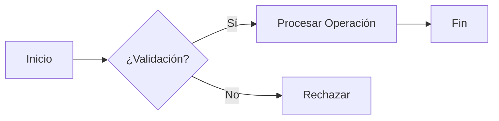

# [TÍTULO DEL DOCUMENTO]

### [Subtítulo o Módulo del Sistema]

---

`📍 Docs` > `XX-Categoría` > **[Nombre del Archivo]**  
[⬅ Documento Anterior](./anterior.md) | [🏠 Índice General](../../README.md) | [Documento Siguiente ➡](./siguiente.md)

---

## 1. Propósito y Contexto

> 📌 **Nota:** Breve resumen ejecutivo de 2 a 3 líneas describiendo la finalidad del documento y su aporte al proyecto.

Explica aquí el problema que aborda este entregable o módulo.

---

## 2. Diagrama Conceptual / Flujo

---

## 3. Especificaciones Técnicas

### 3.1 Estructura de Datos / Entidades

| Campo | Tipo | Requerido | Descripción |
|---|:---:|:---:|---|
| `id` | `UUID` | Sí | Identificador único |
| `nombre` | `VARCHAR(100)` | Sí | Nombre descriptivo |
| `estado` | `ENUM` | Sí | Estado actual de la entidad |

---

## 4. Reglas de Negocio

> 💡 **Regla Crítica:** Destaca aquí las validaciones o invariantes fundamentales de negocio que el backend debe asegurar.

> 📌 **Recomendación:** Sugerencias para optimización o buenas prácticas de integración.

> ⚠️ **Advertencia:** Puntos donde pueda ocurrir concurrencia, fallo de datos o excepciones.

---

## 5. Consideraciones de Implementación

- [ ] Tarea técnica 1 relacionada
- [ ] Tarea técnica 2 relacionada
- [ ] Pruebas unitarias/integración asociadas

---

[⬅ Documento Anterior](./anterior.md) | [🏠 Volver al Índice General](../../README.md) | [Documento Siguiente ➡](./siguiente.md)
