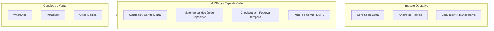
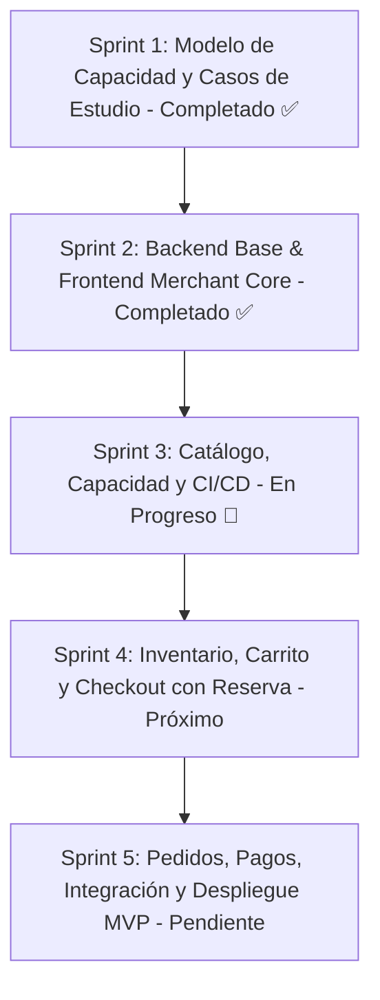

# 🛍️ JaldiShop

### Plataforma de Gestión de Pedidos y Control Inteligente de Capacidad para MYPE

> **Capa de orden operativa** para micro y pequeñas empresas que comercializan por WhatsApp e Instagram, eliminando la sobreventa y sincronizando pedidos con su capacidad real.

---

## 📌 Visión General

Las MYPE que trabajan bajo pedido (panaderías, dark kitchens, reposterías, catering) enfrentan a diario **sobreventa, pedidos traspapelados y saturación operativa**. 

A diferencia del e-commerce tradicional —que únicamente evalúa si hay *stock* de producto—, **JaldiShop** incorpora la **capacidad operativa** (tiempo de preparación, disponibilidad de personal y slots de entrega) como restricción inteligente para asegurar que el negocio solo acepte lo que verdaderamente puede cumplir.

---

## 👥 Equipo de Desarrollo

| Miembro | Rol | Responsabilidad Sprint 3 | Perfil |
|---|:---:|---|:---:|
| **Josue Royer Tanta Cieza** | Full Stack Dev | CI-01 Pipeline CI/CD + BE-17 Carrito + Despliegue Render/Cloudflare + FE Branding | [@iJosueeh](https://github.com/iJosueeh) |
| **Katherine Patricia Salas Quiroz** | Full Stack Dev | BE-12 Módulo de Catálogo + BE-13 Inventario | [@kath144](https://github.com/kath144) |
| **Mia Vitalia Gual Vega** | Full Stack Dev | BE-14 Capacidad Base + BE-15 Excepciones + BE-16 Capacidad Efectiva | [@miagv](https://github.com/miagv) |

---

## 🛠️ Stack Tecnológico

| Capa | Tecnologías | Propósito |
|:---|:---|:---|
| **Backend** | Spring Boot 4.1.1, Java 21 | API RESTful, Arquitectura Hexagonal/DDD y Transaccionalidad |
| **Seguridad** | JWT, Spring Security | Autenticación sin estado y RBAC (CUSTOMER, MERCHANT, ADMIN) |
| **Frontend** | Angular 20 Standalone, Next.js, Tailwind CSS | Panel de Comerciante (Angular) y Portal Cliente (Next.js) |
| **Persistencia** | PostgreSQL 18.6 (NeonDB), Flyway, Hibernate | Base de datos relacional en la nube y JPA |
| **Despliegue & DevOps** | Render, Cloudflare Pages, Docker, GitHub Actions | Despliegue continuo y validación automatizada en la nube |
| **Calidad / QA** | JUnit 5, Mockito, Vitest | 260 pruebas automatizadas pasando al 100% (153 Backend + 107 Frontend) |
| **Tiempo Real** | WebSockets | Actualización de estados y disponibilidad en vivo |

---

## 🚀 Estado de los Sprints

---

## 💡 Conceptos Clave del Dominio

* **Capacidad Base:** Límite estándar de pedidos que una tienda procesa por día o bloque horario.
* **Excepción Temporal:** Ajuste en caliente para fechas festivas o imprevistos operativos sin alterar la base semanal.
* **Reserva Temporal (Hold):** Bloqueo transaccional de cupo durante 10 minutos mientras el cliente realiza el pago.
* **Capacidad Comprometida:** Total de cupos bloqueados por pedidos pagados y reservas en curso.
