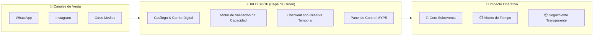
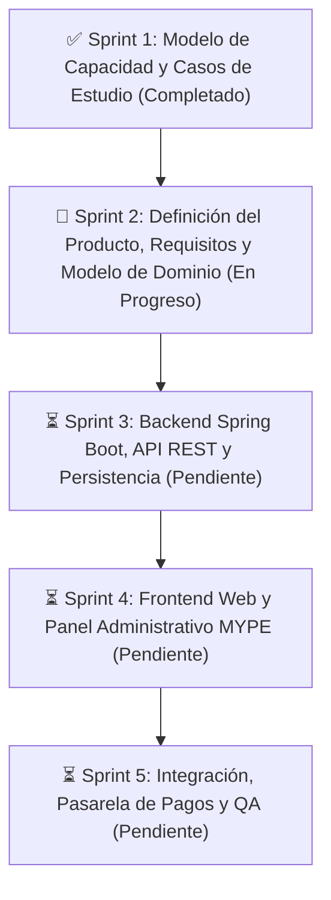

# 🛍️ JaldiShop

### Plataforma de Gestión de Pedidos y Control Inteligente de Capacidad para MYPE

> **Capa de orden operativa** para micro y pequeñas empresas que comercializan por WhatsApp e Instagram, eliminando la sobreventa y sincronizando pedidos con su capacidad real.

---

## 📌 Visión General

Las MYPE que trabajan bajo pedido (panaderías, dark kitchens, reposterías, catering) enfrentan a diario **sobreventa, pedidos traspapelados y saturación operativa**. 

A diferencia del e-commerce tradicional —que únicamente evalúa si hay *stock* de producto—, **JaldiShop** incorpora la **capacidad operativa** (tiempo de preparación, disponibilidad de personal y slots de entrega) como restricción inteligente para asegurar que el negocio solo acepte lo que verdaderamente puede cumplir.

---

## 👥 Equipo de Desarrollo

| Miembro | Rol | Responsabilidad Sprint 2 | Perfil |
|---|:---:|---|:---:|
| **Josue Royer Tanta Cieza** | Full Stack Dev | Reglas de Negocio (RN-01 a 15) & Modelo de Dominio | [@iJosueeh](https://github.com/iJosueeh) |
| **Katherine Patricia Salas Quiroz** | Full Stack Dev | Modelo de Dominio & Flujo Completo del Pedido | [@kath144](https://github.com/kath144) |
| **Mia Vitalia Gual Vega** | Full Stack Dev | Historias de Usuario (MoSCoW) & Criterios de Aceptación | [@miagv](https://github.com/miagv) |

---

## 🛠️ Stack Tecnológico

| Capa | Tecnologías | Propósito |
|:---|:---|:---|
| **Backend** | Spring Boot 4, Java 17+ | API RESTful, Reglas de Dominio y Transaccionalidad |
| **Frontend** | Next.js, Angular, Tailwind CSS | Portal Cliente y Panel Administrativo MYPE |
| **Persistencia** | PostgreSQL, Hibernate | Base de datos relacional y control concurrente |
| **Tiempo Real** | WebSockets | Actualización de estados y disponibilidad en vivo |

---

## 🚀 Estado de los Sprints

---

## 💡 Conceptos Clave del Dominio

* **Capacidad Base:** Límite estándar de pedidos que una tienda procesa por día o bloque horario.
* **Excepción Temporal:** Ajuste en caliente para fechas festivas o imprevistos operativos sin alterar la base semanal.
* **Reserva Temporal (Hold):** Bloqueo transaccional de cupo durante 10 minutos mientras el cliente realiza el pago.
* **Capacidad Comprometida:** Total de cupos bloqueados por pedidos pagados y reservas en curso.
