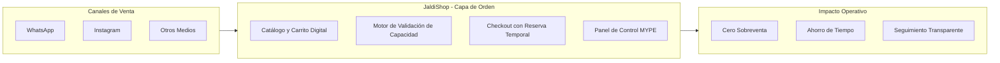
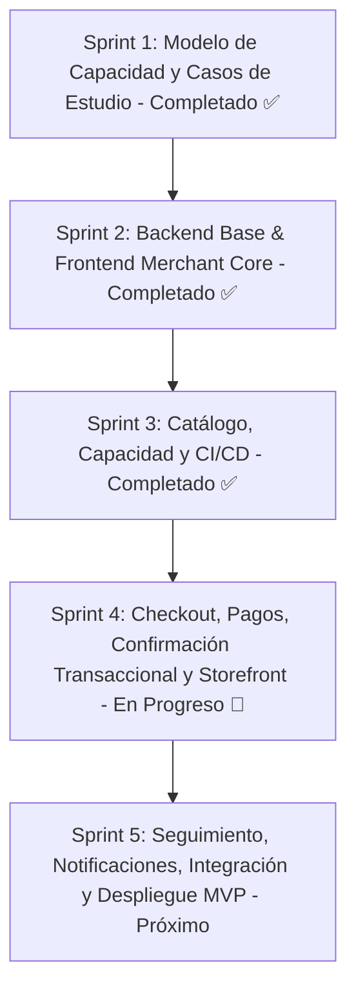

# 🛍️ JaldiShop

### Plataforma de Gestión de Pedidos y Control Inteligente de Capacidad para MYPE

> **Capa de orden operativa** para micro y pequeñas empresas que comercializan por WhatsApp e Instagram, eliminando la sobreventa y sincronizando pedidos con su capacidad real.

---

## 📌 Visión General

Las MYPE que trabajan bajo pedido (panaderías, dark kitchens, reposterías, catering) enfrentan a diario **sobreventa, pedidos traspapelados y saturación operativa**. 

A diferencia del e-commerce tradicional —que únicamente evalúa si hay *stock* de producto—, **JaldiShop** incorpora la **capacidad operativa** (tiempo de preparación, disponibilidad de personal y slots de entrega) como restricción inteligente para asegurar que el negocio solo acepte lo que verdaderamente puede cumplir.

```mermaid
flowchart LR
    subgraph CLIENTES["Canales de Venta"]
        W[WhatsApp]
        I[Instagram]
        O[Otros Medios]
    end

    subgraph PLATAFORMA["JaldiShop - Capa de Orden"]
        direction TB
        C1["Catálogo y Carrito Digital"]
        C2["Motor de Validación de Capacidad"]
        C3["Checkout con Reserva Temporal"]
        C4["Panel de Control MYPE"]
    end

    subgraph BENEFICIOS["Impacto Operativo"]
        B1["Cero Sobreventa"]
        B2["Ahorro de Tiempo"]
        B3["Seguimiento Transparente"]
    end

    CLIENTES --> PLATAFORMA --> BENEFICIOS
```

---

## 👥 Equipo de Desarrollo

| Miembro | Rol | Responsabilidad Sprint 4 | Perfil |
|---|:---:|---|:---:|
| **Josue Royer Tanta Cieza** | Full Stack Dev | **BE-19** Checkout + **FE-STORE-01** Storefront + **FE-LEGAL-01** Legal + **FE-MKT-01** Landing + **OPS-DEPLOY-01** Vercel | [@iJosueeh](https://github.com/iJosueeh) |
| **Katherine Patricia Salas Quiroz** | Full Stack Dev | **BE-PAYMENTS-01** Integración de Pagos + **FE-STORE-03** Catálogo Público | [@kath144](https://github.com/kath144) |
| **Mia Vitalia Gual Vega** | Full Stack Dev | **BE-20** Confirmación Transaccional de Compra + **FE-STORE-02** Carrito Customer | [@miagv](https://github.com/miagv) |

---

## 🛠️ Stack Tecnológico

| Capa | Tecnologías | Propósito |
|:---|:---|:---|
| **Backend** | Spring Boot 3.4.x, Java 21 | API RESTful, Arquitectura Hexagonal/DDD y Transaccionalidad |
| **Seguridad** | JWT, Spring Security | Autenticación sin estado y RBAC (CUSTOMER, MERCHANT, ADMIN) |
| **Frontend** | Angular 20 Standalone, Next.js 15, Tailwind CSS | Panel de Comerciante (Angular) y [Portal Marketplace (Next.js)](./05-arquitectura/arquitectura-frontend-marketplace.md) |
| **Persistencia** | PostgreSQL 16+ (NeonDB), Flyway, Hibernate | Base de datos relacional en la nube y JPA |
| **Despliegue & DevOps** | Vercel, Cloudflare Pages, Google Cloud DNS, Render, Docker, GitHub Actions | Despliegue continuo y validación automatizada multi-cloud |
| **Calidad / QA** | JUnit 5, Mockito, Vitest | 904 pruebas automatizadas pasando al 100% (454 Backend + 450 Frontend) |
| **Tiempo Real** | WebSockets | Actualización de estados y disponibilidad en vivo |

---

## 🚀 Estado de los Sprints

```mermaid
flowchart TD
    S1["Sprint 1: Modelo de Capacidad y Casos de Estudio - Completado ✅"]
    S2["Sprint 2: Backend Base & Frontend Merchant Core - Completado ✅"]
    S3["Sprint 3: Catálogo, Capacidad y CI/CD - Completado ✅"]
    S4["Sprint 4: Checkout, Pagos, Confirmación Transaccional y Storefront - En Progreso 🚀"]
    S5["Sprint 5: Seguimiento, Notificaciones, Integración y Despliegue MVP - Próximo"]

    S1 --> S2 --> S3 --> S4 --> S5
```

---

## 💡 Conceptos Clave del Dominio

* **Capacidad Base:** Límite estándar de pedidos que una tienda procesa por día o bloque horario.
* **Excepción Temporal:** Ajuste en caliente para fechas festivas o imprevistos operativos sin alterar la base semanal.
* **Reserva Temporal (Hold):** Bloqueo transaccional de cupo durante 10 minutos mientras el cliente realiza el pago.
* **Capacidad Comprometida:** Total de cupos bloqueados por pedidos pagados y reservas en curso.
